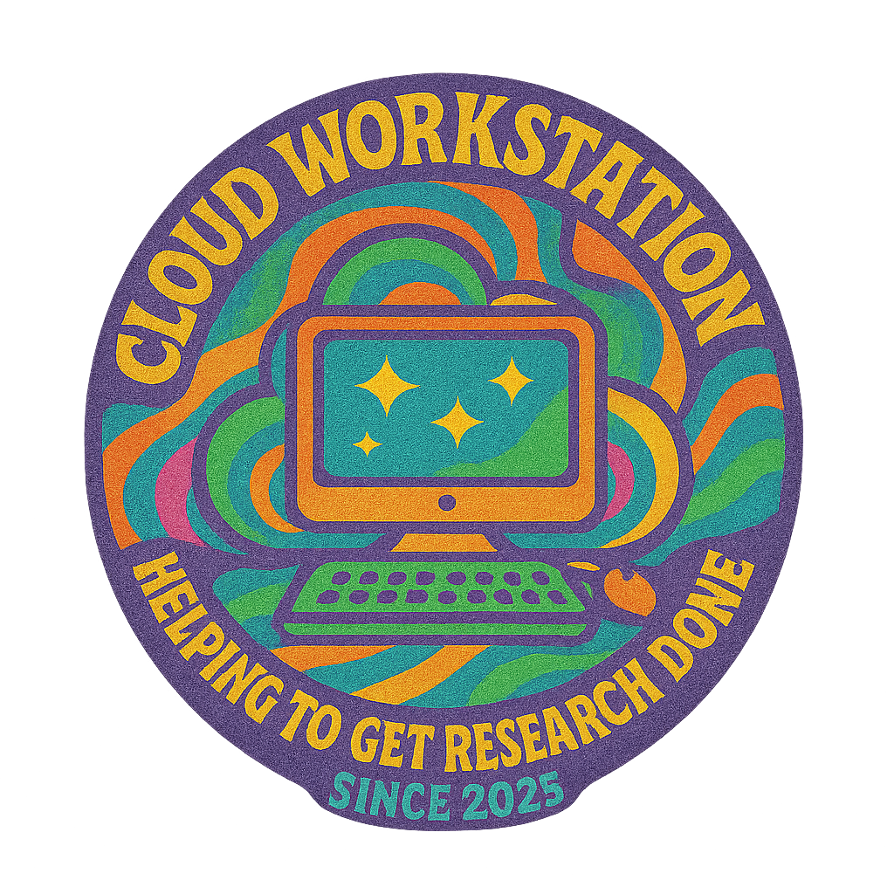

# CloudWorkstation

<p align="center">
  
</p>

<p align="center"><strong>Academic Research Computing Platform - Pre-configured cloud environments made simple</strong></p>

<p align="center">
  <a href="https://github.com/scttfrdmn/cloudworkstation/actions/workflows/ci.yml">
    
  </a>
  <a href="https://github.com/scttfrdmn/cloudworkstation/releases/latest">
    
  </a>
  <a href="https://github.com/scttfrdmn/cloudworkstation/blob/main/LICENSE">
    
  </a>
  <a href="https://goreportcard.com/report/github.com/scttfrdmn/cloudworkstation">
    
  </a>
  <a href="https://github.com/scttfrdmn/cloudworkstation/blob/main/cmd/cws-gui/frontend/eslint.config.js">
    
  </a>
</p>

## What is CloudWorkstation?

CloudWorkstation provides researchers with **pre-configured cloud workstations** for data analysis, machine learning, and computational research. Launch production-ready environments without manual configuration.

**From individual researchers to institutional deployments** - research computing made simple, scalable, and cost-effective.

## 🎯 Core Design Principles

- **🎯 Default to Success**: Every template works out of the box in every supported region
- **⚡ Optimize by Default**: Smart instance sizing and cost-performance optimization  
- **🔍 Transparent Fallbacks**: Clear communication when configurations change
- **💡 Helpful Warnings**: Gentle guidance for optimal choices
- **🚫 Zero Surprises**: Users always know what they're getting
- **📈 Progressive Disclosure**: Simple by default, detailed when needed

## 🚀 Installation

### macOS

**Homebrew (Recommended)**

```bash
brew install scttfrdmn/tap/cloudworkstation
```

**Manual Installation**
```bash
# Download and extract
curl -L https://github.com/scttfrdmn/cloudworkstation/releases/latest/download/cloudworkstation_0.5.4_darwin_arm64.tar.gz | tar xz

# Install binaries
sudo mv cws cwsd /usr/local/bin/
```

### Linux

**Debian/Ubuntu**
```bash
wget https://github.com/scttfrdmn/cloudworkstation/releases/download/v0.5.4/cloudworkstation_0.5.4_linux_amd64.deb
sudo dpkg -i cloudworkstation_0.5.4_linux_amd64.deb
```

**RHEL/CentOS/Fedora**
```bash
wget https://github.com/scttfrdmn/cloudworkstation/releases/download/v0.5.4/cloudworkstation_0.5.4_linux_amd64.rpm
sudo rpm -i cloudworkstation_0.5.4_linux_amd64.rpm
```

**Alpine Linux**
```bash
wget https://github.com/scttfrdmn/cloudworkstation/releases/download/v0.5.4/cloudworkstation_0.5.4_linux_amd64.apk
sudo apk add --allow-untrusted cloudworkstation_0.5.4_linux_amd64.apk
```

### Windows

**Scoop**
```powershell
scoop bucket add scttfrdmn https://github.com/scttfrdmn/scoop-bucket
scoop install cloudworkstation
```

**Manual Installation**
```powershell
# Download from GitHub releases
# https://github.com/scttfrdmn/cloudworkstation/releases/latest
# Extract and add to PATH
```

## 🚀 Quick Start

### 1. Configure AWS Credentials

```bash
# If you already have AWS CLI configured, skip to step 2
aws configure
```

CloudWorkstation automatically discovers credentials from:
- Environment variables (AWS_PROFILE, AWS_ACCESS_KEY_ID)
- AWS CLI configuration (~/.aws/credentials)
- CloudWorkstation profiles (for multi-account management)

### 2. Launch Your First Workstation

```bash
# View available templates
cws templates

# Launch a Python ML environment
cws launch python-ml my-research

# Connect via SSH
cws connect my-research

# View running instances
cws list
```

**What happens automatically:**
- ✅ Daemon starts if not running
- ✅ Optimal instance type selected
- ✅ Security groups configured
- ✅ SSH keys generated and managed
- ✅ Template provisioned and ready

## 🌟 Key Features

### 💰 Cost Optimization
- **Hibernation**: Preserve state while reducing costs by 90%
- **Idle Detection**: Automated hibernation policies with configurable thresholds
- **Budget Management**: Project-level cost tracking and alerts
- **Cost Analytics**: Real-time spending reports and forecasts

### 🏗️ Research Templates
- **21+ Pre-configured Environments**: Python ML, R, bioinformatics, web dev, and more
- **Template Inheritance**: Compose complex environments from simple building blocks
- **Smart Defaults**: Optimal instance sizing and cost-performance ratios
- **Regional Fallbacks**: Automatic handling of availability constraints

### 🏢 Enterprise & Collaboration
- **Project-Based Organization**: Multi-user projects with role-based access
- **Research User System**: Persistent identities across instances
- **Multi-Account Support**: Manage multiple AWS profiles efficiently
- **Template Marketplace**: Share and discover community templates

### 📱 Multi-Modal Access
- **CLI**: Fast, scriptable command-line interface
- **TUI**: Interactive terminal interface with keyboard navigation
- **GUI**: Desktop application (available when building from source)
- **REST API**: Complete HTTP API on port 8947

## 📦 Example Templates

CloudWorkstation includes 21+ pre-configured templates for research computing:

- **Python ML**: Jupyter, scikit-learn, TensorFlow, PyTorch
- **R Research**: RStudio, tidyverse, Bioconductor
- **Bioinformatics**: BLAST, bowtie2, samtools, bedtools
- **Web Development**: Node.js, Docker, nginx
- **Deep Learning**: GPU-optimized environments with CUDA

```bash
# View all templates
cws templates

# Get detailed template info
cws templates info python-ml
```

## 💻 Usage Examples

### Basic Instance Management
```bash
# Launch an instance
cws launch python-ml my-project

# List running instances
cws list

# Connect via SSH
cws connect my-project

# Stop instance
cws stop my-project
```

### Cost Optimization
```bash
# Hibernate to preserve state while saving costs
cws hibernate my-instance
cws resume my-instance

# Automated idle policies
cws idle profile list
cws idle instance my-gpu --profile gpu
```

### Project Management
```bash
# Create project with budget
cws project create ml-research --budget 500

# Add team members
cws project member add ml-research user@example.com --role member

# Launch instance in project
cws launch python-ml analysis --project ml-research
```

### Multi-Modal Access
```bash
# Command line
cws templates

# Terminal UI
cws tui

# REST API
curl http://localhost:8947/api/v1/instances
```

## 📖 Documentation

**📚 [Complete Documentation Site](https://scttfrdmn.github.io/cloudworkstation/)** - User guides, architecture docs, and persona walkthroughs

```bash
cws --help                      # Show all commands
cws templates                   # List available templates
cws templates info <template>   # Detailed template info
cws doctor                      # System health check
```

**Guides:**
- [AWS Setup Guide](AWS_SETUP_GUIDE.md) - AWS account and credential configuration
- [Installation Guide](INSTALL.md) - Comprehensive installation instructions
- [Changelog](CHANGELOG.md) - Version history and release notes

## 🗓️ Version History

### v0.5.4 (Current) - Universal Version System
- **Dynamic OS Versions**: Choose OS versions at launch time with `--version` flag
- **Version Aliases**: Support for `latest`, `lts`, `previous-lts`
- **AMI Freshness Checking**: `cws ami check-freshness` validates static AMI IDs
- **AWS SSM Integration**: Automatic latest AMI discovery for major distributions
- **Package Management**: Available via Homebrew (macOS), Scoop (Windows), deb, rpm, apk

### v0.5.3 - Research User System & Template Marketplace
- **Multi-User Architecture**: Persistent research identities across instances
- **SSH Key Management**: Complete key generation and distribution
- **Template Registry**: Multi-registry support with community templates
- **Policy Framework**: Institutional governance and access control

### v0.4.5 - Enterprise Research Platform
- **Project-Based Organization**: Multi-user projects with role-based access
- **Budget Management**: Real-time cost tracking and automated controls
- **Hibernation Ecosystem**: Manual + automated idle detection policies
- **Template Inheritance**: Stackable template system

## 🚀 Roadmap

**Phase 5 (Current)**: Multi-user collaboration and template marketplace
**Phase 6**: Advanced storage (FSx, S3 integration) and AWS research services
**Phase 7**: Enterprise authentication (OAuth, LDAP, SAML) and TUI enhancements

## 🤝 Contributing

CloudWorkstation is open source and welcomes contributions!

- **Issues**: [Report bugs or request features](https://github.com/scttfrdmn/cloudworkstation/issues)
- **Pull Requests**: Submit code improvements
- **Templates**: Contribute research environment templates
- **Documentation**: Help improve guides

**Development:**
```bash
git clone https://github.com/scttfrdmn/cloudworkstation.git
cd cloudworkstation
make build
make test
```

## 📄 License

[Apache License 2.0](LICENSE) - Free for academic and commercial use

## 🆘 Support

- **Documentation**: [Complete docs site](https://scttfrdmn.github.io/cloudworkstation/) or `cws --help`
- **System Check**: `cws doctor`
- **Issues**: [GitHub Issues](https://github.com/scttfrdmn/cloudworkstation/issues)
- **Discussions**: [GitHub Discussions](https://github.com/scttfrdmn/cloudworkstation/discussions)
- **AWS Setup**: See [AWS Setup Guide](AWS_SETUP_GUIDE.md)

---

**CloudWorkstation v0.5.4** - Research computing environments made accessible