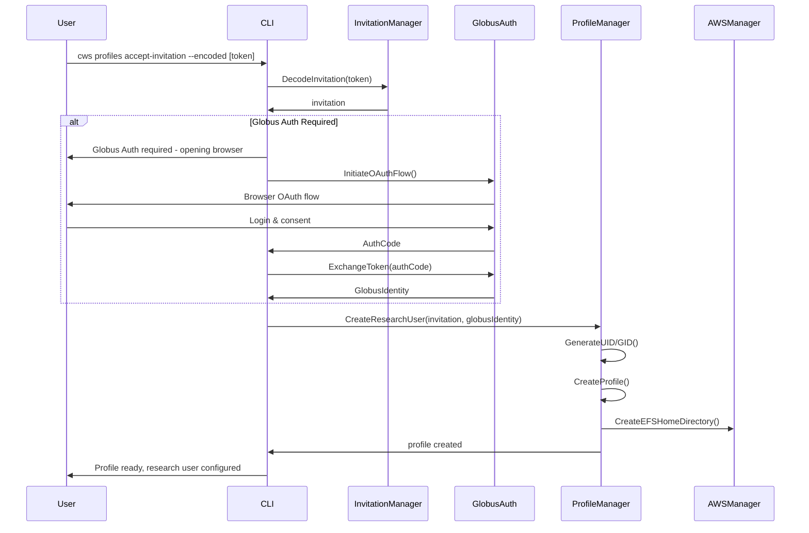
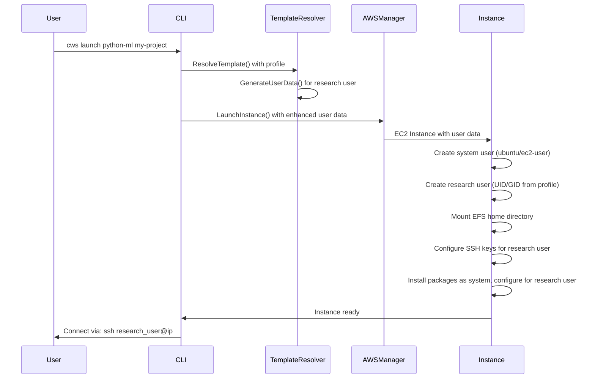

# Research User Architecture Design

## Overview

CloudWorkstation's multi-user architecture implements a **one-user-per-instance** model where each instance contains:
1. **System User**: For system administration and service management
2. **Research User**: For actual research work, connected to the researcher's identity

Research users are **per-profile**, meaning each AWS account invitation creates a unique research user identity with consistent UID/GID mapping across all instances in that account.

## Core Principles

### Single-User Instance Model
- **One research user per instance** - CloudWorkstation extends your laptop/workstation concept
- **No multi-tenancy** - Each instance is dedicated to one researcher  
- **Profile-Based Identity** - Research user tied to profile (AWS account), not global
- **Consistent Identity** - Same UID/GID across all instances in an AWS account

### Identity Integration
- **Optional Globus Auth** - Enhanced identity verification for sensitive invitations
- **Device Binding** - Secure device-based authorization (existing system)
- **Profile Isolation** - Research users cannot cross AWS account boundaries

## Architecture Design

### Research User Model

```go
// ResearchUser represents the research identity for a profile
type ResearchUser struct {
    // Core identity (per-profile, not global)
    ProfileID    string `json:"profile_id"`    // Links to Profile.AWSProfile
    Username     string `json:"username"`      // Research username (e.g., "alice_researcher")
    UID          int    `json:"uid"`           // Consistent UID across all instances
    GID          int    `json:"gid"`           // Consistent GID across all instances
    
    // Identity verification
    GlobusIdentity *GlobusIdentity `json:"globus_identity,omitempty"` // Optional Globus Auth
    EmailVerified  bool            `json:"email_verified"`            // Email verification status
    
    // SSH key management (per-profile)
    SSHPublicKey  string `json:"ssh_public_key,omitempty"`  // Research user SSH key
    SSHKeyPath    string `json:"ssh_key_path,omitempty"`    // Local private key path
    
    // Research environment preferences
    Shell         string            `json:"shell,omitempty"`         // Default: /bin/bash
    HomeDirMount  string           `json:"home_dir_mount,omitempty"` // EFS mount for home directory
    Groups        []string         `json:"groups,omitempty"`         // Additional groups (docker, etc.)
    
    // Metadata
    CreatedAt     time.Time `json:"created_at"`
    LastUsed      time.Time `json:"last_used"`
    DisplayName   string    `json:"display_name,omitempty"` // From invitation or Globus
}

// GlobusIdentity represents optional Globus Auth integration
type GlobusIdentity struct {
    GlobusID     string `json:"globus_id"`      // Globus user identifier
    ORCID        string `json:"orcid,omitempty"` // ORCID if linked
    Institution  string `json:"institution,omitempty"` // Institution from Globus
    Email        string `json:"email,omitempty"` // Verified email from Globus
    VerifiedAt   time.Time `json:"verified_at"` // When Globus verification completed
}
```

### Profile Integration

Enhanced profile structure with research user:

```go
// Extension to existing Profile struct
type Profile struct {
    // ... existing fields ...
    
    // Research user identity (new fields)
    ResearchUser   *ResearchUser `json:"research_user,omitempty"`   // Research identity
    RequireGlobus  bool          `json:"require_globus,omitempty"`  // Globus Auth required
    
    // Home directory management
    EFSHomeDir     string        `json:"efs_home_dir,omitempty"`    // EFS filesystem for home
    HomeDirectory  string        `json:"home_directory,omitempty"`  // Home directory path
}
```

### Invitation Enhancement

Enhanced invitation system with optional Globus requirements:

```go
// Extension to existing InvitationToken
type InvitationToken struct {
    // ... existing fields ...
    
    // Research user requirements
    RequireGlobusAuth    bool     `json:"require_globus_auth,omitempty"`  // Globus Auth required
    AllowedInstitutions  []string `json:"allowed_institutions,omitempty"` // Institution whitelist
    RequiredORCID        bool     `json:"required_orcid,omitempty"`       // ORCID required
    
    // Research user provisioning
    DefaultUsername      string   `json:"default_username,omitempty"`     // Suggested username
    DefaultShell         string   `json:"default_shell,omitempty"`        // Default shell
    AdditionalGroups     []string `json:"additional_groups,omitempty"`    // Extra groups
}
```

## Implementation Flow

### Invitation Acceptance with Research User Creation



### Instance Launch with Research User



## Globus Auth Integration

### OAuth 2.0 Flow

```go
// GlobusAuthClient handles OAuth integration
type GlobusAuthClient struct {
    ClientID     string
    ClientSecret string
    RedirectURI  string
    Scopes       []string // ["openid", "profile", "email", "urn:globus:auth:scope:auth.globus.org:view_identities"]
}

// InitiateAuth starts Globus OAuth flow
func (g *GlobusAuthClient) InitiateAuth() (*AuthSession, error) {
    // Generate state parameter for CSRF protection
    state := generateSecureState()
    
    authURL := fmt.Sprintf(
        "https://auth.globus.org/v2/oauth2/authorize?response_type=code&client_id=%s&redirect_uri=%s&scope=%s&state=%s",
        g.ClientID,
        url.QueryEscape(g.RedirectURI),
        url.QueryEscape(strings.Join(g.Scopes, " ")),
        state,
    )
    
    return &AuthSession{
        AuthURL: authURL,
        State:   state,
    }, nil
}

// ExchangeAuthCode exchanges authorization code for tokens
func (g *GlobusAuthClient) ExchangeAuthCode(code, state string, session *AuthSession) (*GlobusIdentity, error) {
    // Verify state parameter
    if state != session.State {
        return nil, fmt.Errorf("state mismatch - possible CSRF attack")
    }
    
    // Exchange authorization code for access token
    tokenResp, err := g.exchangeCode(code)
    if err != nil {
        return nil, err
    }
    
    // Get user info from Globus Auth
    userInfo, err := g.getUserInfo(tokenResp.AccessToken)
    if err != nil {
        return nil, err
    }
    
    return &GlobusIdentity{
        GlobusID:    userInfo.Sub,
        Email:       userInfo.Email,
        Institution: userInfo.Organization,
        ORCID:       userInfo.ORCID,
        VerifiedAt:  time.Now(),
    }, nil
}
```

### CLI Integration

```bash
# Enhanced invitation acceptance with optional Globus Auth
$ cws profiles accept-invitation --encoded [token] --name "Lab Collaboration"

# If invitation requires Globus Auth:
Invitation requires Globus Auth for identity verification.
Opening browser for authentication...

Globus Auth completed successfully:
  - Identity: alice.researcher@university.edu  
  - Institution: University of Research
  - ORCID: 0000-0000-0000-0000

Creating profile 'Lab Collaboration'...
  ✓ Research user: alice_researcher (UID: 5001)
  ✓ Home directory: EFS mount configured
  ✓ SSH key: Generated and configured
  ✓ Profile: Ready for use

Profile 'Lab Collaboration' created successfully.
Switch to it with: cws profiles switch Lab-Collaboration
```

## Research User Provisioning

### User Data Script Enhancement

Enhanced user data generation for research user creation:

```bash
#!/bin/bash
# Enhanced CloudWorkstation user data with research user

# Create research user with consistent UID/GID
RESEARCH_USER="alice_researcher"
RESEARCH_UID=5001
RESEARCH_GID=5001

# Create research user
groupadd -g $RESEARCH_GID $RESEARCH_USER
useradd -u $RESEARCH_UID -g $RESEARCH_GID -m -s /bin/bash $RESEARCH_USER
usermod -aG sudo,docker $RESEARCH_USER

# Configure SSH access for research user
mkdir -p /home/$RESEARCH_USER/.ssh
echo "ssh-rsa AAAA... alice_researcher@cloudworkstation" > /home/$RESEARCH_USER/.ssh/authorized_keys
chmod 600 /home/$RESEARCH_USER/.ssh/authorized_keys
chown -R $RESEARCH_USER:$RESEARCH_USER /home/$RESEARCH_USER/.ssh

# Mount EFS home directory (if configured)
if [ "$EFS_HOME_DIR" != "" ]; then
    mkdir -p /home/$RESEARCH_USER/workspace
    echo "$EFS_HOME_DIR.efs.us-west-2.amazonaws.com:/ /home/$RESEARCH_USER/workspace nfs4 defaults,_netdev" >> /etc/fstab
    mount /home/$RESEARCH_USER/workspace
    chown $RESEARCH_USER:$RESEARCH_USER /home/$RESEARCH_USER/workspace
fi

# Install packages as system user, configure for research user
apt-get update && apt-get install -y python3-pip jupyter-notebook

# Configure Jupyter for research user
sudo -u $RESEARCH_USER bash -c "
cd /home/$RESEARCH_USER
jupyter notebook --generate-config
echo \"c.NotebookApp.ip = '0.0.0.0'\" >> ~/.jupyter/jupyter_notebook_config.py
echo \"c.NotebookApp.open_browser = False\" >> ~/.jupyter/jupyter_notebook_config.py
"

# Create systemd service for Jupyter (runs as research user)
cat > /etc/systemd/system/jupyter-$RESEARCH_USER.service << EOF
[Unit]
Description=Jupyter Notebook for $RESEARCH_USER
After=network.target

[Service]
Type=simple
User=$RESEARCH_USER
WorkingDirectory=/home/$RESEARCH_USER
ExecStart=/usr/local/bin/jupyter notebook
Restart=always

[Install]
WantedBy=multi-user.target
EOF

systemctl enable jupyter-$RESEARCH_USER
systemctl start jupyter-$RESEARCH_USER
```

## Security & Isolation

### Per-Profile Isolation
- **UID/GID Uniqueness**: Each AWS account gets unique UID/GID range (5000-5999, 6000-6999, etc.)
- **No Cross-Account Access**: Research users cannot access other AWS accounts' resources
- **Device Binding**: Existing security system maintains device restrictions
- **SSH Key Isolation**: Each profile has separate SSH key pair

### Optional Globus Enhancement
- **Identity Verification**: Stronger identity assurance beyond email verification
- **Institution Validation**: Ensure users belong to expected institutions
- **ORCID Integration**: Link research identity to ORCID for academic workflows
- **Audit Trail**: Complete audit of identity verification for compliance

This architecture provides a clean separation between system administration and research work while maintaining the simplicity of one-user-per-instance and optional enhanced identity verification through Globus Auth.