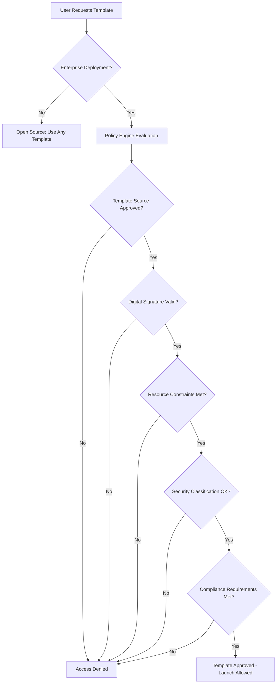

# Template Policy Framework Design

## Overview

The Template Policy Framework provides institutional control over template access, usage, and governance within CloudWorkstation deployments. This is a **proprietary enterprise feature** designed for institutional and organizational deployments.

## Architecture

### Core Components

```
┌─────────────────────────────────────────────────────────────┐
│                Institutional Control Plane                 │
│  (Enterprise Feature - Proprietary/Not Open Source)        │
├─────────────────────────────────────────────────────────────┤
│                                                             │
│  Template Governance Engine                                 │
│  ├── Policy Evaluation                                      │
│  ├── Template Source Control                               │
│  ├── Digital Signature Verification                        │
│  └── Compliance Auditing                                   │
│                                                             │
├─────────────────────────────────────────────────────────────┤
│                   Open Source Core                         │
│  (Base CloudWorkstation - MIT Licensed)                    │
├─────────────────────────────────────────────────────────────┤
│                                                             │
│  Profile System + Basic Invitations                        │
│  ├── Personal Profiles                                     │
│  ├── Invitation System                                     │
│  ├── Device Binding                                        │
│  └── Template Resolution                                   │
│                                                             │
└─────────────────────────────────────────────────────────────┘
```

## Policy Framework Structure

### 1. Template Source Hierarchy

**Enterprise Policy Control** (proprietary):
- **Institutional Templates**: Institution-approved, digitally signed templates
- **Departmental Templates**: Department-specific, policy-compliant templates
- **PI/Lab Templates**: Research group templates within policy bounds
- **External Templates**: Third-party templates subject to institutional approval

**Open Source Base** (MIT licensed):
- **Community Templates**: Basic research environment templates
- **Personal Templates**: User-created templates (no policy enforcement)

### 2. Policy Evaluation Engine

#### InstitutionalPolicyEngine (Enterprise Feature)

```go
// Enterprise-only types (not in open source)
type InstitutionalPolicyEngine struct {
    // Template source policies
    AllowedSources     []TemplateSource `json:"allowed_sources"`
    RequiredSignature  bool             `json:"required_signature"`
    
    // Resource constraints  
    MaxInstanceTypes   []string         `json:"max_instance_types"`
    BudgetLimits      BudgetPolicy     `json:"budget_limits"`
    
    // Security policies
    SecurityClassification SecurityLevel `json:"security_classification"`
    DataHandlingRules     []DataRule    `json:"data_handling_rules"`
    
    // Compliance requirements
    ComplianceFrameworks []string       `json:"compliance_frameworks"` // HIPAA, SOX, etc.
    AuditLogging        AuditConfig    `json:"audit_logging"`
}

type TemplateSource string
const (
    SourceInstitutional TemplateSource = "institutional"
    SourceDepartmental  TemplateSource = "departmental" 
    SourcePI           TemplateSource = "pi_lab"
    SourceCommunity    TemplateSource = "community"
    SourceExternal     TemplateSource = "external"
)

type SecurityLevel string
const (
    SecurityPublic       SecurityLevel = "public"
    SecurityInternal     SecurityLevel = "internal"
    SecurityConfidential SecurityLevel = "confidential"
    SecurityRestricted   SecurityLevel = "restricted"
)
```

### 3. Template Policy Evaluation Flow



## Integration with Existing Systems

### Profile Integration

The policy engine extends existing profile types with enterprise controls:

```go
// Extension to existing Profile struct (enterprise-only fields)
type Profile struct {
    // ... existing open source fields ...
    
    // Enterprise policy fields (only in enterprise builds)
    InstitutionalPolicyID string        `json:"institutional_policy_id,omitempty"`
    TemplateRestrictions  []Restriction `json:"template_restrictions,omitempty"`
    ComplianceLevel      SecurityLevel  `json:"compliance_level,omitempty"`
    AuditTrail          []AuditEvent    `json:"audit_trail,omitempty"`
}
```

### Invitation System Enhancement

Enterprise invitations include policy inheritance:

```go
// Enterprise extension to InvitationToken
type InvitationToken struct {
    // ... existing open source fields ...
    
    // Enterprise policy inheritance
    PolicyInheritance   PolicyInheritance `json:"policy_inheritance,omitempty"`
    TemplateWhitelist   []string         `json:"template_whitelist,omitempty"`
    SecurityClearance   SecurityLevel    `json:"security_clearance,omitempty"`
    ComplianceRequired  []string         `json:"compliance_required,omitempty"`
}
```

## Template Governance Implementation

### 1. Digital Signature System

Templates in enterprise deployments require digital signatures:

```yaml
# Example institutional template with signature
name: "Institutional Python ML Environment"
description: "IT-approved machine learning environment"
signature:
  authority: "University IT Security"
  public_key_id: "univ-it-2024"
  signature: "base64-encoded-signature"
  signed_at: "2024-01-15T10:30:00Z"
  
policy_metadata:
  security_classification: "internal"
  compliance_frameworks: ["FERPA", "University Policy 123"]
  data_handling: ["no_phi", "encrypted_storage_required"]
```

### 2. Policy Enforcement Points

**Template Resolution** (enhanced):
- Before resolving template → Check institutional policy
- Verify template source is approved
- Validate digital signature
- Enforce resource constraints

**Launch Validation** (enhanced):
- Before instance launch → Check current policy
- Validate user permissions for template
- Log policy decisions for audit
- Apply resource constraints

## Deployment Models

### Open Source Deployment (Basic Policy Framework)
```bash
# Class/lab invitation with template restrictions
cws profiles invitations create "CS101 Class" --type read_only --template-whitelist "python-basic,r-basic"
# Creates invitation that only allows specific templates

# Student accepting class invitation
cws profiles accept-invitation --encoded [token] --name "CS101"
cws launch python-advanced my-project  
# → Policy check: Template not in whitelist ✗
# → Error: Template 'python-advanced' not allowed for this profile
# → Available templates: python-basic, r-basic

cws launch python-basic my-project
# → Policy check: Template in whitelist ✓
# → Launch approved
```

### Enterprise Deployment (Advanced Policy Framework)
```bash
# Enterprise CloudWorkstation with full policy engine
cws launch python-ml my-project
# → Policy check: Approved institutional template ✓
# → Security check: User clearance sufficient ✓  
# → Resource check: Instance type within budget ✓
# → Compliance check: Audit logged ✓
# → Launch approved

cws launch external-gpu-template my-project  
# → Policy check: External template not approved ✗
# → Access denied: Contact IT for template approval
```

## Migration Strategy

### Phase 1: Policy Framework Foundation
- Design policy engine architecture
- Create digital signature system  
- Implement template source validation
- Add enterprise profile extensions

### Phase 2: Resource & Security Controls
- Budget limit enforcement
- Security classification system
- Instance type restrictions
- Compliance framework integration

### Phase 3: Audit & Governance
- Comprehensive audit logging
- Policy violation reporting
- Template lifecycle management
- Institutional dashboard/reporting

## Open Source vs Enterprise Separation

### Open Source Core (MIT License)
- Basic profile system
- Simple invitation system with **basic template restrictions**
- Template whitelist/blacklist per invitation
- Instance type constraints per profile
- Community template library
- Basic policy validation for invitations

### Enterprise Features (Proprietary)
- Institutional policy engine with digital signatures
- Advanced template governance & source control
- Security classification & clearance levels
- Compliance frameworks (HIPAA, SOX, etc.)
- Comprehensive audit logging & reporting
- Institutional control plane & dashboards

### Basic Policy Framework (Open Source)

The open source version includes fundamental policy capabilities:

```go
// BasicPolicyRestrictions - included in open source
type BasicPolicyRestrictions struct {
    // Template restrictions
    TemplateWhitelist    []string `json:"template_whitelist,omitempty"`    // Allowed templates
    TemplateBlacklist    []string `json:"template_blacklist,omitempty"`    // Forbidden templates
    
    // Instance constraints  
    MaxInstanceTypes     []string `json:"max_instance_types,omitempty"`    // Max instance size
    ForbiddenRegions     []string `json:"forbidden_regions,omitempty"`     // Regional restrictions
    
    // Basic budget controls
    MaxHourlyCost        float64  `json:"max_hourly_cost,omitempty"`       // Cost ceiling
    MaxDailyBudget       float64  `json:"max_daily_budget,omitempty"`      // Daily limit
}
```

### Use Cases for Basic Policy Framework

**Educational Settings**:
- **Class Invitations**: Restrict students to specific templates for coursework
- **Lab Management**: Control which templates lab members can use
- **Budget Control**: Set cost limits for student/researcher spending

**Small Organizations**:
- **Department Budgets**: Basic cost controls per team/project
- **Template Curation**: Limit templates to approved, tested environments
- **Regional Compliance**: Restrict instances to specific AWS regions

**Research Groups**:
- **Grant Compliance**: Ensure spending aligns with grant requirements
- **Reproducibility**: Standardize templates across research collaborations
- **Resource Management**: Prevent expensive instance launches

This tiered approach provides immediate value for educational and small organizational use cases in the open source version, while reserving advanced enterprise governance for proprietary features.