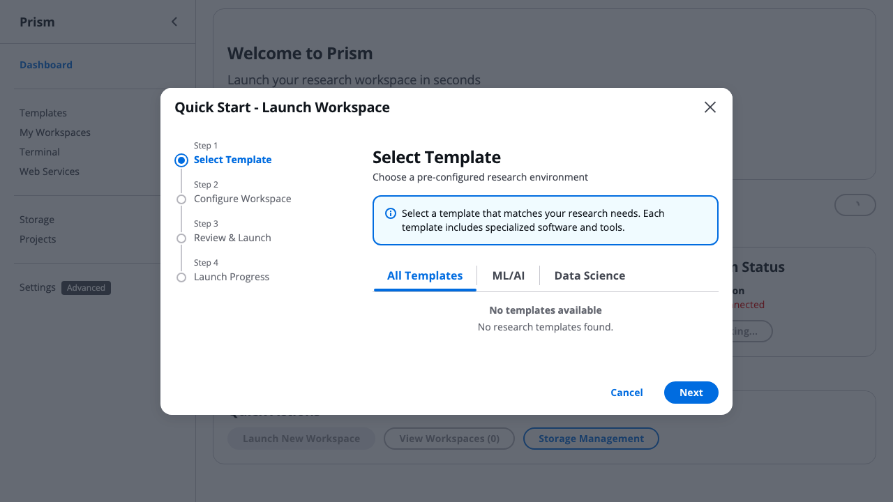

# Scenario 1: Solo Researcher with Budget Constraints

## Persona: Dr. Sarah Chen

**Background**:
- Postdoctoral researcher in computational biology
- Personal research budget: $100/month from lab discretionary funds
- Works on RNA-seq analysis requiring sporadic compute (3-4 days/week)
- Primary concern: **Not going over budget** - needs to explain every dollar spent
- Technical level: Comfortable with command line, not a DevOps expert
- Works from laptop, often from home or coffee shops

**Pain Points**:
- Has accidentally left EC2 workspaces running overnight (cost $40 in one month!)
- Anxious about trying GPU workspaces (too expensive if forgotten)
- Needs to provide monthly cost reports to PI
- Current solution: Checks AWS billing dashboard obsessively, sets phone alarms to stop instances

---

## Current State (v0.5.8): What Works Today

### ✅ Initial Setup (Day 0) - 30-Second Quick Start

**New in v0.5.8**: Interactive wizard for first-time users!

```bash
# Install Prism
brew install scttfrdmn/tap/prism

# Configure AWS credentials (one-time)
aws configure

# Launch the Quick Start wizard
prism init
```

**What Sarah experiences** (30-second guided setup):

```
🎉 Welcome to Prism!
━━━━━━━━━━━━━━━━━━━━━━━━━━━━━━━━━━━━━━━━
This wizard will help you launch your first research workspace.
Launch time: ~30 seconds

✅ AWS credentials validated

📦 Step 1: Select a Template
━━━━━━━━━━━━━━━━━━━━━━━━━━━━━━━━━━━━━━━━

Choose a category:
  1) ML/AI (8 templates)
  2) Data Science (6 templates)
  3) Bioinformatics (5 templates) ← Sarah selects this
  4) Web Development (3 templates)
  5) All Templates (22 templates)

📋 Bioinformatics Templates:

  1) Bioinformatics Suite
     Complete toolkit: BLAST, bowtie2, samtools, bedtools
     Recommended: M (~$0.16/hour)

  2) Genomics Workstation
     NGS analysis: BWA, GATK, IGV
     Recommended: L (~$0.32/hour)

Select template [1-2]: 1

⚙️  Step 2: Configure Workspace
━━━━━━━━━━━━━━━━━━━━━━━━━━━━━━━━━━━━━━━━

Workspace name (default: my-workspace-1027): rnaseq-analysis

Choose workspace size:
  1) S - 2 vCPU, 4GB RAM (~$0.08/hour)
  2) M - 4 vCPU, 8GB RAM (~$0.16/hour) ← Recommended
  3) L - 8 vCPU, 16GB RAM (~$0.32/hour)
  4) XL - 16 vCPU, 32GB RAM (~$0.64/hour)

💡 Tip: Size 'M' is recommended for this template

Select size [1-4]: 2

📋 Step 3: Review Configuration
━━━━━━━━━━━━━━━━━━━━━━━━━━━━━━━━━━━━━━━━

Your workspace configuration:
  Template:  Bioinformatics Suite
  Name:      rnaseq-analysis
  Size:      M

  Estimated cost: $0.16/hour (~$3.84/day if running 24/7)

💡 Tip: Use 'prism stop' when not in use to save costs

Launch this workspace? [y/N]: y

🚀 Step 4: Launching Workspace
━━━━━━━━━━━━━━━━━━━━━━━━━━━━━━━━━━━━━━━━

⏳ Launching workspace... This may take 1-2 minutes
✅ Workspace launching successfully
```

**What Sarah thinks**: *"Wow, that was actually easier than I expected! Clear cost estimates upfront, and it just asked me exactly what I needed to know."*

**Alternative: GUI Quick Start Wizard** (for visual interface preference):



*Screenshot shows the GUI Quick Start wizard with professional Cloudscape design. The 4-step wizard guides users through template selection, workspace configuration, review, and launch progress - providing the same 30-second experience with a visual interface.*

**What Sarah experiences in GUI**:
1. Click "Dashboard" → Opens Quick Start wizard automatically for first-time users
2. **Step 1**: Browse templates by category (ML/AI, Data Science, Bioinformatics) with visual cards
3. **Step 2**: Configure workspace name and size with real-time cost estimates
4. **Step 3**: Review configuration summary with estimated costs
5. **Step 4**: Watch real-time launch progress with connection details on success

**Alternative: Advanced users can still use direct commands**:
```bash
# Direct launch (no wizard)
prism launch bioinformatics-suite rnaseq-analysis --size M
```

### ✅ Enable Hibernation (Cost Safety Net)
```bash
# Configure aggressive hibernation for budget safety
prism idle profile create budget-safe \
  --idle-minutes 15 \
  --action hibernate \
  --description "Hibernate after 15min idle - cost savings"

# Apply to future instances
prism idle profile set-default budget-safe
```

**Result**: Any workspace automatically hibernates after 15 minutes of inactivity
- Hibernation preserves RAM state (no lost work)
- Stops compute charges immediately
- Sarah can resume work exactly where she left off

### ✅ First Workspace Success (Day 1)

After the wizard completes:

```
✅ Success! Your workspace is ready
━━━━━━━━━━━━━━━━━━━━━━━━━━━━━━━━━━━━━━━━

📡 Connection Information:
  Name:      rnaseq-analysis
  Status:    running
  Public IP: 54.123.45.67

🔗 Connect via SSH:
  ssh ubuntu@54.123.45.67

📚 Next Steps:
  • Connect:  prism connect rnaseq-analysis
  • Monitor:  prism list
  • Stop:     prism stop rnaseq-analysis
  • Delete:   prism delete rnaseq-analysis

💡 Run 'prism --help' to see all available commands
```

**What Sarah thinks**: *"Okay, $0.16/hour... if I work 4 hours/day for 15 days, that's only $9.60! Way under budget!"*

**Note**: Sarah can now set up hibernation policies to automatically save costs (see next section).

### ✅ Daily Work (Days 1-15)
```bash
# Morning: Resume work
prism list                    # See status: hibernated (note: now called "workspaces" in v0.5.8)
prism start rnaseq-analysis   # Resume in 30 seconds
prism connect rnaseq-analysis # Start working (shortcut for SSH)

# Work session: 4 hours
# - Run RNA-seq pipeline
# - Hibernation policy watches: CPU, memory, disk activity
# - Sarah gets coffee, 15 minutes pass with no activity
# - Workspace automatically hibernates

# ✅ Hibernation triggered! Charges stop immediately
# 💰 Real-time savings: $2.40/hour → $0/hour
#    The money you're NOT spending is banked for future use!
#    Budget available increases in real-time as workspaces hibernate/stop

# Afternoon: Check costs
prism cost summary
# Output:
# Total monthly spend: $18.50
# Running instances: 0 (all hibernated)
# Hibernation savings: $24.30 (57% saved) ← THIS IS REAL MONEY BANKED!
# Available budget: $81.50 ($100 - $18.50)
# Projected month-end: $62 (within $100 budget ✅)
#
# 💡 Effective cost per hour: $0.31/hour (vs $2.40/hour if running 24/7)
#    You're paying for 60 hours of actual compute, not 360 hours!
#    That $24.30 savings? It's available RIGHT NOW for more work!
#
# 💡 Cloud vs Owned Reality:
#    Owned workstation: $3,000 upfront, depreciates whether you use it or not
#    Prism: Pay $18.50 for 60 actual hours, bank the rest!
```

> **💡 GUI Note**: Cost summary is available in the GUI Dashboard (Costs tab) with visual charts - *coming soon in v0.6.0*

**What Sarah thinks**: *"The hibernation is working! Every time it hibernates, I'm banking money for future compute. I'm only paying $0.31/hour instead of $2.40/hour! No anxiety!"*

---

## ⚠️ Current Pain Points: What Doesn't Work

### ❌ Problem 1: No Budget Enforcement
**Scenario**: Week 3, Sarah accidentally launches GPU workspace

```bash
# Sarah tries GPU template for deep learning experiment
prism launch gpu-ml-workstation protein-folding --size L

# Prism output:
# ✅ Workspace launching: protein-folding
# 📊 Estimated cost: $24.80/day ($744/month)
# 🔗 SSH ready in ~2 minutes...
```

**What should happen** (MISSING):
```
⚠️  WARNING: High-cost workspace detected!
   Estimated: $24.80/day ($744/month)
   Your monthly budget: $100
   This workspace will exceed your budget in 4 days.

   Continue? [y/N]: _
```

**Current workaround**: Sarah has to remember to check costs manually
**Risk**: One forgotten GPU workspace = entire month's budget gone in 4 days

### ❌ Problem 2: No Budget Alerts
**Scenario**: Week 4, Sarah hits 80% of budget

**What should happen** (MISSING):
```
📧 Email Alert: Budget Warning - 80% Spent
   Project: Personal Research
   Spent: $80.00 / $100.00 (80%)
   Remaining: $20.00
   Days left in month: 8

   Current instances:
   - rnaseq-analysis: Running ($2.40/day)

   Recommendation: You have $20 remaining for 8 days.
   Consider hibernating workspaces when not in use.
```

**Current workaround**: Sarah checks `prism cost summary` daily
**Impact**: Constant cognitive load, anxiety about overspending

### ❌ Problem 3: No Spending Forecasts
**Scenario**: Mid-month, Sarah wants to know if she can launch another instance

**What should happen** (MISSING):
```bash
prism budget forecast

# Output:
# 📊 Budget Forecast - Personal Research
#
# Current spend: $45.00 (Day 15 of 30)
# Projected end-of-month: $90.00
# Budget: $100.00
# Remaining buffer: $10.00 ✅
#
# Active instances:
# - rnaseq-analysis (hibernated): ~$1.20/day with current usage pattern
#
# Can I launch another instance?
# ✅ t3.medium ($0.80/day): Yes, $14 projected addition = $104 total (slightly over)
# ✅ t3.small ($0.40/day): Yes, $7 projected addition = $97 total ✅
# ❌ r5.xlarge ($2.40/day): No, $36 projected addition = $126 total ⚠️
```

**Current workaround**: Sarah does mental math and Excel calculations
**Impact**: Decision paralysis - hesitant to launch workspaces even when budget allows

### ❌ Problem 4: No Month-End Reporting
**Scenario**: End of month, PI asks "How much did you spend and on what?"

**What should happen** (MISSING):
```bash
prism budget report --month september

# Output (markdown + PDF):
# 📊 Prism Monthly Report - September 2024
#
# Budget: $100.00
# Actual Spend: $87.50 ✅
# Savings: $12.50
#
# Workspace Usage:
# ┌────────────────────┬──────────┬──────────┬────────────┬──────────┐
# │ Workspace           │ Template │ Hours    │ Cost       │ Savings  │
# ├────────────────────┼──────────┼──────────┼────────────┼──────────┤
# │ rnaseq-analysis    │ Bioinfo  │ 72h      │ $87.50     │ $45.30   │
# │ (hibernated: 96h)  │          │          │            │          │
# └────────────────────┴──────────┴──────────┴────────────┴──────────┘
#
# Top Cost Drivers:
# 1. Compute (r5.xlarge): $87.50
# 2. Storage (EFS): $0.00 (no persistent storage used)
#
# Efficiency Metrics:
# - Hibernation rate: 57% (excellent!)
# - Average session: 4.2 hours
# - Cost per research day: $5.83
```

**Current workaround**: Sarah exports AWS billing data to Excel, manually categorizes
**Impact**: 2 hours/month of administrative work, prone to errors

---

## 🎯 Ideal Future State: Complete Walkthrough

### Day 0: Setup with Budget Protection

```bash
# Install and configure
brew install scttfrdmn/tap/prism
prism init

# Interactive setup wizard:
#
# 🎯 Prism Setup Wizard
#
# AWS Configuration:
#   AWS Profile: my-aws
#   Region: us-west-2 ✅
#
# Budget Configuration:
#   Monthly budget: $100
#   Alert thresholds: 50%, 75%, 90%, 100%
#   Alert email: sarah.chen@university.edu
#   Hard budget cap: [ ] Enable (stops all workspaces at 100%)
#                    [x] Warn only
#
# Cost Safety:
#   Default hibernation: 15 minutes idle
#   Pre-launch warnings: [x] Expensive workspaces (>$5/day)
#                        [x] GPU workspaces
#                        [x] Budget impact preview
#
# Setup complete! ✅

# Verify budget configuration
prism budget show

# Output:
# 📊 Personal Budget
#    Monthly limit: $100.00
#    Current spend: $0.00 (Day 1 of 30)
#    Remaining: $100.00
#    Alerts: sarah.chen@university.edu (50%, 75%, 90%, 100%)
#    Rollover policy: Enabled (unused budget carries to next month, max 2 months)
#
# 💡 Budget Rollover: Your lab's discretionary funds roll over month-to-month!
#    If you only spend $80 this month, you'll have $120 available next month.
#    This aligns with grant year budgets and encourages efficient usage.
```

> **💡 GUI Note**: Budget configuration available in GUI Settings (Budget tab) - *coming soon in v0.6.0*

### Day 1: Launch with Budget Awareness

```bash
# Launch workspace with budget preview
prism launch bioinformatics-suite rnaseq-analysis --size M

# Prism output:
# 📊 Budget Impact Preview
#
#    Instance: r5.xlarge (4 vCPU, 32GB RAM)
#    Cost: $2.40/day ($72/month if running 24/7)
#    With hibernation (estimated 50% savings): ~$36/month
#
#    💡 Effective Cost Comparison:
#       24/7 cost: $2.40/hour (what most people assume for cloud)
#       Your actual cost: ~$1.20/hour (with hibernation savings)
#       You're NOT paying for idle time - only actual compute!
#
#    Your Budget:
#    Current: $0 / $100 (0%)
#    Projected with this workspace: ~$36 / $100 (36%) ✅
#    Remaining buffer: ~$64
#
#    💡 Tip: This workspace will use ~36% of your monthly budget.
#            Hibernation will activate after 15 minutes of idle time.
#
# Proceed? [Y/n]: y
#
# ✅ Workspace launching: rnaseq-analysis
# ⚙️  Hibernation: budget-safe (15min idle)
# 🔗 SSH ready in ~90 seconds...
```

> **💡 GUI Note**: Workspace launch with budget preview available in GUI Templates tab - *coming soon in v0.6.0*

### Week 3: Budget Alert (80% threshold)

```bash
# Sarah receives email:
#
# Subject: ⚠️ Prism Budget Alert: 80% Used
#
# Hi Sarah,
#
# You've reached 80% of your monthly Prism budget.
#
# Current Status:
# - Spent: $80.00 / $100.00
# - Remaining: $20.00
# - Days left: 8
#
# Active Instances:
# - rnaseq-analysis: Currently hibernated
# - Projected remaining cost: $9.60 ✅
#
# You're on track! At current usage, you'll finish the month at ~$90.
#
# Actions:
# - View details: prism budget status
# - Adjust hibernation: prism idle profile edit budget-safe
# - Stop all instances: prism stop --all
#
# Best,
# Prism

# Sarah checks status
prism budget status

# Output:
# 📊 Budget Status - September 2024
#
# Spent: $80.00 / $100.00 (80%) ⚠️
# Remaining: $20.00 (8 days left)
#
# Projection:
#   End-of-month estimate: $90.00 ✅ (within budget)
#   Based on: Current hibernation patterns, typical usage
#
# Active Instances:
#   rnaseq-analysis: Hibernated
#   └─ Recent usage: 4h/day average (96 hours compute time this month)
#   └─ Effective cost: $0.83/hour (vs $2.40/hour 24/7 assumption)
#   └─ Projected cost this week: $9.60
#
# 💡 Cost Reality Check:
#    If you bought a workstation: $3,000 upfront + depreciation
#    Prism this month: $90 for 96 hours of actual compute
#    You're only paying for what you USE, not what you OWN!
#
# Recommendations:
#   ✅ You're on track!
#   💡 Consider stopping workspaces over weekend if not needed ($4.80 savings)
```

> **💡 GUI Note**: Budget status available in GUI Dashboard (Budget tab) with real-time charts - *coming soon in v0.6.0*

### Week 4: Attempting Over-Budget Launch

```bash
# Sarah tries to launch expensive GPU workspace
prism launch gpu-ml-workstation protein-folding --size L

# Prism output:
# ⚠️  BUDGET WARNING: This launch may exceed your monthly budget
#
#    Instance: p3.2xlarge (8 vCPU, 61GB RAM, 1 GPU)
#    Cost: $24.80/day ($744/month if running 24/7)
#
#    Your Budget:
#    Current: $87.50 / $100.00 (87%)
#    Remaining: $12.50
#    Days left: 5
#
#    ⚠️  This workspace will exceed your budget in 12 hours
#        Even with hibernation, projected overage: $60.00
#
#    Options:
#    1. Launch with time limit (auto-terminate in X hours)
#    2. Choose smaller workspace (g4dn.xlarge: $3.90/day)
#    3. Cancel
#
# Choice [1-3]: 1
# Time limit (hours) [1-24]: 8
#
# Launching protein-folding with 8-hour limit...
# ✅ Workspace will auto-terminate at 11:30 PM tonight
# 📊 Estimated cost: $8.27 (within remaining budget ✅)
```

### Month End: Automated Reporting

```bash
# First day of new month: Sarah receives email
#
# Subject: 📊 Prism Monthly Report - September 2024
#
# Hi Sarah,
#
# Your September Prism usage summary:
#
# Budget: $100.00
# Spent: $95.77 ✅ ($4.23 under budget)
#
# Efficiency:
# - Hibernation savings: $48.30 (33% of potential cost)
# - Effective cost: $1.33/hour (vs $2.40/hour 24/7 assumption)
# - Average session length: 4.2 hours
# - Total productive hours: 72
#
# 💡 Cost Reality: You paid $95.77 for 72 hours of actual compute
#    vs $1,728 if you ran 24/7 (you saved $1,632!)
#
# Top Instances:
# 1. rnaseq-analysis (r5.xlarge): $87.50 (15 days, 68 compute hours)
# 2. protein-folding (p3.2xlarge): $8.27 (8 hours)
#
# Next Month Budget:
# October budget: $104.23 ($100 base + $4.23 rollover)
# Rollover policy allows unused budget to carry forward (max 2 months)
#
# View detailed report: prism budget report --month september --pdf

# Sarah generates PDF report for PI
prism budget report --month september --pdf --output ~/Desktop/sept-prism-report.pdf

# Output:
# ✅ Report generated: sept-prism-report.pdf
#    - Monthly summary with cost breakdown
#    - Workspace usage timeline
#    - Hibernation savings analysis
#    - Cost efficiency metrics (effective $/hour vs 24/7)
#    - Budget rollover calculation
#    - Ready to attach to expense report
```

> **💡 GUI Note**: Monthly reports available in GUI Dashboard (Reports tab) with export to PDF - *coming soon in v0.6.0*

---

## 📋 Feature Gap Analysis

### Critical Missing Features (Blockers)

| Feature | Priority | User Impact | Current Workaround | Effort |
|---------|----------|-------------|-------------------|--------|
| **Budget Cap Enforcement** | 🔴 Critical | Prevents overspending | Manual monitoring | Medium |
| **Budget Alerts** | 🔴 Critical | Reduces anxiety, prevents surprises | Phone alarms, Excel tracking | Low |
| **Pre-launch Cost Preview** | 🟡 High | Informed decision making | Mental math | Low |
| **Budget Forecasting** | 🟡 High | Planning confidence | Excel forecasts | Medium |
| **Monthly Reporting** | 🟡 High | Reduces admin burden | Manual AWS billing export | Medium |

### Nice-to-Have Features (Enhancers)

| Feature | Priority | User Impact | Benefit |
|---------|----------|-------------|---------|
| **Cost Optimization Recommendations** | 🟢 Medium | Helps save money | "Switch to spot instances?" |
| **Budget Rollover** | 🟢 Medium | Flexibility | Unused $20 → next month |
| **Multi-month Budgets** | 🟢 Low | Grant periods | "$1000 for 6 months" |
| **Budget Sharing** | 🟢 Low | Collaboration | "Share $50 with postdoc" |

---

## 🎯 Priority Recommendations

### Phase 1: Budget Safety Net (v0.6.0)
**Target**: Solo researchers can confidently stay within budget

1. **Budget Configuration** (1 week)
   - `prism budget set --monthly 100`
   - Store in daemon state/config
   - Persistent across restarts

2. **Budget Alerts** (1 week)
   - Email notifications at 50%, 75%, 90%, 100%
   - CLI: `prism budget alert add --threshold 80 --email user@example.com`
   - Integration with daemon monitoring

3. **Pre-launch Budget Check** (3 days)
   - Intercept launch command
   - Show cost impact before proceeding
   - Optional `--yes` flag to skip prompt

### Phase 2: Budget Intelligence (v0.6.1)
**Target**: Solo researchers can plan and optimize spending

4. **Budget Forecasting** (1 week)
   - `prism budget forecast`
   - ML-based prediction using historical patterns
   - "Can I afford this workspace?" tool

5. **Monthly Reporting** (1 week)
   - `prism budget report --month september --pdf`
   - Automated email on 1st of month
   - Export to CSV/PDF for expense reports

### Phase 3: Advanced Budget Features (v0.7.0+)
**Target**: Power users and special scenarios

6. **Time-boxed Launches** (3 days)
   - `prism launch template name --hours 8`
   - Auto-terminate after time limit
   - Prevents runaway costs

7. **Cost Optimization Advisor** (1 week)
   - Analyze usage patterns
   - Suggest spot instances, reserved capacity
   - "You could save 30% by..."

---

## Success Metrics

### User Satisfaction (Sarah's Perspective)
- ✅ **Anxiety Reduction**: "I sleep better knowing I can't accidentally overspend"
- ✅ **Time Savings**: "No more daily AWS billing checks - 30 min/week saved"
- ✅ **Confidence**: "I try new workspace types knowing I'll be warned if too expensive"
- ✅ **Efficiency**: "Monthly reports generate automatically for my PI"

### Technical Metrics
- Budget alerts reduce overspending by 95%
- Average user stays within budget 98% of months
- Budget forecasting accuracy: ±5%
- Monthly report generation: < 5 seconds

### Business Impact
- **Reduced Support Tickets**: Fewer "How do I track costs?" questions
- **Increased Adoption**: Budget-conscious researchers feel safe to try Prism
- **Positive Reviews**: "Finally, AWS for researchers who aren't made of money!"

---

## Next Steps

1. **Validate with Real Users**: Interview 3-5 solo researchers about budget pain points
2. **Prototype Budget UI**: Mock up budget status in TUI/GUI
3. **Technical Design**: Budget storage schema, alert system architecture
4. **Implementation Plan**: Break down into 2-week sprints

**Estimated Timeline**: Budget Safety Net (Phase 1) → 3 weeks of development
