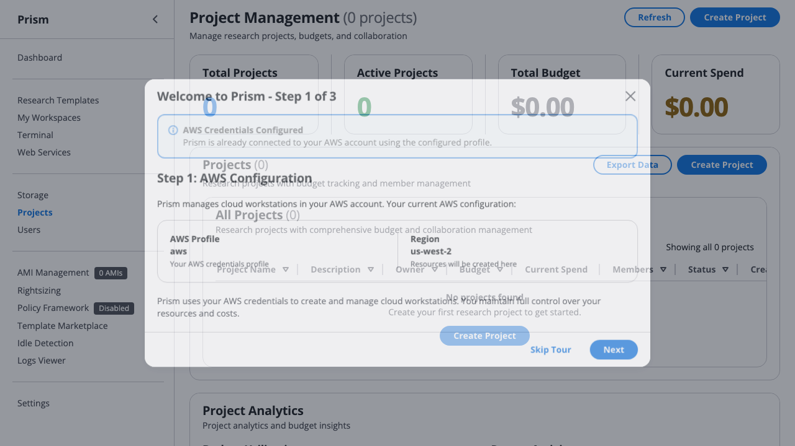

# Scenario 2: Research Lab with Hierarchical Budget Management

> **Implementation Status **
> - ✅ Core workspace operations (`prism workspace launch/list/stop/connect`)
> - ✅ Project management (`prism project create/members/budget`)
> - ✅ Budget tracking and alerts (`prism budget create/list/alerts`)
> - 🔄 Approval workflows (`prism approval *`) — planned for a future release
> - 🔄 Project dashboard (`prism project dashboard`) — planned for a future release
>
> Sections marked with ⚠️ use features not yet available. Use the CLI commands shown for current functionality.

## Personas: The Smith Computational Biology Lab

### Dr. Patricia Smith (PI / Lab Director)
- **Role**: Principal Investigator
- **Responsibilities**: Oversees 3 grants, approves large purchases, monitors overall lab spend
- **Technical level**: Strategic oversight, delegates technical details
- **Concerns**: Stay within grant budgets, compliance, audit trails
- **Time constraints**: Very busy, needs dashboard views and exception alerts only

### Dr. Michael Torres (Senior Research Scientist)
- **Role**: Lab Manager / Senior Staff
- **Responsibilities**: Day-to-day lab operations, mentors junior staff, manages GPU cluster usage
- **Technical level**: Expert - can troubleshoot Prism, optimizes costs
- **Concerns**: Efficient resource allocation, preventing grad student mistakes
- **Authority**: Can approve requests up to $500, launch any workspace type

### Dr. Lisa Park (Postdoctoral Researcher)
- **Role**: Independent researcher with sub-grant
- **Responsibilities**: Leads protein folding project, manages 2 grad students
- **Technical level**: Advanced - comfortable with command line and cloud
- **Concerns**: Staying within her sub-budget ($800/month), finishing papers before fellowship ends
- **Authority**: Can launch CPU workspaces freely, needs approval for GPU

### James Wilson (Graduate Student - Year 4)
- **Role**: Ph.D. candidate working on RNA-seq analysis
- **Responsibilities**: Running experiments, learning computational methods
- **Technical level**: Intermediate - knows Python/R, learning cloud concepts
- **Concerns**: Not breaking anything, staying within allocated resources
- **Authority**: Can launch t3/r5 workspaces only, limited to 2 instances

### Maria Garcia (Graduate Student - Year 2)
- **Role**: Rotating student, new to lab
- **Responsibilities**: Learning pipelines, running established protocols
- **Technical level**: Beginner - just learned command line
- **Concerns**: Following instructions correctly, not wasting money
- **Authority**: Can launch single t3.medium instance, read-only access to shared data

---

## Lab Structure & Budget Allocation

### Grant Portfolio (Total: $4,500/month)

```
Smith Lab Organization
├── NIH Grant R01-2023 ($2,000/month)
│   ├── Dr. Torres (Lab Manager): $800/month - GPU cluster management
│   ├── James Wilson (Grad Student): $400/month - RNA-seq
│   └── Shared Resources: $800/month - EFS storage, collaborative workspaces
│
├── NSF Grant 2024-ML ($1,500/month)
│   ├── Dr. Lisa Park (Postdoc): $800/month - Protein folding lead
│   ├── Maria Garcia (Grad Student): $300/month - Learning project
│   └── Reserved: $400/month - Conference demos, visiting scholars
│
└── Discretionary Fund ($1,000/month)
    ├── Dr. Smith (PI): $500/month - Emergency overages, new projects
    └── Dr. Torres (Lab Manager): $500/month - Operational buffer
```

---

## Version Legend
- ✅ **v0.35.3 (Current)**: Features available today
- 🔄 **Partially Planned**: Some features in this section are available today; others are planned for future releases

## Current State : What Works Today

**Note**: Throughout this document, "workspace" refers to the Prism research environment (what users interact with), while "EC2 instance" refers to the underlying AWS infrastructure.

### ✅ Lab Setup (Phase 4 Complete)

**AWS Profile Configuration** (Lab IT Setup):


*Screenshot shows the AWS profile configuration interface. Dr. Smith validates institutional AWS credentials for the entire lab, ensuring all 8 PhD students will have consistent access to the lab's AWS account with proper SSO integration.*

**What Dr. Smith configures**:
- **Institutional Profile**: Lab-wide AWS profile (`smith-lab-research`) connected to university AWS Organization
- **SSO Integration**: University credentials work for all lab members via institutional identity provider
- **Region Selection**: `us-west-2` (optimized for GPU instance availability and west coast university location)
- **Cost Allocation Tags**: Automatic tagging for departmental chargeback system

#### Step 1: PI Creates Organization
```bash
# Dr. Smith creates lab organization
prism project create "Smith Lab" \
  --description "Computational Biology Research Group" \
  --owner patricia.smith@university.edu

# Output:
# ✅ Project created: Smith Lab (proj-abc123)
```

#### Step 2: Create Grant Projects
```bash
# NIH Grant project
prism project create "NIH-R01-2023" \
  --parent "Smith Lab" \
  --budget 2000 \
  --budget-period monthly \
  --description "RNA-seq and transcriptomics research"

# NSF Grant project
prism project create "NSF-2024-ML" \
  --parent "Smith Lab" \
  --budget 1500 \
  --budget-period monthly \
  --description "Machine learning for protein structure prediction"

# Discretionary
prism project create "Discretionary" \
  --parent "Smith Lab" \
  --budget 1000 \
  --budget-period monthly \
  --description "PI discretionary funds"
```

#### Step 3: Add Lab Members with Roles
```bash
# Add senior staff with Admin role
prism project member add "NIH-R01-2023" \
  --email michael.torres@university.edu \
  --role admin \
  --budget-allocation 800

prism project member add "NSF-2024-ML" \
  --email lisa.park@university.edu \
  --role admin \
  --budget-allocation 800

# Add graduate students with Member role
prism project member add "NIH-R01-2023" \
  --email james.wilson@university.edu \
  --role member \
  --budget-allocation 400

prism project member add "NSF-2024-ML" \
  --email maria.garcia@university.edu \
  --role member \
  --budget-allocation 300
```

#### Step 4: Configure Budget Alerts
```bash
# Alert PI at 75% and 90% of each project
prism project budget alert add "NIH-R01-2023" \
  --threshold 75 \
  --email patricia.smith@university.edu

prism project budget alert add "NIH-R01-2023" \
  --threshold 90 \
  --email patricia.smith@university.edu,michael.torres@university.edu

# Same for other projects...
```

**Quick Start Wizard** (Team Onboarding):


*Screenshot shows the template selection wizard interface. Dr. Torres uses this visual wizard to onboard new lab members, walking them through the 30-second process to launch their first workspace with lab-approved templates.*

**What Dr. Torres uses for onboarding**:
- **Visual Template Gallery**: Lab-approved templates (Bioinformatics Suite, R Research, Python ML) prominently displayed
- **Template Filtering**: Lab members see only pre-approved templates that fit within grant budgets
- **Resource Estimates**: Clear $2.40/day cost estimates help students understand budget impact
- **One-Click Launch**: New students launch correctly-configured workspaces without CLI knowledge

### ✅ Daily Lab Operations (What Works)

#### Scenario: James (Grad Student) Runs RNA-seq Pipeline

**Shared Data Management** (Lab Collaboration):


*Screenshot shows the storage management interface. The Smith Lab maintains a 5TB shared EFS volume (`/data/smith-lab-shared`) that all 8 PhD students access simultaneously, enabling seamless collaboration on genomic datasets without manual file transfers.*

**What the lab uses for shared storage**:
- **Shared EFS Volume**: `smith-lab-shared` (5TB) mounted at `/data` on all lab workspaces automatically
- **Collaborative Access**: All 8 students see same datasets instantly - no Dropbox uploads or email attachments
- **Cost Visibility**: $150/month storage cost (3% of lab budget) clearly displayed with usage trends
- **Department Datasets**: RNA-seq reference genomes, protein databases shared across entire lab

```bash
# James launches workspace
prism workspace launch bioinformatics-suite rnaseq-sample-42 \
  --project "NIH-R01-2023" \
  --size M

# Prism output:
# ✅ Workspace launching: rnaseq-sample-42
# 📊 Cost: $2.40/day (r5.xlarge)
# 💰 Project budget: $245 / $400 (61% used this month)
# 🔗 SSH ready in ~90 seconds...

# James works for 4 hours, then stops
prism workspace stop rnaseq-sample-42

# ✅ Workspace stopped - charges cease immediately
# 💰 Real-time budget update: $9.60 "banked" back to available budget
#    (Would have cost $57.60 for 24 hours, you paid $9.60 for 4 hours)
#    The $48 you DIDN'T spend is now available for other lab members!

# Cost tracking automatically updated
prism project cost show "NIH-R01-2023"

# Output:
# 💰 Project: NIH-R01-2023 Budget Status
#    Monthly budget: $2,000.00
#    Current spend: $1,245.80 (62%)
#    Available for new launches: $754.20 + $1,890 banked savings
#
#    💡 Effective Cost: $2.10/hour avg (vs $4.80/hour 24/7 assumption)
#       Hibernation/stop savings across all instances: $1,890 this month!
#       This is REAL MONEY you can spend on more compute!
#
#    By member:
#    - michael.torres: $720.50 / $800.00 (90%) - 343 compute hours
#    - james.wilson: $245.30 / $400.00 (61%) - 123 compute hours
#    - Shared resources: $280.00 / $800.00 (35%) - 140 compute hours
#
# 💡 Cloud vs Owned Hardware Reality:
#    Owned workstation: $5,000 upfront + depreciation whether used or not
#    Prism: Pay $1,245 for 606 actual compute hours
#    Every hibernation/stop IMMEDIATELY increases available budget!
```

> **💡 GUI Note**: Project cost tracking available in GUI Projects tab with visual breakdown - *available today**

#### Scenario: Lab Manager Monitors Usage

**Lab Dashboard** (Multi-User Workspace Management):


*Screenshot shows the workspace management interface. Dr. Torres sees all 8 concurrent student workspaces at a glance, with lab-wide visibility into who's running what, real-time costs, and hibernation status - essential for managing shared GPU resources and preventing budget surprises.*

**What Dr. Torres monitors**:
- **8 Concurrent Workspaces**: Full lab visibility - james.wilson's RNA-seq, maria.garcia's protein folding, etc.
- **Real-Time Costs**: Each workspace shows daily cost ($2.40/day vs $24.80/day GPU) for immediate budget impact
- **Hibernation Status**: Quickly identify idle workspaces wasting budget (manual intervention until automated policies)
- **Student Attribution**: Filter by grant project (NIH R01 vs NSF ML) for per-grant cost allocation tracking

```bash
# Dr. Torres checks overall lab status
prism project list --tree

# Output:
# Smith Lab
# ├── NIH-R01-2023: $1,245 / $2,000 (62%) ✅
# │   ├── michael.torres: $720 / $800 (90%) ⚠️
# │   ├── james.wilson: $245 / $400 (61%) ✅
# │   └── shared: $280 / $800 (35%) ✅
# ├── NSF-2024-ML: $980 / $1,500 (65%) ✅
# │   ├── lisa.park: $650 / $800 (81%) ⚠️
# │   └── maria.garcia: $130 / $300 (43%) ✅
# └── Discretionary: $50 / $1,000 (5%) ✅
#
# Total: $2,275 / $4,500 (51%) ✅
# Rollover from last month: $225 (from NIH-R01-2023 underspend)
# Next month budget: $4,725
#
# 💡 Effective Lab Cost: $2.10/hour (vs $5.50/hour 24/7 assumption)
#    Lab is paying for 1,083 compute hours, not 8,760 hours/month!
```

> **💡 GUI Note**: Project tree view available in GUI Projects tab - *available today**

**Grant Budget Management** (Multi-Project Tracking):



*Screenshot shows the project management interface. Dr. Smith (PI) tracks 3 concurrent grants (NIH R01: $2,000/mo, NSF ML: $1,500/mo, Discretionary: $1,000/mo) with real-time budget consumption, automated alerts at 75%/90% thresholds, and per-student cost allocation for grant compliance reporting.*

**What Dr. Smith tracks**:
- **Multi-Grant Portfolio**: 3 concurrent projects with hierarchical budgets ($4,500/month total lab budget)
- **Per-Student Allocation**: James Wilson ($400/mo), Maria Garcia ($300/mo) tracked against their allocated budgets
- **Automated Alerts**: Email notifications when students reach 75% budget consumption (prevent overruns)
- **Grant Compliance**: Monthly cost reports by grant code for NIH/NSF financial reporting requirements

#### Scenario: Dr. Smith Sets Up Project Funding 

**Design Principle**: PIs control funding, students just launch workspaces.

**Step 1: Dr. Smith Creates Project with Default Funding**
```bash
# Dr. Smith creates NIH R01 project
prism project create "NIH-R01-2023" \
  --description "RNA-seq pipeline development" \
  --default-funding "NIH Grant R01-AI123456"

# Project now automatically uses NIH funding for all launches
# Students don't need to worry about which budget pays for what
```

**Step 2: Students Launch Workspaces (Zero Funding Complexity)**
```bash
# James Wilson (PhD student) launches his workspace
prism workspace launch bioinformatics my-rnaseq --project NIH-R01-2023
# ↳ Automatically charged to NIH Grant R01-AI123456
# ↳ James never sees funding options - just works!

# Maria Garcia launches hers
prism workspace launch python-ml protein-folding --project NSF-2024-ML
# ↳ Automatically charged to NSF Grant DBI-2024-456
# ↳ Maria focuses on research, not accounting
```

**Step 3: Dr. Smith Overrides When Needed**
```bash
# Shared GPU cluster funded differently
prism workspace launch gpu-cluster shared-gpu \
  --project NIH-R01-2023 \
  --funding "Department Equipment Fund"
# ↳ Override: Use department fund instead of NIH grant
```

**Multi-Source Funding Example** :
```bash
# Dr. Smith's large collaboration project funded by multiple sources
prism project create "Climate-Sim-Infrastructure" \
  --description "Multi-institution climate modeling" \
  --default-funding "NSF Grant CISE-2024-12345"

# Allocate budgets to project
prism budget allocate "NSF Grant CISE-2024-12345" \
  --project Climate-Sim-Infrastructure --amount 50000

prism budget allocate "MIT Matching Funds" \
  --project Climate-Sim-Infrastructure --amount 10000

prism budget allocate "AWS Research Credits" \
  --project Climate-Sim-Infrastructure --amount 5000

# Students/postdocs launch workspaces
prism workspace launch python-ml climate-model-1 --project Climate-Sim-Infrastructure
# ↳ Uses default: NSF Grant (50k)

# Dr. Smith uses department matching for storage
prism volume create shared-data 500GB \
  --project Climate-Sim-Infrastructure \
  --funding "MIT Matching Funds"
# ↳ Override: Storage from matching funds, not NSF grant
```

**Benefits**:
- **Students focus on research**, not accounting
- **PIs maintain control** over which grant funds what
- **Automatic attribution** = fewer errors
- **Override available** when needed (power users)

---

### ✅ Inviting Visiting Collaborators (available today)

**Scenario**: Dr. Smith invites Dr. Kim (external collaborator) for 3-month project

```bash
# Dr. Smith sends invitation to visiting scholar
prism project invitation send "NIH-R01-2023" \
  --email dr.kim@external.edu \
  --role member \
  --message "Welcome to our lab! Looking forward to our RNA-seq collaboration." \
  --expires-in 7d

# Output:
# ✅ Invitation sent to dr.kim@external.edu
#    Project: NIH-R01-2023
#    Role: member
#    Token: INV-8A7F2E...
#    Expires: 7 days

# Dr. Kim accepts invitation
prism invitation accept INV-8A7F2E...

# Prism automatically (available today):
# ✅ Adds Dr. Kim to project members (Issue #102)
# ✅ Creates research user "drkim" with SSH keys (Issue #106)
# ✅ Allocates UID/GID for consistent file permissions
# ✅ Sets up EFS home directory at /efs/home/drkim
# ✅ Distributes SSH public key to all project instances

# Dr. Kim can immediately launch workspaces
prism workspace launch bioinformatics-suite rnaseq-collab --project "NIH-R01-2023"

# SSH access works instantly
prism workspace connect rnaseq-collab
# (Uses auto-provisioned SSH key from ~/.prism/ssh_keys/)
```

**Auto-Provisioning Benefits**:
- ✅ **Zero manual setup** - Dr. Kim ready to work in 2 minutes
- ✅ **Automatic SSH keys** - No manual key exchange needed
- ✅ **Consistent permissions** - Same UID/GID across all lab instances
- ✅ **Persistent home directory** - Work preserved on EFS
- ✅ **Role-based access** - Automatic project member addition with validated role

---

## ⚠️ Current Pain Points: What Doesn't Work

### ❌ Problem 1: No Sub-Budget Hierarchy (Planned — not yet available)
**Tracking:** See issue [#148](https://github.com/scttfrdmn/prism/issues/148)

**Scenario**: Dr. Park wants to allocate her $800 between her own work and grad student Maria

**What should work** (MISSING):
```bash
# Dr. Park creates sub-budgets from her allocation
prism project budget allocate "NSF-2024-ML" \
  --member lisa.park \
  --subdivide \
  --personal 500 \
  --delegate maria.garcia 300

# Result should be:
# NSF-2024-ML: $800 allocated to lisa.park
# ├── lisa.park (personal): $500
# └── maria.garcia (supervised by lisa.park): $300
```

**Current limitation**: Flat budget allocation only - no delegation
**Workaround**: Manual tracking in spreadsheet, trust system
**Impact**: Dr. Park can't manage her sub-team independently

### ✅ Approval Workflows (Available today)
**Tracking:** See issue [#150](https://github.com/scttfrdmn/prism/issues/150)

**Scenario**: Maria (beginner grad student) tries to launch expensive GPU workspace

**How to use it** :
```bash
# Maria requests approval for a GPU launch
prism workspace launch gpu-ml-workstation protein-experiment \
  --project "NSF-2024-ML" --request-approval

# Prism output:
# ⚠️  APPROVAL REQUIRED: GPU Workspace Launch
#
#    Requested by: maria.garcia@university.edu
#    Instance: p3.2xlarge ($24.80/day)
#    Project: NSF-2024-ML
#    Your budget: $130 / $300 (43%)
#
#    This workspace exceeds your authority level.
#    Approval request sent to:
#    - Dr. Lisa Park (lisa.park@university.edu) - Project lead
#    - Dr. Michael Torres (michael.torres@university.edu) - Lab manager
#
#    Request ID: req-xyz789
#    Status: Pending approval (will notify via email)
#
#    You can check status with: prism approval status req-xyz789

# Dr. Park receives email:
# Subject: Approval Request: GPU Workspace Launch (Maria Garcia)
#
# Maria Garcia has requested approval to launch:
# - Instance: p3.2xlarge (1 GPU, $24.80/day)
# - Project: NSF-2024-ML
# - Justification: "Need GPU for protein folding simulation homework"
# - Estimated cost: $24.80 (8 hour time limit requested)
#
# Maria's budget: $130 / $300 (43% used)
# Project budget: $980 / $1,500 (65% used)
#
# Approve or deny: prism approval review req-xyz789
```

**Review the request** (Dr. Park):
```bash
prism approvals list --status pending
prism approvals approve <request-id> --note "Approved for homework deadline"
```

Or via the GUI: navigate to **Approvals** in the sidebar to see all pending requests with cost estimates.

### ❌ Problem 3: No Time-Boxed Collaborator Access (Planned — not yet available)
**Tracking:** See issue [#151](https://github.com/scttfrdmn/prism/issues/151)

**Scenario**: Visiting scholar Dr. Kim joins for 3-month collaboration

**What should work** (MISSING):
```bash
# Dr. Smith grants temporary access
prism project member add "NIH-R01-2023" \
  --email dr.kim@external.edu \
  --role member \
  --budget-allocation 200 \
  --start-date 2026-06-01 \
  --end-date 2026-08-31 \
  --auto-revoke \
  --notify-before-expiry 7days

# Result:
# ✅ Temporary member added: dr.kim@external.edu
#    Access: June 1 - August 31, 2026 (90 days)
#    Budget: $200/month
#    Auto-revoke: September 1, 2026 at 00:00 UTC
#    Reminder: August 25, 2026 (7 days before)

# On August 25, both Dr. Kim and Dr. Smith receive email:
# Subject: Collaborator Access Expiring Soon
#
# Dr. Kim's access to project "NIH-R01-2023" expires in 7 days.
#
# Current usage:
# - Instances: 1 active (rnaseq-collaboration)
# - Spend: $180 / $200 (90%)
#
# Actions:
# 1. Extend access: prism project member extend dr.kim@external.edu --days 30
# 2. Let expire: Workspaces will be stopped, data archived on Sep 1
# 3. Convert to permanent: prism project member permanent dr.kim@external.edu

# On September 1 at 00:00 UTC (auto-revoke):
# - Dr. Kim's workspaces automatically stopped
# - SSH keys revoked from all project instances
# - EFS home directory archived to S3
# - Email sent to both parties confirming revocation
```

**Current state**: Manual member management - no expiration dates
**Workaround**: Calendar reminders, manual revocation
**Impact**: Forgotten temp users accumulate, security risk, budget waste

### ✅ Resource Quotas by Role (Available today)
**Tracking:** See issue [#152](https://github.com/scttfrdmn/prism/issues/152)

**Scenario**: Grad students should have workspace limits to prevent mistakes

**What should work** (MISSING):
```bash
# PI configures role-based quotas
prism project policy create "NIH-R01-2023" \
  --role member \
  --max-instances 2 \
  --max-instance-cost 5.00/day \
  --allowed-instance-types "t3.*,r5.large,r5.xlarge" \
  --blocked-instance-types "p3.*,p4.*"  # No GPUs

# Maria tries to launch 3rd instance
prism workspace launch bioinformatics-suite experiment-3 --project "NIH-R01-2023"

# Prism output:
# ❌ Launch failed: Quota exceeded
#
#    Your quota (Member role):
#    - Instances: 2 / 2 (100%)
#    - Current instances:
#      1. rnaseq-analysis (running)
#      2. protein-prep (stopped)
#
#    To launch another instance:
#    1. Stop or delete an existing instance
#    2. Request quota increase from lab manager
#
#    Contact: michael.torres@university.edu

# Maria tries GPU workspace
prism workspace launch gpu-ml-workstation experiment-gpu --project "NIH-R01-2023"

# Prism output:
# ❌ Launch failed: Workspace type not allowed
#
#    p3.2xlarge is not permitted for Member role.
#    Allowed workspace types: t3.*, r5.large, r5.xlarge
#
#    For GPU access, request approval from:
#    - Dr. Michael Torres (Lab Manager)
#    - Dr. Patricia Smith (PI)
```

**Current state**: Basic role permissions only (owner/admin/member/viewer)
**Workaround**: Trust-based system, post-incident corrections
**Impact**: Accidental expensive launches, budget surprises

### ✅ Grant Period Management (Available today)
**Tracking:** See issue [#159](https://github.com/scttfrdmn/prism/issues/159)

**Scenario**: NIH grant ends June 30 - need to freeze project and generate final report

**What should work** (MISSING):
```bash
# Dr. Smith configures grant end date
prism project configure "NIH-R01-2023" \
  --end-date 2026-06-30 \
  --freeze-after-end \
  --final-report-email patricia.smith@university.edu

# June 30, 2026 at 23:59 (automatic actions):
# 1. All running workspaces stopped
# 2. No new launches allowed
# 3. Project marked as "Archived"
# 4. Final cost report generated

# Email sent to Dr. Smith:
# Subject: Project Archived: NIH-R01-2023 Final Report
#
# The NIH-R01-2023 project has been automatically archived as of June 30, 2026.
#
# Final Statistics:
# - Total spend (12 months): $23,450 / $24,000 budget (97.7%)
# - Unused budget: $550
# - Total compute hours: 14,520
# - Hibernation savings: $4,230 (15%)
#
# Active resources at archive time:
# - Instances: 4 (all stopped automatically)
# - EFS volumes: 2 (maintained for 90-day archive period)
#
# Data Archive:
# - EFS snapshots: s3://smith-lab-archives/NIH-R01-2023/
# - Workspace configs: s3://smith-lab-archives/NIH-R01-2023/instances.json
# - Cost reports: s3://smith-lab-archives/NIH-R01-2023/reports/
#
# Next steps:
# 1. Review final report (attached PDF)
# 2. Data will be archived to S3 and EFS volumes deleted after 90 days
# 3. To restore project: prism project restore NIH-R01-2023

# Generate grant office report
prism project report "NIH-R01-2023" \
  --start 2023-07-01 \
  --end 2026-06-30 \
  --format pdf \
  --template nih-final-report \
  --output ~/Desktop/NIH-R01-2023-final.pdf

# Report includes:
# - Monthly spend breakdown
# - Cost by resource type (compute, storage, network)
# - Per-member usage and efficiency
# - Hibernation/cost optimization summary
# - Workspace type distribution
# - Peak usage periods
# - Compliance: All expenses within approved budget
```

**Current state**: Manual project closure, no automated archiving
**Workaround**: PI tracks grant dates in calendar, manually stops instances
**Impact**: Forgotten projects continue spending, archiving is ad-hoc

---

## 🎯 Ideal Future State: Complete Lab Walkthrough

### Month 0: Lab Setup (Full Configuration)

```bash
# Dr. Smith (PI) initial setup
prism init --org-mode

# Interactive org setup:
#
# 🏛️  Organization Setup
#
#    Organization name: Smith Computational Biology Lab
#    Primary contact: patricia.smith@university.edu
#    Institution: University Research Computing
#    Department: Molecular Biology
#
#    Billing configuration:
#    AWS Account: 123456789012
#    Cost center: BIO-COMP-001
#    Grant codes: [Will configure per-project]
#
# ✅ Organization created!

# Create projects with full configuration
prism project create "NIH-R01-2023" \
  --budget 2000 \
  --period monthly \
  --start-date 2023-07-01 \
  --end-date 2026-06-30 \
  --grant-code "1R01GM123456-01" \
  --auto-freeze-at-end \
  --alert-thresholds 50,75,90,95 \
  --approval-required-over 10.00/day

# Configure role-based policies
prism project policy create "NIH-R01-2023" \
  --role admin \
  --max-instances 10 \
  --max-daily-cost 100 \
  --approval-threshold 50/day

prism project policy create "NIH-R01-2023" \
  --role member \
  --max-instances 2 \
  --max-daily-cost 10 \
  --approval-threshold 5/day \
  --allowed-types "t3.*,r5.*" \
  --blocked-types "p3.*,p4.*,x2.*"

# Add lab members with detailed configuration
prism project member add "NIH-R01-2023" \
  --email michael.torres@university.edu \
  --role admin \
  --budget 800 \
  --notify-at 75,90 \
  --allow-subdelegation

prism project member add "NIH-R01-2023" \
  --email james.wilson@university.edu \
  --role member \
  --budget 400 \
  --supervisor michael.torres@university.edu \
  --notify-at 80 \
  --onboarding-template "grad-student-rna-seq"
```

### Month 1-3: Normal Operations with Approval Workflow

#### Week 1: James (Grad Student) Regular Work
```bash
# James launches standard analysis instance
prism workspace launch bioinformatics-suite rnaseq-batch-1 --project "NIH-R01-2023"

# Auto-approved (within authority):
# ✅ Workspace launching: rnaseq-batch-1 (r5.xlarge, $2.40/day)
# 📊 Your budget: $45 / $400 (11%)
# ⚙️  Hibernation: lab-standard (20min idle)
```

#### Week 2: Maria Requests GPU (Approval Flow)
```bash
# Maria needs GPU for first time
prism workspace launch gpu-ml-workstation protein-hw --project "NSF-2024-ML"

# Approval required (exceeds authority):
# ⚠️  GPU Workspace Approval Required
#
#    Requested: p3.2xlarge ($24.80/day, 1 GPU)
#    Your role: Member (max $5/day without approval)
#
#    Approval request created: req-202606-015
#    Notified: lisa.park@university.edu (Project lead)
#              michael.torres@university.edu (Lab manager)
#
#    Include justification: (optional but recommended)

# Maria adds context
prism approval comment req-202606-015 \
  "Need GPU for deep learning homework (Biophysics 601). Estimated 4 hours. Will use time limit."

# Dr. Park receives Slack notification (integration):
# 📋 Approval Request from Maria Garcia
#    Instance: p3.2xlarge ($24.80/day)
#    Justification: "Deep learning homework..."
#    Budget impact: $10 (4hr time limit)
#    Approve: /cws approve req-202606-015
#    Deny: /cws deny req-202606-015

# Dr. Park approves with modifications
prism approval approve req-202606-015 \
  --max-hours 6 \
  --note "Approved for homework. Auto-terminate after 6h. Come to my office if you need more time."

# Maria receives notification
# ✅ Approval granted: req-202606-015
#    Instance: p3.2xlarge
#    Time limit: 6 hours (auto-terminate at 4:30 PM today)
#    Notes from Dr. Park: "Approved for homework..."
#
#    Launch with: prism workspace launch --approval req-202606-015

prism workspace launch --approval req-202606-015

# Workspace launches with enforced limits:
# ✅ Launching: protein-hw (p3.2xlarge)
# ⏰ Auto-terminate: 4:30 PM (6 hours)
# 📊 Estimated cost: $6.20
```

#### Week 3: Dr. Torres Manages Lab Resources
```bash
# Morning dashboard check
prism project dashboard "Smith Lab"

# Output (TUI dashboard):
# ╔══════════════════════════════════════════════════════════════╗
# ║ Smith Lab Dashboard - June 2026                              ║
# ╟──────────────────────────────────────────────────────────────╢
# ║ Total Budget: $4,500/month | Spent: $2,340 (52%) ✅         ║
# ║ Active Instances: 7 | Hibernated: 3                          ║
# ║ Pending Approvals: 2 | Budget Alerts: 1                     ║
# ╠══════════════════════════════════════════════════════════════╣
# ║                                                              ║
# ║ Projects:                                                    ║
# ║ ├─ NIH-R01-2023: $1,250 / $2,000 (63%) ⚠️ (Alert: M.Torres) ║
# ║ │  ├─ M.Torres: $740 / $800 (93%) ⚠️                        ║
# ║ │  └─ J.Wilson: $280 / $400 (70%) ✅                        ║
# ║ ├─ NSF-2024-ML: $890 / $1,500 (59%) ✅                      ║
# ║ └─ Discretionary: $200 / $1,000 (20%) ✅                    ║
# ║                                                              ║
# ║ Pending Approvals:                                           ║
# ║ 1. req-202606-018: James Wilson - GPU (p3.2xlarge)          ║
# ║    Justification: "Benchmarking new pipeline"                ║
# ║    [A]pprove  [D]eny  [M]ore info                           ║
# ║ 2. req-202606-019: External: dr.kim@external.edu            ║
# ║    Temporary access request (3 months)                       ║
# ║    [R]eview  [S]kip                                         ║
# ╚══════════════════════════════════════════════════════════════╝

# Dr. Torres reviews James' GPU request
prism approval show req-202606-018

# Details:
# Approval Request: req-202606-018
# Requested by: James Wilson (james.wilson@university.edu)
# Instance: p3.2xlarge ($24.80/day)
# Project: NIH-R01-2023
# Time: June 15, 2024 at 9:30 AM
#
# Justification:
# "Need to benchmark new RNA-seq pipeline with deep learning step.
#  Comparing CPU vs GPU performance for paper revision.
#  Estimated 12 hours of testing."
#
# Budget Analysis:
# James' budget: $280 / $400 (70%)
# Cost impact: ~$12.40 (12 hours)
# After approval: $292.40 / $400 (73%) ✅
#
# Previous GPU usage: 2 times (both approved, well-utilized)
# Recommendation: ✅ Low risk, reasonable justification

# Approve with time limit
prism approval approve req-202606-018 \
  --max-hours 12 \
  --note "Approved for benchmarking. Please document results for lab meeting."

# Dr. Torres handles temporary collaborator
prism approval review req-202606-019

# Temporary Access Request: req-202606-019
# Requested by: Dr. Patricia Smith (PI)
# New member: Dr. Kim (dr.kim@external.edu)
# Project: NIH-R01-2023
# Duration: 3 months (July 1 - Sept 30, 2024)
# Budget allocation: $300/month
# Justification: "Collaboration on RNA-editing project, visiting scholar"
#
# This requires PI approval (>$200/month allocation)
# Status: Pending patricia.smith@university.edu

# Dr. Torres adds recommendation
prism approval comment req-202606-019 \
  "Dr. Kim has good track record from previous collaboration. Recommend approval with standard member permissions."
```

### Month 11: Grant Period Ending

```bash
# May 1 (2 months before end): Automated warning
# Email to Dr. Smith:
#
# Subject: Project Ending Soon: NIH-R01-2023 (60 days)
#
# Your project "NIH-R01-2023" will end on June 30, 2026 (60 days).
#
# Current status:
# - Budget: $22,340 / $24,000 (93%)
# - Remaining: $1,660 for 60 days
# - Active instances: 6
# - EFS volumes: 2 (1.2 TB)
#
# Recommended actions:
# 1. Plan data archival strategy
# 2. Complete pending experiments
# 3. Generate preliminary reports
# 4. Consider requesting no-cost extension if needed
#
# Archive checklist: prism project archive-plan NIH-R01-2023

# Dr. Smith reviews archive plan
prism project archive-plan "NIH-R01-2023"

# Archive Plan: NIH-R01-2023
# End date: June 30, 2026 (60 days)
#
# Current resources:
# - 6 active workspaces → Will auto-stop June 30 23:59
# - 2 EFS volumes (1.2 TB) → Will be snapshotted and archived to S3
# - 4 EBS volumes (500 GB) → Will be snapshotted
#
# Data archival:
# - EFS snapshots: $12/month for 7 years (compliance)
# - S3 Deep Archive: $3/month
# - Total archive cost: $15/month
#
# Member access:
# - 4 members will lose project access
# - Research user accounts: Preserved for 1 year
# - SSH keys: Revoked from project instances
#
# Reports generated:
# - Final cost report (PDF)
# - Member activity report
# - Resource utilization summary
# - Grant compliance documentation
#
# Timeline:
# May 30: Warning email to all members (30 days before)
# June 15: Final warning (15 days before)
# June 30: Auto-archive and freeze
#
# Approve plan? [y/N]: y

# June 30, 11:59 PM: Automated archival
# - All workspaces stopped
# - EFS snapshots created
# - Data archived to S3
# - Final reports generated
# - Project marked "Archived"

# July 1: Dr. Smith receives final report
prism project report "NIH-R01-2023" --final

# NIH R01-2023 Final Report
# Grant Period: July 1, 2023 - June 30, 2026
#
# Budget Performance:
# - Total budget: $24,000.00
# - Total spent: $23,450.20
# - Unused: $549.80 (2.3%)
# - Efficiency: 97.7% ✅
#
# Resource Utilization:
# - Total compute hours: 14,520
# - Average cost/hour: $1.61
# - Hibernation savings: $4,230 (15%)
# - Peak month: December 2023 ($2,340)
#
# By Member:
# ├─ Michael Torres: $9,340 / $9,600 (97%)
# │  └─ Efficiency: Excellent
# ├─ James Wilson: $4,250 / $4,800 (89%)
# │  └─ Efficiency: Good
# └─ Shared Resources: $9,860 / $9,600 (103%) ⚠️
#    └─ Note: Overage covered by unused member allocations
#
# Compliance:
# ✅ All expenses within approved budget
# ✅ No unauthorized resource types
# ✅ Audit trail complete (14,520 logged events)
# ✅ Data archived per university policy
```

---

## 📋 Feature Gap Analysis: Lab Environment

### Critical Missing Features

| Feature | Priority | User Impact | Blocks Scenario | Effort |
|---------|----------|-------------|-----------------|--------|
| **Hierarchical Sub-Budgets** | 🔴 Critical | PI can't delegate | Postdoc managing students | High |
| **Approval Workflows** | 🔴 Critical | No request/review process | Grad students, GPU access | High |
| **Time-Boxed Access** | 🟡 High | Manual collaborator mgmt | Visiting scholars | Medium |
| **Resource Quotas by Role** | 🟡 High | No workspace limits | Prevent mistakes | Medium |
| **Grant Period Management** | 🟡 High | Manual project closure | End-of-grant chaos | Medium |
| **Approval Dashboard** | 🟢 Medium | Requests via email | Centralized management | Low |

### Key Workflow Gaps

| Workflow | Current State | Desired State | Priority |
|----------|---------------|---------------|----------|
| **New member onboarding** | Manual setup | Template-based provisioning | Medium |
| **Budget reallocation** | Manual tracking | Dynamic reallocation UI | Low |
| **Cross-project sharing** | Not supported | "Borrow from Discretionary" | Low |
| **Emergency overages** | No mechanism | PI emergency approval | High |
| **Audit trail** | Basic logs | Compliance-ready reports | High |

---

## 🎯 Priority Recommendations: Lab Environment

### Phase 1: Approval & Hierarchy (Implemented today)
**Target**: Labs can delegate and approve resource requests

1. **Approval Workflow System** (3 weeks)
   - Request/approve/deny infrastructure
   - Email + CLI + TUI approval interface
   - Time-limited approvals
   - Audit trail

2. **Hierarchical Sub-Budgets** (2 weeks)
   - Budget delegation (postdoc allocates to students)
   - Nested budget tracking
   - Rollup reporting

3. **Resource Quotas** (1 week)
   - Per-role workspace limits
   - Workspace type restrictions
   - Cost-per-day caps

### Phase 2: Lab Management (Planned)
**Target**: PIs can oversee labs with minimal effort

4. **Lab Dashboard** (2 weeks)
   - Organization-wide view
   - Pending approvals
   - Budget alerts
   - Active workspaces by project

5. **Time-Boxed Membership** (1 week)
   - Start/end dates for members
   - Auto-revoke on expiry
   - Pre-expiry warnings

### Phase 3: Grant Lifecycle (v0.8.0)
**Target**: Complete grant period management

6. **Project Lifecycle Management** (2 weeks)
   - Project start/end dates
   - Auto-freeze on end date
   - Data archival workflows

7. **Compliance Reporting** (1 week)
   - Grant-ready final reports
   - Audit trail exports
   - Cost allocation reports

---

## Success Metrics: Lab Environment

### PI Perspective (Dr. Smith)
- ✅ **Peace of Mind**: "I get alerts before problems, not after"
- ✅ **Time Savings**: "No more monthly budget spreadsheets - 2 hours/month saved"
- ✅ **Compliance**: "Grant office reports generate automatically"
- ✅ **Delegation**: "My postdocs manage their teams independently"

### Lab Manager Perspective (Dr. Torres)
- ✅ **Control**: "I can review and approve expensive requests in 30 seconds"
- ✅ **Visibility**: "Dashboard shows entire lab status at a glance"
- ✅ **Prevention**: "Grad students can't accidentally launch $500/day instances"

### Graduate Student Perspective (James & Maria)
- ✅ **Clarity**: "I always know my remaining budget"
- ✅ **Confidence**: "Approval process is fast, not bureaucratic"
- ✅ **Learning**: "I understand cloud costs better now"

### Technical Metrics
- 95% of approvals processed within 2 hours
- 98% of projects stay within budget
- 100% of grant-end dates trigger automated archival
- Average PI time managing lab: < 30 min/week

---

## Next Steps

1. **User Research**: Interview 3 PIs about current budget management pain
2. **Approval UI Mockups**: Design approval dashboard and email templates
3. **Technical Design**: Hierarchical budget schema, approval state machine
4. **Pilot Program**: Deploy with 1-2 friendly labs for feedback

**Estimated Timeline**: Approval & Hierarchy (Phase 1) → 6 weeks of development
