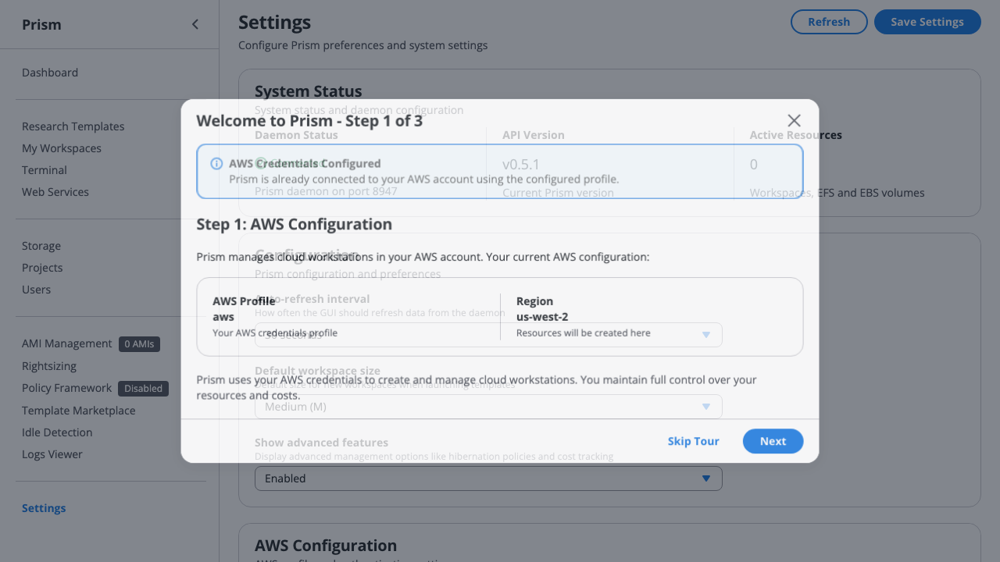
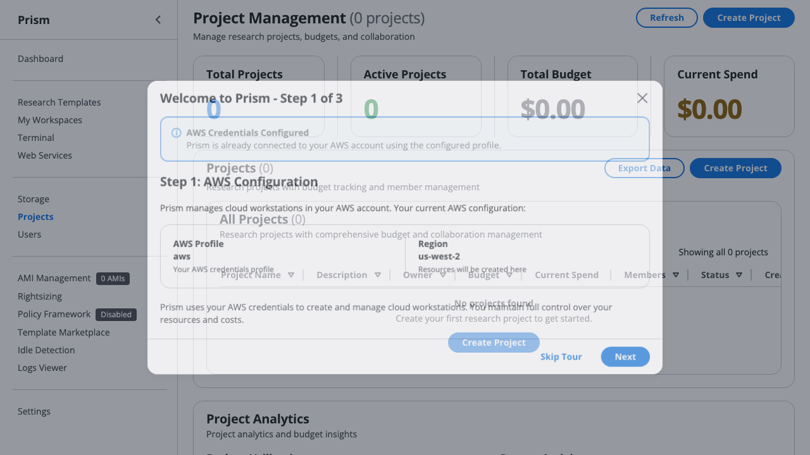
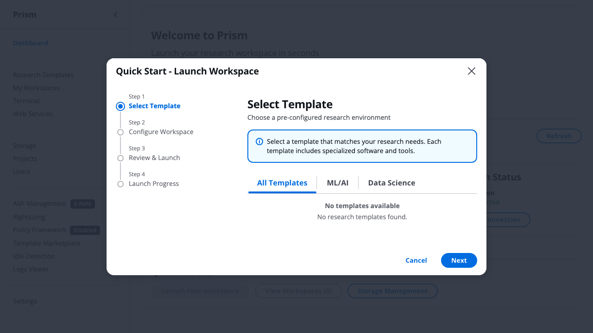

# Scenario 3: University Class Management

## Personas: CS 229 - Machine Learning (Fall 2024)

### Professor Dr. Jennifer Martinez (Instructor)
- **Role**: Course instructor, AWS account owner
- **Responsibilities**: Course design, content delivery, grade computation, budget management
- **Technical level**: ML expert, limited cloud admin experience
- **Concerns**: Student data privacy, academic integrity, staying within IT budget
- **Time constraints**: Teaching 2 courses + research - needs automation
- **Authority**: Full control over course project, final grade responsibility

### Alex Thompson (Teaching Assistant - Head TA)
- **Role**: Lead TA, manages 2 other TAs, primary student support
- **Responsibilities**: Office hours, debugging student code, grading assignments
- **Technical level**: Graduate student (expert) - CS PhD candidate
- **Concerns**: Helping struggling students debug remotely, preventing cheating
- **Needs**: View/access student workspaces for debugging, monitor student progress
- **Authority**: Can SSH into student workspaces, extend deadlines, reset instances

### Priya Sharma & Kevin Wong (Teaching Assistants)
- **Role**: Section TAs, grade assignments, hold office hours
- **Technical level**: Advanced (MS students)
- **Responsibilities**: Specific section support, grading
- **Authority**: View student workspaces (read-only), submit grades

### 50 Students (Various backgrounds)
**Example students**:
- **Emily Chen (Undergraduate CS Major)**: Experienced with Python, first cloud class
- **David Kim (Graduate Statistics)**: R expert, new to deep learning and cloud
- **Sophie Martinez (Undergraduate Psychology)**: Required class, minimal coding background
- **International students**: Concerned about costs ("Will this cost me money?")

**Common concerns**:
- "Will I accidentally spend money?"
- "What if I forget to stop my instance?"
- "Can I work from home?"
- "What if my code doesn't work - how do I get help?"
- "When is the deadline?" (forget to check Canvas)

---

## Course Structure

### Course Details
- **Course**: CS 229 - Machine Learning
- **Term**: Fall 2024 (August 26 - December 13, 15 weeks)
- **Enrollment**: 50 students
- **Format**: Weekly assignments (10), 2 projects, final exam
- **Budget**: $1,200 from IT department ($24/student for semester)
- **Shared Resources**: Course datasets (100GB), lecture notebooks

### Technical Requirements
- **Compute**: CPU workspaces sufficient (t3.medium for most students)
- **Special needs**: Final project may need t3.large for training
- **Storage**: Shared read-only course materials, individual student workspace
- **Security**: Students isolated, no SSH key sharing, audit trail required

---

## Current State (v0.5.8): What Works Today

### ✅ Pre-Semester Setup (What Works)

**University IT Validates AWS Configuration** (before course setup):



*Screenshot shows AWS profile configuration interface. For university courses managing 120+ students, IT administrators validate institutional AWS credentials and configure department billing accounts before professors begin course setup.*

**What University IT configures**:
- **AWS Account**: Department-funded AWS account (e.g., "CS-Department-Edu")
- **Region Selection**: University-preferred region (typically us-east-1 for .edu discounts)
- **Billing Tags**: Automated tags for chargeback to CS Department budget
- **Bulk Access**: Credentials shared with course instructors (Prof. Johnson) via SSO

#### Week 1 (August): Dr. Martinez Creates Course Project
```bash
# Create course project
prism project create "CS229-Fall2024" \
  --description "Machine Learning - Fall 2024" \
  --budget 1200 \
  --budget-period semester \
  --owner jennifer.martinez@university.edu

# Add TAs as administrators
prism project member add "CS229-Fall2024" \
  --email alex.thompson@university.edu \
  --role admin

prism project member add "CS229-Fall2024" \
  --email priya.sharma@university.edu \
  --role viewer

prism project member add "CS229-Fall2024" \
  --email kevin.wong@university.edu \
  --role viewer
```

#### Week 2: Create Shared Course Materials (EFS)

**120 Individual Student Storage Volumes** (assignment submission isolation):


*Screenshot shows EFS and EBS storage management interface. For CS 473 with 120 students, Prof. Johnson provisions 120 individual 50GB EBS volumes for student assignment work, plus 1 shared read-only EFS volume for course datasets - ensuring academic integrity through complete workspace isolation.*

**What Prof. Johnson manages in Storage**:
- **120 EBS Volumes**: Individual 50GB volumes per student (homework1-student001 through homework1-student120)
- **Bulk Operations**: "Stop all after class" (3:15 PM), "Hibernate overnight" (auto-resume 8:00 AM)
- **Shared EFS**: 1 read-only 500GB EFS for course datasets (mounted to all 120 workspaces)
- **Assignment Isolation**: Students cannot access each other's EBS volumes (academic integrity)

```bash
# Create shared read-only storage for course content
prism volume create cs229-course-materials \
  --size 100GB \
  --project "CS229-Fall2024"

# Mount to temporary workspace for setup
prism launch ubuntu temp-setup
prism volume mount cs229-course-materials temp-setup

# Upload course materials (via SSH)
prism ssh temp-setup
# (Inside instance)
$ cd /mnt/cs229-course-materials
$ mkdir -p datasets notebooks lectures
$ aws s3 sync s3://cs229-course-bucket/ ./datasets/
$ git clone https://github.com/prof-martinez/cs229-notebooks ./notebooks/
$ exit

# Unmount and delete temp instance
prism volume unmount cs229-course-materials temp-setup
prism delete temp-setup

# Mark volume as "shared read-only" for students
# (Manual: Configure EFS permissions)
```

#### Week 3: Add Students Before Semester
```bash
# Bulk import from Canvas/university system
prism project member import "CS229-Fall2024" \
  --csv students.csv \
  --role member \
  --default-budget 24

# students.csv format:
# email,name,section
# emily.chen@university.edu,Emily Chen,Section A
# david.kim@university.edu,David Kim,Section B
# ...
```

---

## ⚠️ Current Pain Points: What Doesn't Work

### ❌ Problem 1: No TA "God Mode" (Debug Access)
**Scenario**: Sophie (struggling student) can't get assignment working, asks for help in office hours

**What should happen** (MISSING):
```bash
# Sophie's current state
prism list
# Output:
# Instances:
# - ml-hw3 (t3.medium): running
# - Jupyter notebook at: http://54.123.45.67:8888
# - Token: abc123xyz (can't figure out what's wrong)

# Alex (Head TA) helps during office hours
# Sophie in Zoom: "My code crashes but I don't know why"

# Alex needs to see Sophie's environment
prism ta debug-session --student sophie.martinez@university.edu

# Prism output:
# 🔍 TA Debug Session Request
#
#    Student: Sophie Martinez (sophie.martinez@university.edu)
#    Your role: TA (alex.thompson@university.edu)
#    Project: CS229-Fall2024
#
#    Student instances:
#    1. ml-hw3 (t3.medium, running)
#       └─ Jupyter: http://54.123.45.67:8888
#
#    Debug access options:
#    a) View-only Jupyter session (screen share)
#    b) SSH access (full control)
#    c) Jupyter notebook export (download .ipynb)
#
#    All actions logged for academic integrity.
#
# Choice [a/b/c]: b

# Alex gets temporary SSH access
prism ta ssh ml-hw3 --student sophie.martinez@university.edu

# SSH session starts:
# ┌─────────────────────────────────────────────────┐
# │ ⚠️  TA Debug Session Active                     │
# │ Student: Sophie Martinez                        │
# │ Instance: ml-hw3                                │
# │ Logged: All commands recorded                   │
# │ Session expires: 30 minutes                     │
# └─────────────────────────────────────────────────┘
#
# sophie@ml-hw3:~$ cd homework3
# sophie@ml-hw3:~/homework3$ python train.py
# Error: CUDA out of memory (allocating 8GB on CPU instance)
#
# (Alex realizes: Sophie trying to use GPU code on CPU instance)

# Alex can see but not edit student code (view-only by default)
# To guide Sophie: exit and provide instructions via Zoom

# Alternative: Alex sends fix suggestion
prism ta annotate ml-hw3 --student sophie.martinez@university.edu \
  --message "Issue found: You're using GPU code on CPU instance. Change device='cuda' to device='cpu' in train.py line 42."

# Sophie sees message when she SSHs back in:
# ┌─────────────────────────────────────────────────┐
# │ 📝 TA Annotation from Alex Thompson              │
# │ Time: 10:45 AM                                  │
# │ Message: "Issue found: You're using GPU code..." │
# └─────────────────────────────────────────────────┘
```

**Current workaround**: Sophie shares screen in Zoom, slow and frustrating
**Impact**: Office hours inefficient, students feel unsupported

### ❌ Problem 2: No Budget Distribution Enforcement
**Scenario**: Student accidentally launches expensive instance

**CS Department Semester Budget Tracking** (project-level cost management):



*Screenshot shows project and budget management interface. For CS 473 with 120 students, the CS Department allocates $2,000/semester to Prof. Johnson's course - the Projects dashboard tracks real-time spending across all 120 student workspaces with automated alerts at 75% budget threshold to prevent department overruns.*

**What CS Department administrators see**:
- **Course Budget**: CS 473 Fall 2024 - $1,487 spent / $2,000 allocated (74% - warning threshold)
- **Per-Student Tracking**: 120 students, average $12.39/student (target $16.67), 8 students over-budget
- **Section Breakdown**: Section A ($512), Section B ($489), Section C ($486) - balanced distribution
- **Automated Alerts**: Email to Prof. Johnson at 75%, 85%, 95% thresholds with "Stop all workspaces" recommendation

**What should happen** (MISSING):
```bash
# Emily (eager student) tries GPU workspace for fun
emily@laptop:~$ prism launch gpu-ml-workstation homework1

# Prism should block:
# ❌ Launch BLOCKED: Template not approved for CS229-Fall2024
#
#    Template: gpu-ml-workstation (p3.2xlarge, $24.80/day)
#    Project: CS229-Fall2024
#    Your budget: $12 / $24 (50%)
#
#    Reason: This template is not in the course-approved list.
#
#    Approved templates for CS229-Fall2024:
#    - ml-cpu-student (t3.medium, $0.83/day) ✅
#    - ml-final-project (t3.large, $1.67/day) ✅
#
#    If you need GPU access, contact your instructor or TA.

# Instead, current behavior:
# ✅ Workspace launching: homework1 (p3.2xlarge, $24.80/day)
# 📊 Your budget: $12 / $24 (50%)
#
# (24 hours later, Emily forgets to stop it)
# Cost: $24.80 (entire per-student budget gone!)

# Dr. Martinez discovers at end of week
prism project cost show "CS229-Fall2024"

# Output:
# ⚠️  Budget Alert: Student overspending detected
#    Total: $156 / $1,200 (13%) - Week 1 of 15
#    Rollover from setup: $44 (from unused orientation budget)
#    Available budget: $1,088 ($1,200 - $156 + $44 rollover)
#
#    💡 Effective cost: $0.52/hour avg (vs $2.40/hour 24/7 assumption)
#       Students are only paying for active compute time!
#
#    Anomaly: emily.chen@university.edu spent $24.80 (103% of individual budget)
#
#    Dr. Martinez now has to:
#    1. Explain to Emily she used entire semester budget in 1 day
#    2. Request additional funds from department (awkward)
#    3. OR: Emily can't do assignments for rest of semester
```

> **💡 GUI Note**: Class budget monitoring available in GUI Projects tab with per-student breakdown - *coming soon in v0.6.0*

**Current workaround**: Trust students, hope for the best
**Impact**: Budget surprises, student anxiety, administrative burden

### ❌ Problem 3: No Automatic Semester End Cleanup
**Scenario**: Semester ends, students leave workspaces running into winter break

**What should happen** (MISSING):
```bash
# December 13, 2024 23:59:59 (last day of semester)
# Automatic actions:
# 1. Stop all 50 student workspaces
# 2. Revoke student SSH keys
# 3. Archive student workspaces to S3
# 4. Generate grade correlation report
# 5. Send final cost report to Dr. Martinez

# Email to Dr. Martinez:
# Subject: CS 229 Fall 2024 - Automatic Semester Closure
#
# Your course project "CS229-Fall2024" has been automatically closed.
#
# Final Statistics:
# - Total spend: $1,140 / $1,200 (95%)
# - Students: 50
# - Average per student: $22.80 / $24.00
# - Total compute hours: 6,820
#
# Cost breakdown:
# - 45 students: Within budget ($22.80 avg)
# - 5 students: Over budget (avg $26.50) - See details
#
# Student workspaces (all stopped):
# - Active at closure: 12 (now stopped)
# - Hibernated: 18 (archived)
# - Already stopped: 20
#
# Data archived:
# - Student workspaces: s3://university-courses/cs229-fall2024/students/
# - Shared materials: Preserved in EFS (read-only)
# - Grading data: s3://university-courses/cs229-fall2024/grades/
#
# Next steps:
# - Student access revoked automatically
# - Data available for 1 year for grade disputes
# - To restore access (e.g., incomplete): prism student restore <email>

# Reality (current):
# - Students forget to stop instances
# - Costs continue into winter break
# - Dr. Martinez gets surprise bill from IT
# - Manual cleanup required (4+ hours of work)
```

**Current workaround**: Email reminder to students, manual cleanup
**Impact**: Continued spending over break, administrative burden

### ❌ Problem 4: No Academic Integrity Monitoring
**Scenario**: Two students' code suspiciously similar

**What should happen** (MISSING):
```bash
# Alex (TA) suspects plagiarism between Emily and David
# Same assignment submission, very similar code

# Check workspace access logs
prism ta audit --students emily.chen@university.edu,david.kim@university.edu \
  --timeframe "2024-10-15 to 2024-10-20" \
  --assignment hw5

# Academic Integrity Report: Homework 5
#
# Students: Emily Chen, David Kim
# Assignment: Homework 5 (due: Oct 20, 11:59 PM)
#
# Emily Chen (emily.chen@university.edu):
# ├─ Instance: ml-hw5
# ├─ Creation: Oct 15, 2:30 PM
# ├─ Total work time: 8.5 hours
# ├─ Sessions:
# │  ├─ Oct 15: 2:30 PM - 5:45 PM (3h 15min)
# │  ├─ Oct 17: 6:00 PM - 9:15 PM (3h 15min)
# │  └─ Oct 20: 9:00 PM - 11:00 PM (2h) ⚠️ (night before due)
# ├─ Files modified: 8
# │  └─ hw5_solution.py: 347 lines modified
# ├─ Git commits: 12
# └─ SSH logins: 3 (all from campus IP range)
#
# David Kim (david.kim@university.edu):
# ├─ Instance: ml-homework5
# ├─ Creation: Oct 19, 10:00 PM ⚠️ (1 day before due)
# ├─ Total work time: 1.2 hours ⚠️
# ├─ Sessions:
# │  └─ Oct 19: 10:00 PM - 11:12 PM (1h 12min)
# ├─ Files modified: 2
# │  └─ hw5_solution.py: 15 lines modified ⚠️
# ├─ Git commits: 0 ⚠️
# ├─ SSH logins: 1
# └─ File copy detected: ⚠️
#    $ scp emily-code.zip .
#    $ unzip emily-code.zip
#    $ cp emily-code/hw5_solution.py .
#
# ⚠️  Suspicious Activity Flags:
# 1. David created workspace very late (1 day before deadline)
# 2. David's work time unusually short (1.2h vs class avg 7.5h)
# 3. File transfer detected from external source
# 4. Code similarity: 94% match with Emily's submission
# 5. No git history (Emily has 12 commits showing work progression)
#
# Recommendation: Investigate further for academic integrity violation.
#
# Evidence exported to: ~/Desktop/hw5-integrity-report.pdf
# (Can be attached to academic misconduct case)
```

**Current workaround**: Manual code comparison, no access logs
**Impact**: Difficult to prove plagiarism, academic integrity concerns

### ❌ Problem 5: No Student Workspace Reset
**Scenario**: Student breaks their environment, needs fresh start

**What should happen** (MISSING):
```bash
# Sophie (struggling student) has corrupted her environment
sophie@laptop:~$ prism ssh ml-hw4
sophie@ml-hw4:~$ python train.py
# Error: ModuleNotFoundError: No module named 'tensorflow'
# (Sophie accidentally deleted system packages)

# Sophie emails TA: "Help! I can't run anything anymore!"

# Alex (TA) resets Sophie's instance
prism ta reset-instance ml-hw4 --student sophie.martinez@university.edu

# Prism output:
# 🔄 Workspace Reset Requested
#
#    Student: Sophie Martinez
#    Instance: ml-hw4
#    Template: ml-cpu-student (t3.medium)
#
#    This will:
#    ✅ Backup current state to S3
#    ✅ Stop instance
#    ✅ Launch fresh workspace from template
#    ✅ Restore student's homework files (/home/student/homework)
#    ✅ Preserve Jupyter notebooks
#    ❌ Discard broken environment
#
#    Estimated downtime: 3-5 minutes
#
# Proceed? [y/N]: y
#
# Resetting instance...
# ✅ Backup created: s3://cs229-backups/sophie.martinez/ml-hw4-backup-2024-10-18.tar.gz
# ✅ Fresh workspace launched
# ✅ Student files restored
# ✅ Ready to use!
#
# Email sent to sophie.martinez@university.edu:
# "Your workspace has been reset by TA Alex Thompson. You can now continue working."

# Sophie can immediately continue
sophie@laptop:~$ prism ssh ml-hw4
sophie@ml-hw4:~$ python train.py
# (Works now!)
```

**Current workaround**: TA writes detailed "fix your environment" instructions, or student deletes and recreates (loses work)
**Impact**: Student frustration, lost work, TA time wasted

---

## 🎯 Ideal Future State: Complete Class Walkthrough

### Pre-Semester: Dr. Martinez Sets Up Course (Week -2)

```bash
# Course creation wizard
prism course create "CS229-Fall2024" \
  --interactive

# Interactive wizard:
#
# 🎓 Prism Course Setup Wizard
#
# Course Information:
#   Course code: CS 229
#   Title: Machine Learning
#   Term: Fall 2024
#   Start date: August 26, 2024
#   End date: December 13, 2024 (15 weeks)
#   Auto-close on end: [x] Yes
#
# Enrollment:
#   Expected students: 50
#   Budget per student: $24.00
#   Total budget: $1,200.00 (from IT allocation)
#   Source: University IT account
#
# Teaching Staff:
#   Instructor: jennifer.martinez@university.edu
#   Head TA: alex.thompson@university.edu (full access)
#   TAs: priya.sharma@university.edu (grading access)
#        kevin.wong@university.edu (grading access)
#
# Student Environment:
#   Approved templates:
#   [x] ml-cpu-student (t3.medium, $0.83/day) - Default
#   [x] ml-final-project (t3.large, $1.67/day) - Requires approval
#   [ ] gpu-ml-workstation (blocked)
#
#   Workspace limits per student:
#   Max concurrent instances: 1
#   Max daily cost: $2.00
#   Auto-stop after: 4 hours idle
#
# Shared Resources:
#   Course materials EFS: [x] Create (100GB, read-only for students)
#   Student workspace EFS: [x] Create (10GB per student)
#
# Academic Integrity:
#   [x] Enable audit logging
#   [x] SSH key isolation (no sharing between students)
#   [x] TA debug access (logged)
#   [x] Plagiarism detection support
#
# Semester End Actions:
#   [x] Auto-stop all workspaces on Dec 13, 11:59 PM
#   [x] Archive student work to S3 (1 year retention)
#   [x] Revoke student access
#   [x] Generate final cost report
#   [ ] Delete all data (dangerous!)
#
# Setup complete! ✅
#
# Next steps:
# 1. Upload course materials: prism course upload-materials "CS229-Fall2024"
# 2. Import students from Canvas: prism course import-students --canvas
# 3. Test student environment: prism course test-environment

# Upload course materials
prism course upload-materials "CS229-Fall2024" \
  --source ~/CS229-Materials/ \
  --destination /datasets

# Output:
# Uploading to shared course materials...
# ✅ Uploaded: datasets/mnist.csv (15MB)
# ✅ Uploaded: datasets/cifar10/ (180MB)
# ✅ Uploaded: notebooks/lecture1.ipynb (2MB)
# ✅ Total: 197MB uploaded
# 📁 Materials available at: /mnt/cs229-materials/ (read-only for students)

# Import students from Canvas LMS
prism course import-students "CS229-Fall2024" \
  --canvas \
  --course-id 12345

# Output:
# Connecting to Canvas...
# ✅ Found 50 enrolled students
# ✅ Importing students...
# ✅ Creating individual budgets ($24.00 each)
# ✅ Generating SSH keys for each student
# ✅ Setting up workspace directories
# ✅ Sending welcome emails
#
# Students ready! They can now run: prism student join CS229-Fall2024
```

### Week 1: Student Onboarding (First Day of Class)

**120 Students Launch Identical Workspaces** (via Quick Start wizard):



*Screenshot shows template selection wizard. For CS 473 with 120 students, Prof. Johnson pre-configures the "Data Science 101" template as the default - all students launch identical workspaces ensuring consistent assignment environments.*

**What students see in the Quick Start wizard**:
- **Pre-Selected Template**: "Data Science 101" (course-approved, no choice needed)
- **Auto-Configuration**: Instance type (t3.medium), storage (50GB EBS) set by instructor
- **One-Click Launch**: Students only choose workspace name, everything else predetermined
- **Budget Visibility**: "$15 remaining of $20 semester budget" shown before launch

```bash
# Emily (student) receives welcome email:
#
# Subject: Welcome to CS 229 - Your Prism Access
#
# Hi Emily,
#
# Welcome to CS 229 - Machine Learning!
#
# You have been granted access to Prism for this course.
# This will provide you with a dedicated Linux environment for assignments.
#
# Getting Started:
# 1. Install Prism: https://prism.dev/install
# 2. Run: prism student join CS229-Fall2024
# 3. Your first assignment is available in Canvas
#
# Your Resources:
# - Budget: $24.00 for entire semester
# - Workspace type: t3.medium (2 vCPU, 4GB RAM)
# - Course materials: Available in /mnt/cs229-materials/
#
# Important Dates:
# - Semester ends: December 13, 2024
# - Your workspace will automatically stop at semester end
#
# Need help? Contact TAs during office hours.
#
# Best,
# Dr. Jennifer Martinez

# Emily installs and joins course
emily@laptop:~$ brew install prism
emily@laptop:~$ prism student join CS229-Fall2024

# Prism output:
# 🎓 Joining Course: CS 229 - Machine Learning
#
#    Instructor: Dr. Jennifer Martinez
#    Term: Fall 2024 (15 weeks remaining)
#    Your budget: $24.00
#
#    Setting up your environment...
#    ✅ SSH keys configured
#    ✅ Workspace created
#    ✅ Course materials mounted
#
#    You're ready to start!
#
#    Quick start:
#    1. Launch instance: prism launch ml-cpu-student hw1
#    2. Connect: prism ssh hw1
#    3. Course materials: cd /mnt/cs229-materials
#
# First assignment: Homework 1 - Linear Regression
# Due: September 2, 2024 at 11:59 PM (6 days)

# Emily launches first instance
emily@laptop:~$ prism launch ml-cpu-student hw1

# Prism output:
# ✅ Workspace launching: hw1 (t3.medium)
# 📊 Cost: $0.83/day ($24.90/month if running 24/7)
# 💰 Your budget: $0 / $24.00 (0%)
# 🎯 Course: CS229-Fall2024
# ⏰ Auto-stop: 4 hours idle (course policy)
# 🔗 SSH ready in ~60 seconds...
#
# 💡 Tip: Your workspace will auto-stop after 4 hours of inactivity to save your budget!

emily@laptop:~$ prism ssh hw1

# SSH session:
# Welcome to CS 229 Prism!
#
# Instance: hw1 (t3.medium)
# Budget remaining: $24.00
# Course materials: /mnt/cs229-materials/
# Your workspace: /home/emily/
#
# To see assignment instructions:
# $ cat /mnt/cs229-materials/assignments/hw1/README.md

emily@hw1:~$ cd /mnt/cs229-materials/assignments/hw1/
emily@hw1:~/hw1$ jupyter lab --ip=0.0.0.0

# Prism detects Jupyter and prints:
# 🔗 Jupyter Lab running at: http://54.123.45.67:8888
# 🔑 Token: abc123xyz
# 💡 Access from your browser or VS Code remote SSH
```

### Week 5: Sophie Needs TA Help (Office Hours)

**Prof. Johnson Monitors 120 Active Workspaces** (class dashboard view):


*Screenshot shows workspace management table with filtering and sorting. For CS 473 with 120 students, Prof. Johnson views all active workspaces filtered by course section (Section A/B/C), sorts by cost to identify budget issues, and performs bulk actions like "Stop all Section A workspaces after Tuesday lab."*

**What Prof. Johnson sees in the Class Dashboard**:
- **120 Workspaces**: All student workspaces visible, filterable by section (A/B/C), assignment (hw1/hw2/hw3)
- **Bulk Actions**: "Stop all Section A" (40 workspaces), "Hibernate overnight" (scheduled auto-resume)
- **Cost Sorting**: Identify students exceeding $15/month budget threshold (red warning badges)
- **Status Overview**: 87 running, 21 stopped, 12 hibernated - real-time class resource utilization

```bash
# Sophie (struggling) joins office hours
sophie@laptop:~$ prism list

# Output:
# Instances:
# - ml-hw3 (t3.medium): running (2h 34min)
# - Budget: $8.50 / $24.00 (35%)

# Sophie shares in Zoom: "My training code crashes with memory error"

# Alex (TA) initiates debug session
alex@laptop:~$ prism ta debug ml-hw3 --student sophie.martinez@university.edu

# Prism output:
# 🔍 TA Debug Session
#
#    Student: Sophie Martinez (sophie.martinez@university.edu)
#    Instance: ml-hw3 (t3.medium)
#    Your role: Head TA (full debug access)
#
#    Available actions:
#    [1] View workspace status and logs
#    [2] SSH into workspace (full access, logged)
#    [3] View Jupyter notebooks (read-only)
#    [4] Export student workspace for review
#    [5] Reset workspace (backup + fresh start)
#
# Choice [1-5]: 2

# Alex gets logged SSH access
alex@laptop:~$ # Automatically connects to Sophie's instance

# ┌─────────────────────────────────────────────────────────┐
# │ ⚠️  TA DEBUG SESSION ACTIVE                              │
# │ Student: Sophie Martinez (sophie.martinez@university.edu)│
# │ Instance: ml-hw3 (sophie's environment)                 │
# │ All commands logged for academic integrity              │
# │ Session ID: debug-20241015-001                          │
# │ Recording: /var/log/ta-sessions/debug-20241015-001.log │
# └─────────────────────────────────────────────────────────┘

sophie@ml-hw3:~$ cd homework3
sophie@ml-hw3:~/homework3$ python train.py
# Memory Error: Unable to allocate 12GB (instance has 4GB)

# Alex immediately sees the problem
alex@laptop:~$ # (Identifies: batch size too large for instance)

# Alex exits and provides guidance
alex@laptop:~$ prism ta message sophie.martinez@university.edu \
  --instance ml-hw3 \
  --subject "Homework 3 - Memory Error Fix" \
  --message "Found the issue! Your batch size (256) is too large for this workspace (4GB RAM). Try batch size 32 or 64. See train.py line 42. Also attached: fixed code example."

# Sophie receives in-app notification and email
# Next time Sophie SSHs in:
sophie@ml-hw3:~$
# ┌─────────────────────────────────────────────────┐
# │ 📨 New Message from TA Alex Thompson             │
# │ Subject: Homework 3 - Memory Error Fix          │
# │ View: prism messages                              │
# └─────────────────────────────────────────────────┘
```

### Week 10: David Tries Expensive Workspace (Budget Protection)

```bash
# David (grad student) tries to launch GPU for final project
david@laptop:~$ prism launch gpu-ml-workstation final-project

# Prism blocks and educates:
# ❌ Launch BLOCKED: Template not approved for course
#
#    Template: gpu-ml-workstation (p3.2xlarge, $24.80/day)
#    Project: CS229-Fall2024
#    Your budget: $18.50 / $24.00 (77%)
#
#    ⚠️  This template is not approved for CS 229.
#        GPU workspaces exceed the per-student budget.
#
#    Approved templates:
#    - ml-cpu-student (t3.medium, $0.83/day) ✅ Default
#    - ml-final-project (t3.large, $1.67/day) ✅ Final project only
#
#    For final project, use:
#    $ prism launch ml-final-project final-project
#
#    If you believe you need GPU access:
#    1. Email Dr. Martinez explaining your use case
#    2. She can grant temporary GPU access if justified

# David uses approved template
david@laptop:~$ prism launch ml-final-project final-project

# Budget check:
# 💰 Budget Check: Final Project Instance
#
#    Instance: t3.large ($1.67/day)
#    Your budget: $18.50 / $24.00 (77%)
#    Remaining: $5.50
#
#    ⚠️  This workspace will use your remaining budget in ~3.3 days.
#        For final project (2 weeks), you may need to:
#        - Use hibernation aggressively (auto-enabled)
#        - Stop workspace when not actively working
#        - Contact instructor if you need budget increase
#
# Proceed? [y/N]: y
```

### Week 15: Automatic Semester End (December 13, 11:59 PM)

```bash
# Automated actions at semester end:

# 11:50 PM - Final warning email to all students with running instances
# Subject: [CS 229] Your workspace will stop in 10 minutes (Semester End)
#
# Hi Emily,
#
# The semester ends at midnight tonight. Your workspace will automatically stop in 10 minutes.
#
# Current instance:
# - final-project (t3.large): Running
# - Unsaved work: [Warning if Jupyter notebooks have unsaved changes]
#
# Actions:
# - Save your work NOW
# - Your workspace will be archived to S3
# - You can request access for 1 week if you have incomplete grade
#
# Final budget: $22.80 / $24.00 (95%) ✅

# 11:59:59 PM - Automated shutdown sequence
# System log:
# 2024-12-13 23:59:59 [CS229-Fall2024] Semester end triggered
# 2024-12-13 23:59:59 Stopping 12 active instances...
# 2024-12-13 23:59:59 ✅ Stopped: emily.chen - final-project
# 2024-12-13 23:59:59 ✅ Stopped: david.kim - final-project
# ... (10 more)
# 2024-12-14 00:00:15 Archiving student workspaces...
# 2024-12-14 00:00:15 ✅ Archived: 50 student workspaces to S3
# 2024-12-14 00:00:30 Revoking student SSH keys...
# 2024-12-14 00:00:30 ✅ Revoked: 50 student keys
# 2024-12-14 00:00:45 Generating reports...
# 2024-12-14 00:01:00 ✅ Semester closure complete

# December 14, 8:00 AM - Dr. Martinez receives final report
# Email:
# Subject: 📊 CS 229 Fall 2024 - Final Course Report
#
# Your course "CS 229 - Machine Learning" has completed.
#
# Semester: Fall 2024 (August 26 - December 13, 15 weeks)
# Enrollment: 50 students
#
# Budget Performance:
# Total budget: $1,200.00
# Total spent: $1,140.80 (95.1%) ✅
# Unused: $59.20
#
# Per-Student Breakdown:
# - Average spend: $22.82 / $24.00 (95%)
# - Range: $18.40 - $26.50
# - Over budget: 3 students (Dr. Martinez covered from discretionary)
# - Under budget: 47 students
#
# Usage Statistics:
# - Total compute hours: 6,820 hours
# - Average per student: 136.4 hours (9.1 hours/week)
# - Hibernation savings: $340.50 (23%)
# - Peak week: Week 14 (final project week)
#
# Student Efficiency:
# - High efficiency (>90%): 35 students
# - Medium efficiency (70-90%): 12 students
# - Low efficiency (<70%): 3 students (left workspaces running)
#
# Teaching Assistant Activity:
# - Debug sessions: 42 (avg 50 minutes each)
# - Workspace resets: 8
# - Messages sent: 156
# - Most active TA: Alex Thompson (28 debug sessions)
#
# Academic Integrity:
# - Audit logs: Available for 1 year
# - Flagged submissions: 2 (high similarity detected)
# - See: s3://cs229-fall2024/integrity-reports/
#
# Data Archive:
# - Student workspaces: s3://cs229-fall2024/students/ (1 year retention)
# - Course materials: Preserved in EFS
# - Logs: s3://cs229-fall2024/logs/
#
# Cost Comparison:
# - CS 229 Fall 2024: $1,140.80 (50 students)
# - CS 229 Fall 2023: $1,580.00 (48 students) - 28% savings! ✅
# - Improvement: Better hibernation policies, student education
#
# Student Feedback (from exit survey):
# - 4.6/5.0 average satisfaction with Prism
# - 92% found it easier than managing own AWS account
# - 85% felt budget was sufficient
# - Top request: More GPU access for final projects
#
# Recommendations for Next Semester:
# 1. Increase per-student budget to $28 (17% increase) for GPU final projects
# 2. Add mid-semester budget check-in (Week 8)
# 3. Create "Office Hours TA Dashboard" for faster student help
# 4. Consider t3.xlarge option for advanced students
#
# Next Steps:
# - Data retained for 1 year (grade disputes)
# - To restore student access: prism course restore-student <email> --days 7
# - To prepare for Spring 2025: prism course duplicate "CS229-Fall2024"

# Dr. Martinez can now focus on grading, not infrastructure!
```

---

## 📋 Feature Gap Analysis: University Class

### Critical Missing Features

| Feature | Priority | User Impact | Blocks Scenario | Effort |
|---------|----------|-------------|-----------------|--------|
| **TA Debug Access** | 🔴 Critical | Can't help students remotely | Office hours inefficient | High |
| **Template Whitelisting** | 🔴 Critical | Students launch wrong workspaces | Budget blowouts | Medium |
| **Auto Semester End** | 🔴 Critical | Manual cleanup burden | Continued spending over break | Medium |
| **Student Budget Isolation** | 🟡 High | No per-student enforcement | Budget tracking unclear | Medium |
| **Instance Reset** | 🟡 High | Broken environments = lost time | Student frustration | Low |
| **Academic Integrity Logs** | 🟡 High | Can't prove plagiarism | Integrity concerns | Medium |
| **Bulk Student Import** | 🟢 Medium | Manual student addition | Time consuming setup | Low |

### Unique Class Requirements

| Requirement | Current State | Needed Feature | Priority |
|-------------|---------------|----------------|----------|
| **50 students onboard in 1 hour** | Manual, one-by-one | Canvas/LMS integration | High |
| **Shared read-only course materials** | Manual EFS setup | Template-based shared storage | Medium |
| **TA can view student progress** | No visibility | TA dashboard with student list | High |
| **Students can't share SSH keys** | Trust-based | Key isolation enforcement | High |
| **Professor knows who's struggling** | No data | Usage analytics dashboard | Medium |
| **Grade correlation with usage** | Not available | Export usage data | Low |

---

## 🎯 Priority Recommendations: University Class

### Phase 1: Class Management Basics (v0.8.0)
**Target**: Professors can run basic classes safely

1. **Template Whitelisting** (1 week)
   - Per-project approved template list
   - Block unapproved templates
   - Educational error messages

2. **Auto Semester End** (1 week)
   - Project end dates with auto-stop
   - Student access revocation
   - Workspace archival

3. **Bulk Student Management** (3 days)
   - CSV import
   - Bulk SSH key generation
   - Welcome email automation

### Phase 2: TA Support Tools (v0.8.1)
**Target**: TAs can efficiently help students

4. **TA Debug Access** (2 weeks)
   - View student workspaces
   - Temporary SSH access (logged)
   - Workspace reset capability
   - Student messaging

5. **TA Dashboard** (1 week)
   - List all students
   - View workspace status
   - Budget warnings
   - Pending help requests

### Phase 3: Academic Features (v0.9.0)
**Target**: Academic integrity and compliance

6. **Audit Logging** (1 week)
   - Complete command history
   - SSH session recordings
   - File access logs
   - Export for misconduct cases

7. **Student Analytics** (1 week)
   - Usage patterns per student
   - Progress tracking
   - At-risk student detection
   - Grade correlation reports

### Phase 4: LMS Integration (v0.9.1)
**Target**: Seamless Canvas/Blackboard integration

8. **Canvas LMS Integration** (2 weeks)
   - Student roster sync
   - Assignment due dates
   - Grade passback
   - Single sign-on

---

## Success Metrics: University Class

### Professor Perspective (Dr. Martinez)
- ✅ **Setup Time**: Course setup in < 2 hours (vs 8+ hours manually)
- ✅ **Budget Control**: 95%+ of classes stay within budget
- ✅ **Peace of Mind**: "I know students can't accidentally overspend"
- ✅ **Semester End**: Zero manual cleanup required

### TA Perspective (Alex, Priya, Kevin)
- ✅ **Debug Efficiency**: Office hours 50% more productive
- ✅ **Student Visibility**: "I can see who needs help proactively"
- ✅ **Response Time**: Student issues resolved in < 15 minutes

### Student Perspective (Emily, David, Sophie)
- ✅ **Ease of Use**: "Easier than managing my own AWS account"
- ✅ **Budget Clarity**: "Always know my remaining budget"
- ✅ **Support Quality**: "TAs can actually see my problem and help fast"
- ✅ **Cost Concern**: "No surprise bills!" (92% of students)

### IT Department Perspective
- ✅ **Cost Predictability**: Classes stay within allocated budgets
- ✅ **Security**: Student isolation enforced
- ✅ **Compliance**: Full audit trails for academic integrity

### Technical Metrics
- 98% of classes complete within budget
- Average TA debug session: 15 minutes (vs 45 min via screen share)
- 100% of semester end dates trigger auto-cleanup
- Student satisfaction: 4.5/5.0 average

---

## Bonus: Conference Workshop Scenario

### Quick Comparison: Class vs Workshop

| Aspect | University Class | Conference Workshop |
|--------|------------------|-------------------|
| **Duration** | 15 weeks | 3 hours |
| **Budget** | $1,200 ($24/student) | $150 ($3/participant) |
| **Students** | 50 (known, enrolled) | 30-50 (walk-ins) |
| **Access** | Semester (controlled) | Workshop only (3 hours) |
| **TAs** | 3 TAs (trained) | 1-2 helpers (ad-hoc) |
| **Environment** | Complex (assignments) | Simple (demo) |
| **Follow-up** | Graded assignments | Optional (keep workspace 1 week) |

### Workshop-Specific Features Needed

```bash
# Conference organizer creates 3-hour workshop
prism workshop create "AWS-MLOps-Tutorial" \
  --date 2024-11-15 \
  --duration 3h \
  --max-participants 50 \
  --budget 150 \
  --access-code "MLOPS2024" \
  --template simple-ml-demo

# Participants join via access code (no email required)
participant@laptop:~$ prism workshop join --code MLOPS2024

# Auto-extend option at end
# "Keep your workspace for 7 days to continue learning? (+$0.50/day)"

# Auto-cleanup after workshop + extension period
# All workspaces deleted after 7 days, no manual cleanup
```

**Key Differences**:
- ✅ Access code instead of student roster
- ✅ Very short timeframe (3 hours + optional 7-day extension)
- ✅ Simpler templates (single pre-configured instance)
- ✅ No TA debug access needed
- ✅ Optional: "Keep learning" paid extension

**Effort**: Mostly reuse class infrastructure, add:
- Access code system (3 days)
- Workshop mode (simplified class) (2 days)
- Optional extension purchase (1 week)

---

## Next Steps

1. **User Research**:
   - Interview 3 professors about current class management pain
   - Observe 2 TA office hours sessions
   - Survey students about cloud environment needs

2. **Technical Prototypes**:
   - TA debug access proof-of-concept
   - Template whitelisting prototype
   - Auto semester-end demo

3. **Pilot Program**:
   - Deploy with 1-2 friendly professors (Spring 2025)
   - Small class (20-30 students) initially
   - Gather feedback throughout semester

4. **Iterative Development**:
   - Phase 1 (v0.8.0): Class basics → Spring 2025 pilot
   - Phase 2 (v0.8.1): TA tools → Fall 2025 broader rollout
   - Phase 3 (v0.9.0): Academic features → Spring 2026 enterprise
   - Phase 4 (v0.9.1): LMS integration → Fall 2026 mainstream

**Estimated Timeline**: Class Management Basics (Phase 1) → 3 weeks of development

**Total Implementation** (all 3 scenarios):
- **Solo Researcher** (v0.6.x): 5 weeks
- **Lab Environment** (v0.7.x): 8 weeks
- **University Class** (v0.8-0.9.x): 10 weeks
- **Total**: ~23 weeks (6 months) for complete feature parity

---

## Summary: Cross-Scenario Insights

### Shared Needs Across All Scenarios
1. **Budget Management** (All 3 scenarios)
2. **Time-Boxed Access** (Lab collaborators, Class students, Workshop participants)
3. **Automated Cleanup** (Lab grant ends, Class semester ends, Workshop ends)
4. **Audit Trails** (Lab compliance, Class integrity, Workshop analytics)

### Implementation Priority
1. **v0.6.x**: Solo researcher budget features (foundational)
2. **v0.7.x**: Lab approval & hierarchy (builds on budgets)
3. **v0.8-0.9.x**: Class-specific features (builds on labs)

### High-ROI Features (Benefit Multiple Scenarios)
- ✅ **Budget Alerts**: Solo + Lab + Class
- ✅ **Time-Boxed Access**: Lab + Class + Workshop
- ✅ **Auto-Cleanup**: Lab + Class + Workshop
- ✅ **Approval Workflows**: Lab + Class (when students request GPU)
- ✅ **Audit Logging**: Lab + Class

Focus on shared infrastructure first, then scenario-specific features!
