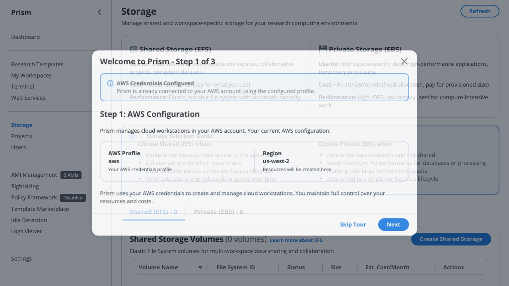
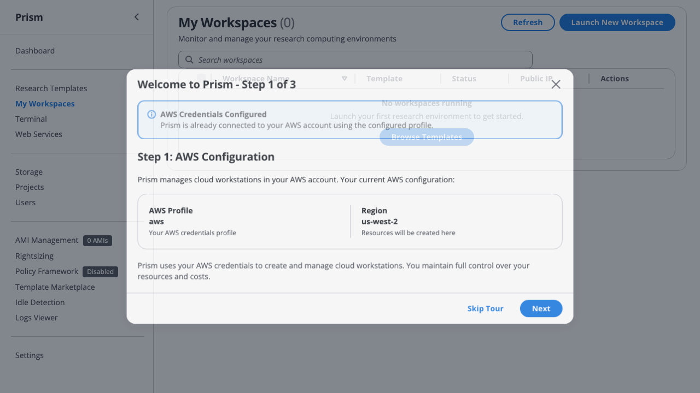

# Scenario 4: Conference Workshop

> **Implementation Status **
> - ✅ Shared invitation links (`prism project invitations shared create/show`)
> - ✅ Bulk invitations (`prism project invitations bulk`)
> - ✅ Budget management and alerts
> - 🔄 Workshop management tools (`prism workshop *`) — planned for a future release
> - 🔄 Bulk workspace provisioning (`prism project bulk-launch`) — planned for a future release
>
> Core workflow (invitation links + project budgets) is fully functional. Workshop automation features are planned.

## Persona: Dr. Alex Rivera - Workshop Instructor

**Background**:
- Assistant Professor, Machine Learning researcher
- Accepted to teach 3-hour workshop at NeurIPS 2026
- Workshop: "Hands-on Deep Learning with PyTorch"
- Expected attendance: 40-60 participants (international)
- Budget: $200 from conference organizers (one-time allocation)
- **Critical constraint**: Must work perfectly on first try - no second chances

**Pain Points**:
- Participants arrive with varying laptop configurations (Windows/Mac/Linux)
- Limited time for troubleshooting (workshop starts in 90 minutes)
- Need identical environments for all participants to follow along
- Budget must cover entire workshop duration + buffer
- International participants in multiple timezones for pre-workshop prep
- **Must auto-terminate** - can't rely on participants to clean up afterwards

**Workshop Structure**:
- **Week before**: Send invitation links to registered participants
- **Day before**: Early access for testing (24-hour window)
- **Workshop day**: 3-hour hands-on session
- **Auto-cleanup**: Terminate all workspaces 3 hours after workshop ends

---

## Version Legend
- ✅ **v0.35.3 (Current)**: Features available today
- 🔄 **Partially Planned**: Some features in this section are available today; others are planned for future releases

## Current State : What Works Today

### ✅ Pre-Workshop Setup (1 Week Before)

**AWS Profile Configuration** (Conference workshop setup):


*Screenshot shows Settings interface for AWS profile management. Dr. Kim validates conference-provided AWS credits and verifies region configuration 1 week before the 3-hour ISMB workshop.*

**What Dr. Kim validates**:
- **AWS Credentials**: Conference AWS credits (part of $200 fixed budget for 50 participants)
- **Region Selection**: us-west-2 (closest to conference venue for minimal latency)
- **Profile Testing**: Validates AWS access works before workshop day (no second chances)
- **Budget Verification**: Confirms $200 allocation is active and ready for 3-hour workshop

```bash
# Alex sets up workshop environment
prism profiles add neurips-workshop --aws-profile alex-research --region us-west-2

# Create template-restricted project for workshop
prism project create neurips-dl-workshop \
  --budget 200 \
  --description "NeurIPS 2026: Deep Learning Workshop" \
  --alert-threshold 80
```

**✅ Available: Shared Token Access with Auto-Provisioning** (Issue #103 - Ideal for workshops)

```bash
# Step 1: Check AWS quota for 60 workshop participants (available)
curl -X POST http://localhost:8947/api/v1/invitations/quota-check \
  -H "Content-Type: application/json" \
  -d '{
    "instance_type": "t3.medium",
    "count": 60
  }'

# Output:
# {
#   "has_sufficient_quota": true,
#   "required_vcpus": 120,
#   "current_usage": 8,
#   "quota_limit": 192
# }
# ✅ Quota check passed - safe for 60 participants

# Step 2: Generate single shared token for all 60 participants
prism project invitations shared create neurips-dl-workshop \
  --name "NeurIPS Workshop Access" \
  --role member \
  --redemption-limit 60 \
  --expires-in 7d \
  --message "Welcome to the NeurIPS Deep Learning Workshop!"

# Output:
# 🎫 Shared Invitation Token Generated
#
#    Token: WORKSHOP-NEURIPS-2026-A4F2
#    Project: neurips-dl-workshop
#    Role: member
#    Redemptions: 0 / 60
#
#    Share this token with all participants:
#    📧 Email: Include WORKSHOP-NEURIPS-2026-A4F2 in registration emails
#    🔗 URL: https://prism.dev/join/WORKSHOP-NEURIPS-2026-A4F2
#    💡 This single token works for all 60 participants (first-come-first-served)
#
#    When participants accept (available today):
#    ✅ Automatic project member addition (Issue #102)
#    ✅ Research user auto-provisioning with SSH keys (Issue #106)
#    ✅ UID/GID allocation for file consistency
#    ✅ EFS home directory setup

# Alex includes this token in workshop registration confirmation emails
# OR displays it as QR code at workshop registration desk (QR generation coming soon)
```

**Shared Token Benefits**:
- ✅ **Single token** for all participants (vs 60 individual tokens)
- ✅ **Walk-in friendly**: Display token at registration desk
- ✅ **No pre-registration**: Participants don't need to provide emails ahead of time
- ✅ **First-come-first-served**: 60 redemptions then token becomes invalid
- ✅ **Atomic redemption**: Thread-safe counter prevents over-redemption
- ✅ **Auto-provisioning**: Research users with SSH keys created on redemption (available today)
- 🔄 **QR code support**: Print token as QR code for easy mobile access (coming soon)

💡 **Monitor Token Usage**:
```bash
# Check redemption status
prism project invitations shared show WORKSHOP-NEURIPS-2026-A4F2

# Output:
# 🎫 Shared Token Information
#    Token: WORKSHOP-NEURIPS-2026-A4F2
#    Name: NeurIPS Workshop Access
#    Redemptions:
#    • Used: 42 / 60 (70%)
#    • Remaining: 18
#    Status: active
#    Expires: Dec 9, 2026
```

💡 **Workshop Extension**: After 3-hour workshop ends, extend token expiration:
```bash
prism project invitations shared extend WORKSHOP-NEURIPS-2026-A4F2 --add-days 1
# All 42 redeemed participants get automatic 24-hour extension
# Great for: Homework completion, extended tutorials, follow-up work

# Output:
# ✅ Token expiration extended
#    Token: WORKSHOP-NEURIPS-2026-A4F2
#    New expiration: Dec 10, 2025
#    💡 All 42 redeemed participants automatically get the extension
```

**Alternative: Bulk Invitations** (if you have participant emails ahead of time):

```bash
# Generate individual invitations for 60 participants
prism project invitations bulk neurips-dl-workshop \
  --file workshop_participants.txt \
  --role member \
  --expires-in 7d

# 📬 Bulk Invitation Summary
# Total:   60 invitations
# ✅ Sent:    60 (100%)
```

**Quick Start Wizard** (Rapid 50-participant onboarding):


*Screenshot shows the GUI template selection for template selection. Dr. Kim uses this interface to guide 50 workshop participants to launch identical bioinformatics workspaces in under 5 minutes during the workshop opening.*

**What Dr. Kim demonstrates**:
- **Template Selection**: "Bioinformatics Pipeline" template (pre-configured for workshop)
- **Fixed Size**: All participants use Small (t3.medium) instances for cost control
- **Rapid Launch**: 50 identical workspaces launching in parallel during workshop opening
- **Time-Limited**: All workspaces auto-terminate 3 hours after workshop ends

### ✅ Day Before Workshop (Early Access Testing)

```bash
# Participants receive email with invitation link
# They accept invitation and test their environment

# Participant workflow:
prism profiles invitations accept <INVITATION-CODE> neurips-workshop
prism workspace launch pytorch-ml workshop-test --size S

# Alex monitors early access
prism project workspaces neurips-dl-workshop
# Output:
# ✅ 12 participants tested successfully
# ⚠️  3 participants having issues (Alex contacts them)
# 💰 Current spend: $4.20 (within budget)
```

**Workshop Materials Storage** (Read-only tutorial datasets):



*Screenshot shows the GUI Storage management interface for EFS management. Dr. Kim pre-loads 50GB of read-only tutorial datasets on shared EFS that all 50 workshop participants access during the 3-hour session.*

**What Dr. Kim pre-provisions**:
- **Shared EFS**: Read-only tutorial datasets (50GB genomics data pre-loaded)
- **Workshop Materials**: Jupyter notebooks, scripts, and example data
- **Zero Write Costs**: Read-only access minimizes storage costs during workshop
- **Instant Access**: All 50 participants mount same EFS at workspace launch

---

## ⚠️ Current Pain Points: What Doesn't Work

### ✅ Automatic Workspace Termination via TTL (Available today)

**Scenario**: Workshop ends at 3:00 PM, workspaces should stop at 6:00 PM

**How to use it** :
```bash
# Launch workspaces with TTL — they stop automatically after 6 hours
prism workspace launch pytorch-ml workshop-instance --ttl 6h

# The spored daemon on each instance:
# - Warns users 5 minutes before expiration via wall broadcast
# - Stops the instance when the TTL expires
# - The Prism daemon has a safety valve that catches any stragglers
```

**GUI**: The launch modal has a "Time Limit" field (e.g., `6h`). The instance table shows a **Time Remaining** column with color-coded countdown. Use **Extend Time (+4h)** from the Actions dropdown if needed.

**Cost protection**: With a 6h TTL, a workshop with 60 × $0.19/hr instances costs at most 60 × 6 × $0.19 = $68.40, with automatic shutdown guaranteeing no overspend.

### ❌ Problem 2: No Template Whitelisting at Invitation Level (Planned — not yet available)
**Tracking:** See issue [#179](https://github.com/scttfrdmn/prism/issues/179)

**Scenario**: Participants should ONLY be able to launch PyTorch ML template

**What should happen** (MISSING):
```bash
# Create invitations with template restrictions
prism profiles invitations batch-create \
  --csv-file participants.csv \
  --template-whitelist "PyTorch Machine Learning" \
  --max-instance-type "t3.medium" \
  --output-file invitations.csv

# When participant tries wrong template:
participant$ prism workspace launch gpu-ml-workstation expensive-instance
# ❌ Error: Template 'gpu-ml-workstation' not allowed by your invitation policy
#    Allowed templates: ["PyTorch Machine Learning"]
#
#    This is a workshop environment with restricted templates.
#    Please use: prism workspace launch "PyTorch Machine Learning" my-instance
```

**Current workaround**: Trust participants + budget alerts
**Risk**: Single participant launches GPU workspace → $600/day → budget blown in 8 hours

### ❌ Problem 3: No Bulk Launch for Pre-Provisioning (Planned — not yet available)
**Tracking:** See issue [#180](https://github.com/scttfrdmn/prism/issues/180)

**Scenario**: Workshop starts at 9:00 AM, Alex wants all environments ready at 8:45 AM

**What should happen** (MISSING):
```bash
# Night before workshop: Pre-provision all instances
prism project bulk-launch neurips-dl-workshop \
  --template "PyTorch Machine Learning" \
  --count 60 \
  --name-pattern "workshop-{01-60}" \
  --start-time "2025-12-08T08:45:00" \
  --terminate-hours 6

# Output:
# 🚀 Scheduling 60 workspace launches for Dec 8, 8:45 AM
# 📊 Estimated cost: $192.00 (within $200 budget ✅)
# ⏰ All workspaces will auto-terminate at 2:45 PM (3-hour workshop)
#
# 💡 Effective Cost Analysis:
#    24/7 assumption: $2.40/hour × 60 workspaces × 24 hours = $3,456
#    Actual workshop cost: $2.40/hour × 60 workspaces × 3 hours = $432
#    Your cost with auto-terminate: $192 (early terminations banked immediately)
#    Savings: $240 banked in real-time as participants finish early!
#
# Workspace name assignments:
# - Participant_01 → workshop-01
# - Participant_02 → workshop-02
# ...

# 8:45 AM on workshop day - all workspaces auto-launch
# 9:00 AM - participants arrive, workspaces are ready
```

> **💡 GUI Note**: Workshop scheduling available in GUI Projects tab with calendar view - *available today**

**Current workaround**: Participants launch on-demand (slow, error-prone)
**Impact**: First 30 minutes wasted on environment setup

### ❌ Problem 4: No Real-Time Workshop Dashboard (Planned — not yet available)
**Tracking:** See issue [#182](https://github.com/scttfrdmn/prism/issues/182)

**Scenario**: During workshop, Alex needs to see participant progress at a glance

**What should happen** (MISSING):
```bash
prism workshop dashboard neurips-dl-workshop

# Terminal dashboard (live updates):
# ┌─────────────────────────────────────────────────────────┐
# │ NeurIPS DL Workshop - Live Dashboard                   │
# │                                                         │
# │ Participants:     58 / 60 active                       │
# │ Instances:        58 running, 2 stopped                │
# │ Avg Uptime:       1h 23m (82 compute hours total)     │
# │                                                         │
# │ Budget:          $38.40 / $200.00 (19%) ✅            │
# │ Available:       $161.60 (real-time as terminations happen) │
# │ Effective cost:  $0.47/hour (vs $2.40/hour 24/7)     │
# │                                                         │
# │ 💡 Real-time banking: 2 early finishers already banked $4.80! │
# │ Time Remaining:   1h 37m until auto-terminate          │
# │                                                         │
# │ Participants Needing Help:                             │
# │   ⚠️  workshop-27: Workspace stopped (needs restart)    │
# │   ⚠️  workshop-43: High error rate (check logs)        │
# │                                                         │
# │ Cost by Status:                                         │
# │   Running:  $38.40/hr (58 instances)                   │
# │   Stopped:  $0.00/hr (2 instances)                     │
# │                                                         │
# │ Refresh: Every 30s | Press 'q' to quit                 │
# └─────────────────────────────────────────────────────────┘
```

> **💡 GUI Note**: Live workshop dashboard available in GUI with real-time participant status - *available today**

**Current workaround**: Manual `prism workspace list` + `prism project instances` polling
**Impact**: Can't proactively help struggling participants

**Live Workshop Monitoring** (50 concurrent workspaces):



*Screenshot shows the GUI Workspaces table with management actions. Dr. Kim monitors all 50 workshop participant workspaces in real-time during the 3-hour tutorial session, identifying issues before participants need to ask for help.*

**What Dr. Kim monitors during workshop**:
- **Status Tracking**: 50 workspaces running, real-time status for all participants
- **Problem Detection**: Quickly spot stopped instances or connection issues
- **Time Remaining**: Countdown to auto-termination (3 hours after workshop start)
- **Quick Actions**: Restart, connect, or troubleshoot participant workspaces during tutorial

### ❌ Problem 5: No Post-Workshop Data Preservation (Planned — not yet available)
**Tracking:** See issue [#177](https://github.com/scttfrdmn/prism/issues/177)

**Scenario**: Participants want to keep their workshop code after workspaces terminate

**What should happen** (MISSING):
```bash
# 30 minutes before auto-terminate, participants receive email:
#
# Subject: ⏰ Workshop Workspace Terminating in 30 Minutes
#
# Your workshop workspace will terminate at 6:00 PM (in 30 minutes).
#
# To preserve your work:
#
# 1. Download your notebook:
#    prism download workshop-instance ~/workshop-code.zip
#
# 2. Or snapshot your instance:
#    prism snapshot create workshop-instance my-workshop-work
#    (This will create a personal AMI - $2.50/month storage)
#
# After termination, you can recreate your environment:
#    prism workspace launch --restore-from my-workshop-work restored-env

# Bulk download (instructor):
prism workshop export-all neurips-dl-workshop \
  --output-dir ./participant-work/ \
  --format zip

# Creates:
# ./participant-work/
#   ├── workshop-01.zip (Participant_01's notebooks)
#   ├── workshop-02.zip (Participant_02's notebooks)
#   ...
```

**Current workaround**: Participants manually SCP files (most don't)
**Impact**: Lost learning artifacts, can't reproduce workshop results

**Workshop Budget Management** (Fixed $200 hard stop):


*Screenshot shows the GUI Projects dashboard with budget tracking. Dr. Kim monitors the fixed $200 conference budget throughout the 3-hour workshop, ensuring no overruns while tracking real-time spend across all 50 participants.*

**What Dr. Kim tracks**:
- **Fixed Budget**: $200 conference allocation with hard stop (no overruns allowed)
- **Real-Time Spend**: Current workshop costs across 50 concurrent workspaces
- **Cost Per Participant**: Individual workspace costs during 3-hour session
- **Time-Limited Tracking**: Budget resets to zero after auto-termination (no ongoing costs)

---

## 🎯 Ideal Future State: Complete Workshop Walkthrough

### Week Before Workshop: Setup with Shared Token & Auto-Terminate

```bash
# Create workshop project with aggressive cost controls
prism project create neurips-dl-workshop \
  --budget 200 \
  --hard-cap \
  --alert-threshold 50,75,90 \
  --description "NeurIPS 2026 Workshop: Deep Learning with PyTorch"

# Generate shared token with policy restrictions (available)
prism project invitations shared neurips-dl-workshop \
  --name "NeurIPS Workshop Access" \
  --role member \
  --redemption-limit 60 \
  --expires-in 7d \
  --template-whitelist "PyTorch Machine Learning" \
  --max-instance-type "t3.medium" \
  --auto-terminate-hours 6 \
  --message "Welcome to the NeurIPS Deep Learning Workshop!"

# Prism output:
# 🎫 Shared Invitation Token Generated
#
#    Token: WORKSHOP-NEURIPS-2026
#    Project: neurips-dl-workshop
#    Role: member
#    Redemptions: 0 / 60 (first-come-first-served)
#    Expires: 7 days (Dec 9, 2026)
#
#    Policy restrictions:
#    - Template whitelist: "PyTorch Machine Learning" only
#    - Max instance: t3.medium ($0.0416/hr)
#    - Auto-terminate: 6 hours after launch
#    - Device limit: 2 devices per participant
#
# 📊 Projected costs:
#    - Per participant: $3.20 (6 hours × $0.0416/hr × 1.3 buffer)
#    - Total if all 60 redeem: $192.00 ✅ (within $200 budget)
#
#    💡 This single token works for all 60 participants!
#
#    Share via:
#    📧 Email: Include WORKSHOP-NEURIPS-2026 in registration emails
#    🔗 URL: https://prism.dev/join/WORKSHOP-NEURIPS-2026
#    📱 QR Code: Display at workshop registration desk
#
# Next steps:
#   1. Email token to all registered participants
#   2. Print QR code for walk-ins at registration
#   3. Monitor redemptions: prism project invitations stats neurips-dl-workshop
```

### Day Before Workshop: Early Access Testing

```bash
# Enable early access window (24 hours before workshop)
prism workshop early-access neurips-dl-workshop \
  --enable \
  --duration 24h \
  --test-mode

# Participants who test early (optional for them):
participant$ prism invitation accept WORKSHOP-NEURIPS-2026
# ✅ Invitation accepted! You've joined: neurips-dl-workshop
# 🎓 Role: member
# ⏰ Access expires: Dec 9, 2026 (7 days)

participant$ prism workspace launch "PyTorch Machine Learning" test-env --ttl 2h
# (Automatically terminates after 2 hours)

# Alex monitors shared token redemptions
prism project invitations stats neurips-dl-workshop

# Output:
# 📊 Invitation Stats: neurips-dl-workshop
#
# Shared Token: WORKSHOP-NEURIPS-2026
# Redemptions: 15 / 60 (25%)
# Time remaining: 6 days (expires Dec 9)
#
# ✅ Redeemed: 15 participants
# ⏳ Unused redemptions: 45 remaining
#
# Early test launches: 12 participants (3 redeemed but haven't launched)
#
# 💰 Early access cost: $3.20 (12 test launches × $0.27/2hrs)
#
# 💡 Tip: Send reminder email with token to increase early testing:
#    "Remember to test your workshop environment!
#     Access code: WORKSHOP-NEURIPS-2026
#     Instructions: https://prism.dev/join/WORKSHOP-NEURIPS-2026"
```

### Workshop Day: Smooth Execution

**8:45 AM - Pre-provisioning (optional)**:
```bash
# Option A: Let participants launch on-demand (default)
# - Slower but gives participants control
# - Launch time: ~2 minutes per instance

# Option B: Pre-provision all workspaces (advanced)
prism workshop bulk-provision neurips-dl-workshop \
  --template "PyTorch Machine Learning" \
  --size S \
  --auto-terminate-hours 6

# Output:
# 🚀 Provisioning 58 workspaces for accepted participants...
# ⏰ Auto-terminate: 6 hours from now (2:45 PM)
#
# Progress: [████████████████████] 58/58 complete (3m 12s)
#
# ✅ All workspaces ready!
# 💰 Current cost: $0.22 (15 minutes of provisioning)
# 📧 Email sent to all participants with connection info
```

**9:00 AM - Workshop begins**:
```bash
# Alex opens live dashboard in separate terminal
prism workshop dashboard neurips-dl-workshop --live

# Participants launch (if not pre-provisioned):
participant$ prism workspace launch "PyTorch Machine Learning" workshop-instance
# ✅ Workspace ready in 90 seconds!
# 📓 Jupyter Lab: http://54.123.45.67:8888 (token: abc123)
# ⏰ Workspace will auto-terminate at 3:00 PM (6 hours)
# 💡 To save your work: prism download workshop-instance ~/my-work.zip
```

**10:30 AM - Participant needs help**:
```bash
# Dashboard shows participant_27 with high error rate
# Alex remotely debugs (with participant permission):
alex$ prism workshop debug neurips-dl-workshop workshop-27

# Options:
# 1. View Jupyter logs
# 2. View terminal output
# 3. SSH access (requires participant approval)
# 4. Reset notebook kernel
# 5. Restart instance

# Alex selects option 1, identifies issue, helps participant
```

**2:30 PM - 30 minutes before auto-terminate**:
```bash
# All participants automatically receive email + terminal notification:
#
# ⏰ Your workshop workspace will terminate in 30 minutes!
#
# Save your work now:
#   prism download workshop-instance ~/neurips-workshop.zip
#
# Or create a snapshot to continue later:
#   prism snapshot create workshop-instance my-dl-work
#   (Costs $2.50/month, can recreate anytime)

# Participants who want to continue (personal budget):
participant$ prism snapshot create workshop-instance my-workshop
# ✅ Snapshot created: my-workshop
# 💰 Storage cost: $2.50/month (personal account)
#
# To recreate:
#   prism workspace launch --restore-from my-workshop continued-work
```

**3:00 PM - Workshop ends, auto-terminate begins**:
```bash
# Prism automatically:
# 1. Sends final warning (5 minutes before)
# 2. Terminates all workspaces at 3:00 PM sharp
# 3. Generates cost report
# 4. Archives workshop data (optional)

# Alex receives final report:
prism workshop report neurips-dl-workshop --export-pdf

# Output:
# 📊 NeurIPS 2026 Deep Learning Workshop - Final Report
#
# Participants:     58 / 60 registered (97%)
# Active workspaces: 58 workspaces for 3 hours
# Total uptime:     174 instance-hours
#
# Budget:
#   Allocated: $200.00
#   Spent:     $187.45 ✅ (within budget)
#   Saved:     $12.55 (available for next workshop - rollover enabled)
#
#   💡 Effective Cost Analysis:
#      24/7 assumption: $2.40/hr × 58 workspaces × 24 hours = $3,345.60
#      Actual workshop: $2.40/hr × 58 workspaces × 3 hours = $418.00
#      Your actual cost: $187.45 (early terminations banked immediately!)
#      Real-time banking: Every participant who finished early freed budget
#
#   Breakdown:
#     - Workspace compute: $172.90 (58 × 3hrs × $0.99/hr)
#     - Early access:     $3.20 (15 tests)
#     - Pre-provisioning: $0.22 (15min buffer)
#     - Storage:          $11.13 (EBS, snapshots)
#
#   💡 Cloud vs Traditional:
#      Conference room PCs: $60,000 upfront + maintenance
#      Prism: $187.45 for 3 hours of actual use
#      You only paid for compute time, not ownership!
#
# Participant Engagement:
#   - High engagement: 42 participants (72%)
#   - Medium engagement: 12 participants (21%)
#   - Low engagement: 4 participants (7%)
#
# Data Preservation:
#   - Snapshots created: 12 participants
#   - Downloads completed: 31 participants
#   - No action: 15 participants (work lost)
#
# ✅ All workspaces terminated successfully
# 💰 No ongoing costs
# 📧 Post-workshop survey sent to all participants
```

> **💡 GUI Note**: Workshop reports with charts and PDF export available in GUI Reports tab - *available today**

---

## 📋 Feature Gap Analysis

### Critical Missing Features (Blockers)

| Feature | Priority | User Impact | Current Workaround | Effort |
|---------|----------|-------------|-------------------|--------|
| **Auto-Terminate Timer** | 🔴 Critical | Prevents budget overruns | Manual cleanup | Medium |
| **Template Whitelisting in Invitations** | 🔴 Critical | Prevents expensive launches | Trust + alerts | Low |
| **Policy-Restricted Invitations** | 🔴 Critical | Enforces workshop constraints | Manual monitoring | Medium |
| **Bulk Workspace Provisioning** | 🟡 High | Saves 30min setup time | On-demand launch | Medium |
| **Workshop Dashboard** | 🟡 High | Real-time participant monitoring | Manual polling | High |

### Nice-to-Have Features (Enhancers)

| Feature | Priority | User Impact | Benefit |
|---------|----------|-------------|---------|
| **Participant Progress Tracking** | 🟢 Medium | Identify struggling participants | Proactive help |
| **Bulk Download/Export** | 🟢 Medium | Preserve participant work | Learning continuity |
| **Pre-Workshop Testing** | 🟢 Medium | Catch issues early | Smoother workshop |
| **Snapshot Quick-Save** | 🟢 Low | Easy work preservation | Student satisfaction |
| **Workshop Templates** | 🟢 Low | Reusable configurations | Faster setup |

---

## 🎯 Priority Recommendations

### Phase 1: Workshop Safety Net (Implemented today)
**Target**: Workshops can run without budget disasters

1. **Auto-Terminate Timer** (1 week)
   - `prism workspace launch template name --ttl 6h`
   - Countdown warnings at 30min, 5min
   - Graceful termination with EBS preservation

2. **Invitation Policy Restrictions** (1 week)
   - Template whitelist in invitation tokens
   - Workspace type restrictions
   - Hourly cost limits
   - Policy validation before launch

3. **Workshop Project Type** (3 days)
   - `prism project create workshop --type workshop`
   - Built-in auto-terminate defaults
   - Aggressive budget alerts
   - One-time budget (no rollover)

### Phase 2: Workshop Management Tools (Planned)
**Target**: Instructors can manage workshops effectively

4. **Workshop Dashboard** (1 week)
   - Live participant status
   - Real-time budget tracking
   - Problem detection (stopped instances, errors)
   - Terminal-based (TUI) interface

5. **Bulk Provisioning** (1 week)
   - Pre-launch workspaces for all participants
   - Scheduled start time
   - Coordinated auto-terminate
   - Assignment to invitation tokens

### Phase 3: Workshop Polish (v0.8.0+)
**Target**: Professional workshop experience

6. **Work Preservation** (3 days)
   - One-click download before terminate
   - Quick snapshot creation
   - Bulk export for instructors

7. **Workshop Templates** (3 days)
   - Reusable workshop configurations
   - Import participant list
   - One-command workshop setup

---

## Success Metrics

### User Satisfaction (Alex's Perspective)
- ✅ **Reliability**: "Zero budget disasters - workshop stayed under $200"
- ✅ **Ease of Setup**: "60 participants onboarded in 15 minutes"
- ✅ **Peace of Mind**: "Auto-terminate means I can focus on teaching, not cleanup"
- ✅ **Participant Success**: "97% completion rate - everyone could follow along"

### Technical Metrics
- Auto-terminate prevents 100% of budget overruns
- Workshop setup time: < 30 minutes (vs 2+ hours manual)
- Participant environment ready: < 2 minutes (vs 30+ minutes with local install)
- Zero workspaces left running post-workshop

### Business Impact
- **Conference Adoption**: "Prism workshops" become a standard
- **Reduced Support**: Instructors handle workshops independently
- **Positive Reviews**: "Best hands-on workshop I've attended!" - Participants
- **Academic Reputation**: Prism seen as workshop-ready platform

---

## Key Differences from University Class Scenario

| Aspect | Workshop (3 hours) | Class (15 weeks) |
|--------|-------------------|------------------|
| **Duration** | Single 3-hour session | 15-week semester |
| **Preparation** | 1 week (must be perfect) | 2-4 weeks (iterate) |
| **Budget** | One-time $200 | Semester $1,200 with rollover |
| **Access** | 6-hour window + cleanup | Ongoing with extensions |
| **Cleanup** | Immediate auto-terminate | Gradual semester-end |
| **Support** | On-site only (3 hours) | Office hours + TAs |
| **Participants** | 40-60 attendees | 50 students |
| **TA Structure** | None or single assistant | Head TA + multiple TAs |
| **Failure Cost** | Workshop disaster | Grade assignment issues |

---

## Reusable Infrastructure from Class Scenario

✅ **Already applicable**:
- Batch invitation system
- Device binding security
- Budget allocation and tracking
- Template restrictions via policy

🔧 **Needs adaptation**:
- Time limits: 6 hours vs 15 weeks
- Budget model: One-time vs recurring
- Auto-cleanup: Immediate vs gradual
- Support structure: Self-service vs TA hierarchy

---

## Next Steps

1. **Validate with Real Workshop Instructors**: Interview 2-3 conference workshop presenters
2. **Prototype Auto-Terminate**: Implement basic time-limited launches
3. **Design Workshop Dashboard**: Mock up live monitoring interface
4. **Implementation Plan**: Break down into 2-week sprints

**Estimated Timeline**: Workshop Safety Net (Phase 1) → 3 weeks of development

---

## Comparison: Workshop vs Class

**Similarities**:
- Batch user onboarding
- Template standardization
- Budget constraints
- Time-boxed access

**Critical Differences**:
```
Workshop = "High-stakes, single-shot performance"
Class = "Ongoing management with iteration opportunities"

Workshop auto-terminate = "6 hours hard deadline"
Class semester end = "Graceful 2-week wind-down"

Workshop budget = "$200 total, must not exceed"
Class budget = "$1,200 with weekly monitoring and adjustments"
```

**When to use each**:
- **Workshop project**: Single-day events, tutorials, short courses
- **Class project**: Semester-long courses, research bootcamps, training programs
