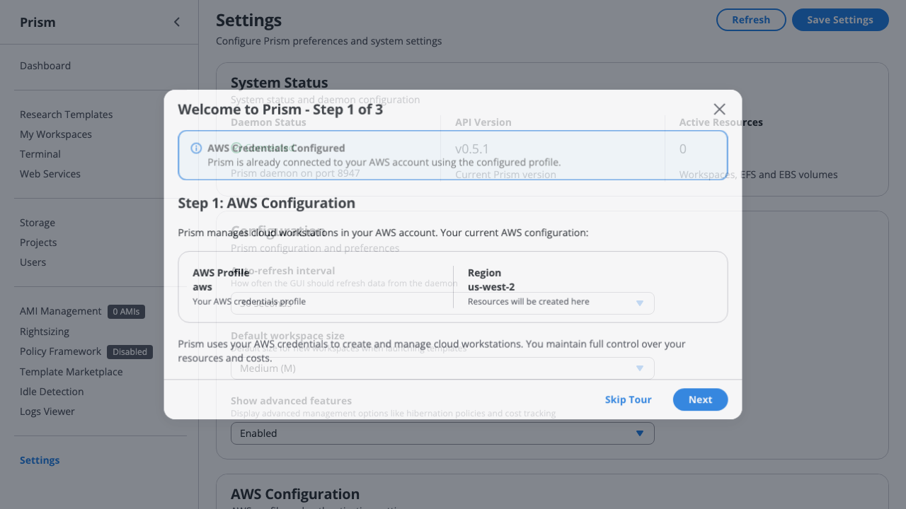
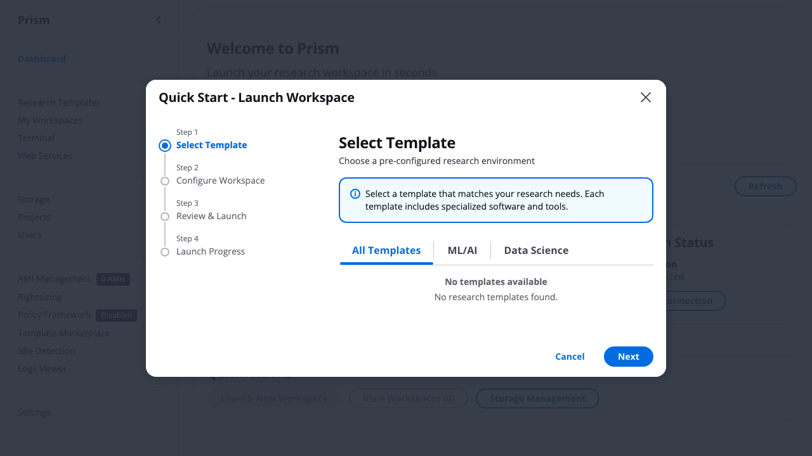
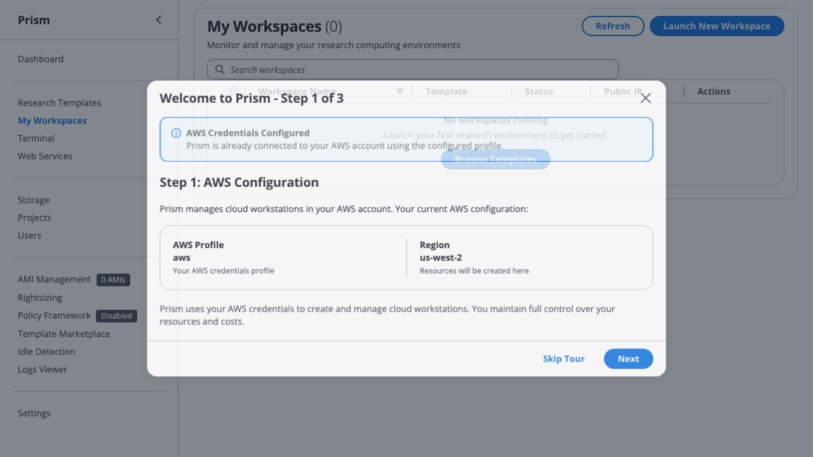
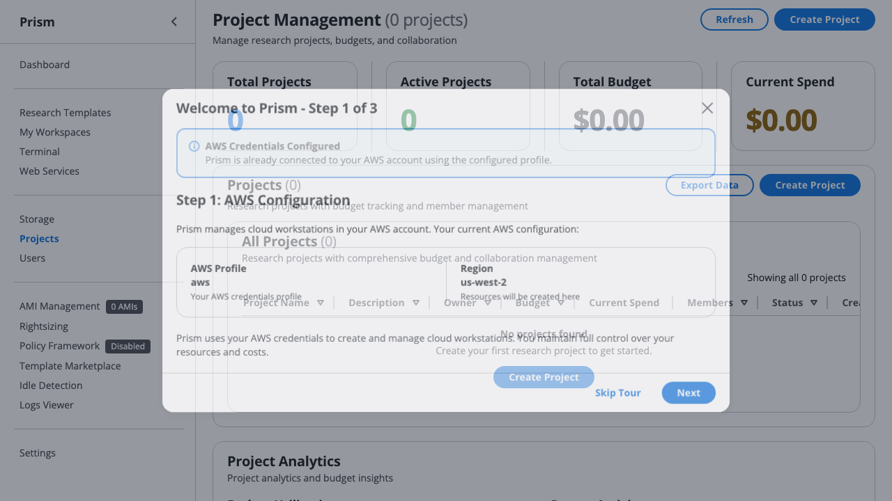

# Scenario 5: Cross-Institutional Research Collaboration

## Personas: Multi-Site Research Consortium

### Lead Institution: Stanford University
**Dr. Jennifer Smith** - Principal Investigator
- Associate Professor, Computational Neuroscience
- Grant: NIH R01 ($5,000/month AWS budget for 3 years)
- AWS Account: stanford-neuroscience
- Needs: Collaborative data analysis environment for consortium

### Partner Institution 1: MIT
**Dr. Michael Johnson** - Co-Investigator
- Associate Professor, Machine Learning expertise
- Grant: Local MIT funding (uses MIT AWS account normally)
- AWS Account: mit-csail
- Role: Algorithm development and validation

### Partner Institution 2: UC Berkeley
**Dr. Sarah Lee** - Co-Investigator
- Assistant Professor, Domain expertise in neural imaging
- Grant: UC Berkeley startup funds (uses Berkeley AWS account)
- AWS Account: berkeley-neuroscience
- Role: Data analysis and interpretation

### Consortium Structure
- **Duration**: 18-month collaborative project
- **Budget**: Stanford's $5,000/month covers shared infrastructure
- **Data**: 50TB neuroimaging dataset on Stanford's EFS
- **Workflow**: MIT develops algorithms → Berkeley validates → Stanford integrates

**Collaboration Challenge**:
- Three different AWS accounts (stanford-neuroscience, mit-csail, berkeley-neuroscience)
- Need seamless access to shared Stanford infrastructure
- Budget attribution: Stanford pays, but who launched what?
- Time-bounded: Collaborators need access revoked when project ends
- Security: Institutional compliance for data access

---

## Version Legend
- ✅ **v0.5.7 (Current)**: Features available today
- 🔄 **v0.5.8+ (Planned)**: Features in development (see linked GitHub issues)

## Current State (v0.5.7): What Works Today with Invitations

### ✅ Stanford Creates Collaboration Invitations (Month 1)

```bash
# Dr. Smith (Stanford) sets up collaboration project
stanford$ prism profile use stanford-neuroscience
stanford$ prism project create nih-neuro-consortium \
  --budget 5000 \
  --description "NIH R01: Multi-site neuroimaging analysis" \
  --alert-threshold 75

# Create time-boxed invitation for MIT collaborator (18 months)
stanford$ prism profiles invitations create mit-collaboration \
  --type admin \
  --valid-days 540 \
  --can-invite false \
  --device-bound true \
  --max-devices 3

# Output:
# ✅ Invitation created: mit-collaboration
# 📧 Invitation token: inv-AbCdEf123456789...
# ⏰ Valid for: 540 days (expires June 1, 2027)
# 🔐 Device-bound: Yes (max 3 devices)
# 👥 Type: admin (full resource access)
# 🔗 Share this token with Dr. Johnson (MIT)

# Create similar invitation for Berkeley collaborator
stanford$ prism profiles invitations create berkeley-collaboration \
  --type read_write \
  --valid-days 540 \
  --device-bound true \
  --max-devices 2
```

**Current capabilities (working today)**:
- ✅ Time-boxed cross-account access (540 days = 18 months)
- ✅ Permission levels (admin for MIT, read_write for Berkeley)
- ✅ Device binding for security compliance
- ✅ Secure invitation token distribution

### ✅ MIT and Berkeley Accept Invitations

```bash
# Dr. Johnson (MIT) accepts Stanford invitation
mit$ prism profiles invitations accept <STANFORD-INVITATION-TOKEN> stanford-collab
# ✅ Profile created: stanford-collab
# 🏛️  Accessing: stanford-neuroscience AWS account
# ⏰ Access expires: June 1, 2027 (18 months)
# 💡 Switch profiles: prism profiles use stanford-collab

# Dr. Johnson lists his profiles
mit$ prism profiles list
# Profiles:
# - mit-csail (personal) [default]
# - stanford-collab (invitation) - expires in 18 months

# Dr. Lee (Berkeley) accepts Stanford invitation
berkeley$ prism profiles invitations accept <STANFORD-INVITATION-TOKEN> stanford-collab
berkeley$ prism profiles list
# Profiles:
# - berkeley-neuroscience (personal) [default]
# - stanford-collab (invitation) - expires in 18 months
```

**What works today**:
- ✅ Collaborators can access Stanford's AWS account
- ✅ Profile switching between personal and collaboration accounts
- ✅ Device binding ensures institutional compliance
- ✅ Automatic expiration after 18 months

### ✅ Daily Collaboration Workflow (Month 2-18)

```bash
# Dr. Johnson (MIT) develops algorithms in Stanford's account
mit$ prism profiles use stanford-collab
mit$ prism launch "Python Machine Learning" mit-algorithm-dev

# MIT workspace launches in Stanford's AWS account
# - Uses Stanford's VPC and networking
# - Billed to Stanford's AWS account
# - MIT researcher has full access

# Dr. Lee (Berkeley) analyzes data in Stanford's account
berkeley$ prism profiles use stanford-collab
berkeley$ prism launch "R Research Environment" berkeley-analysis

# Berkeley workspace also in Stanford's AWS account
# - Can access same EFS volumes as MIT
# - Billed to Stanford's AWS account
# - Berkeley researcher has read/write access
```

**Current functionality**:
- ✅ Collaborators launch workspaces in lead institution's account
- ✅ Shared EFS access (if manually configured)
- ✅ Consistent networking and security groups
- ✅ All costs billed to Stanford's grant

---

## ⚠️ Current Pain Points: What Doesn't Work

### ❌ Problem 1: No Cross-Account EFS Access (Coming in v0.5.8+)
**Tracking:** See issue [#185](https://github.com/scttfrdmn/prism/issues/185)

**Scenario**: Stanford's 50TB neuroimaging dataset needs to be accessible to MIT and Berkeley workspaces

**What should happen** (MISSING):
```bash
# Stanford creates shared data volume with cross-account access
stanford$ prism volume create neuro-dataset \
  --size 50000 \
  --cross-account-access mit-csail,berkeley-neuroscience \
  --read-only-for mit-csail \
  --read-write-for berkeley-neuroscience

# Prism output:
# ✅ EFS created: neuro-dataset (fs-1234567890abcdef0)
# 🔐 Cross-account access configured:
#    - mit-csail: Read-only (EFS Access Point: fsap-mit-readonly)
#    - berkeley-neuroscience: Read-write (EFS Access Point: fsap-berkeley-rw)
#    - stanford-neuroscience: Full access (owner)
#
# 📋 IAM policies created:
#    - MIT: arn:aws:iam::MIT-ACCOUNT-ID:policy/stanford-efs-readonly
#    - Berkeley: arn:aws:iam::BERKELEY-ACCOUNT-ID:policy/stanford-efs-readwrite
#
# 💡 Collaborators can mount: prism volume mount neuro-dataset <instance-name>

# MIT mounts Stanford's EFS (read-only)
mit$ prism profiles use stanford-collab
mit$ prism volume mount neuro-dataset mit-algorithm-dev
# ✅ Mounted at /mnt/neuro-dataset (read-only)
# 📊 50TB neuroimaging data accessible

# Berkeley mounts Stanford's EFS (read-write)
berkeley$ prism profiles use stanford-collab
berkeley$ prism volume mount neuro-dataset berkeley-analysis
# ✅ Mounted at /mnt/neuro-dataset (read-write)
# 📊 Can add analysis results to shared dataset
```

**Current workaround**: All workspaces must be in Stanford's account to access EFS
**Risk**: Cannot use collaborators' institutional AWS credits/accounts

### ❌ Problem 2: No Cost Attribution for Collaborators (Coming in v0.5.8+)
**Tracking:** See issue [#186](https://github.com/scttfrdmn/prism/issues/186)

**Scenario**: Who launched what? Stanford needs to track collaborator usage

**What should happen** (MISSING):
```bash
# Stanford views cost breakdown by collaborator
stanford$ prism project cost nih-neuro-consortium --by-user

# Output:
# 📊 NIH Neuro Consortium - Cost Attribution (Month 6)
#
# Total: $4,823.40 / $5,000.00 (96%) ✅
# Available: $176.60 + rollover from month 5: $142.50 = $319.10
#
# 💡 Effective Cost: $1.89/hour avg (vs $4.20/hour 24/7 assumption)
#    Total compute hours: 2,554 hours across all collaborators
#    Hibernation savings: $3,890 this month (banked in real-time!)
#
# By Collaborator:
# ┌──────────────────────┬────────────┬──────────┬──────────┬──────────────┐
# │ User                 │ Institution│ Instances│ Hours    │ Cost         │
# ├──────────────────────┼────────────┼──────────┼──────────┼──────────────┤
# │ Dr. Smith (owner)    │ Stanford   │ 3        │ 656h     │ $1,240.80    │
# │ Dr. Johnson (admin)  │ MIT        │ 5        │ 1,530h   │ $2,890.20    │
# │ Dr. Lee (read_write) │ Berkeley   │ 2        │ 366h     │ $692.40      │
# └──────────────────────┴────────────┴──────────┴──────────┴──────────────┘
#
# By Institution:
#   Stanford: $1,240.80 (26%) - 656 compute hours
#   MIT:      $2,890.20 (60%) - 1,530 compute hours
#   Berkeley: $692.40   (14%) - 366 compute hours
#
# 💡 Cross-Institution Efficiency:
#    Each institution only pays for actual compute time
#    No idle time charges - every hibernation banks budget immediately
#    Shared project benefits from combined hibernation savings!
#
# Chargeback Report: Available in project_chargeback_june2026.csv
```

> **💡 GUI Note**: Cross-institutional cost tracking with chargeback available in GUI Projects tab - *coming soon in v0.6.0*

```bash
# Optional: Enable chargeback to collaborator accounts
stanford$ prism project chargeback nih-neuro-consortium \
  --enable \
  --mit-account 123456789012 \
  --berkeley-account 987654321098

# Chargeback modes:
# 1. Report-only: Track costs, Stanford pays (current)
# 2. AWS chargeback: Collaborator accounts billed monthly
# 3. Hybrid: Stanford pays, collaborators reimbursed via grants
```

**Current workaround**: Manual tagging and AWS Cost Explorer queries
**Impact**: Cannot accurately report grant expenditures by institution

### ❌ Problem 3: No Invitation-Based Policy Enforcement (Coming in v0.5.8+)
**Tracking:** See issue [#187](https://github.com/scttfrdmn/prism/issues/187)

**Scenario**: Berkeley should only launch small workspaces for analysis (not expensive GPUs)

**What should happen** (MISSING):
```bash
# Stanford creates policy-restricted invitation for Berkeley
stanford$ prism profiles invitations create berkeley-collaboration \
  --type read_write \
  --valid-days 540 \
  --policy-restrictions \
    --template-whitelist "R Research Environment,Python Machine Learning" \
    --max-instance-types "t3.large,r5.xlarge" \
    --max-hourly-cost 0.50 \
    --forbidden-regions "us-west-1,eu-west-1"

# Berkeley tries to launch expensive GPU workspace
berkeley$ prism profiles use stanford-collab
berkeley$ prism launch "GPU ML Workstation" expensive-gpu --size XL

# Prism blocks with helpful error:
# ❌ Policy violation: Invitation restrictions prevent this launch
#
# Your invitation from Stanford has the following restrictions:
#   - Allowed templates: "R Research Environment", "Python Machine Learning"
#   - Max workspace types: t3.large, r5.xlarge
#   - Max hourly cost: $0.50/hour
#
# Requested launch:
#   - Template: "GPU ML Workstation" ❌ (not in allowed list)
#   - Workspace type: p3.8xlarge ❌ (exceeds max)
#   - Hourly cost: $12.24/hour ❌ (exceeds $0.50 limit)
#
# Contact Dr. Smith (stanford-neuroscience) to request policy adjustment.
```

**Current workaround**: Trust-based + budget alerts
**Risk**: Single expensive launch depletes monthly budget

### ❌ Problem 4: No Audit Trail for Collaborative Access (Coming in v0.5.8+)
**Tracking:** See issue [#188](https://github.com/scttfrdmn/prism/issues/188)

**Scenario**: Stanford needs compliance audit of who accessed what data when

**What should happen** (MISSING):
```bash
# Stanford generates collaboration audit report
stanford$ prism audit collaboration nih-neuro-consortium \
  --start-date 2026-01-01 \
  --end-date 2026-06-30 \
  --export compliance_audit_h1_2026.json

# Output:
# 📋 Collaboration Audit Report: Jan-June 2026
#
# Invitation Activity:
#   - mit-collaboration: 247 profile switches, 182 workspace launches
#   - berkeley-collaboration: 128 profile switches, 89 workspace launches
#
# Data Access Events:
#   ┌──────────────┬──────────────┬─────────────────────┬─────────────┐
#   │ User         │ Action       │ Resource            │ Timestamp   │
#   ├──────────────┼──────────────┼─────────────────────┼─────────────┤
#   │ Dr. Johnson  │ EFS Mount    │ neuro-dataset       │ 2026-01-15  │
#   │ Dr. Johnson  │ S3 Download  │ raw-data/subject01  │ 2026-01-15  │
#   │ Dr. Lee      │ EFS Mount    │ neuro-dataset       │ 2026-02-03  │
#   │ Dr. Lee      │ EFS Write    │ analysis-results/   │ 2026-02-03  │
#   │ Dr. Johnson  │ Workspace Launch│ mit-algorithm-dev │ 2026-03-12  │
#   └──────────────┴──────────────┴─────────────────────┴─────────────┘
#
# Compliance Summary:
#   - Total data access events: 1,247
#   - Total workspace launches by collaborators: 271
#   - Policy violations: 0 ✅
#   - Unauthorized access attempts: 0 ✅
#
# Export formats: JSON, CSV, PDF
# NIH compliance: READY ✅
```

**Current workaround**: Manual AWS CloudTrail queries
**Impact**: 40+ hours/year of manual compliance reporting

### ❌ Problem 5: No Graceful Collaboration End (Coming in v0.5.8+)
**Tracking:** See issue [#189](https://github.com/scttfrdmn/prism/issues/189)

**Scenario**: Project ends June 2027, need to revoke access and preserve work

**What should happen** (MISSING):
```bash
# 30 days before expiration, automatic notifications:
# Email to Dr. Johnson (MIT):
#
# Subject: ⏰ Stanford Collaboration Access Expiring in 30 Days
#
# Your access to stanford-neuroscience via invitation 'mit-collaboration'
# will expire on June 1, 2027 (30 days).
#
# Current resources in Stanford account:
#   - 2 running instances: mit-algorithm-dev, mit-validation
#   - 3 EFS volumes mounted
#   - 12 snapshots created
#
# Before expiration:
#   1. Download critical data: prism download mit-algorithm-dev ~/backup.zip
#   2. Snapshot instances: prism snapshot create mit-algorithm-dev mit-final-work
#   3. Transfer results: prism transfer mit-algorithm-dev mit-csail:my-account
#
# After expiration, you will lose access to all Stanford resources.

# Stanford PI manages end of collaboration
stanford$ prism collaboration end nih-neuro-consortium \
  --date 2027-06-01 \
  --archive-collaborator-work \
  --transfer-snapshots mit-csail,berkeley-neuroscience

# Prism automated cleanup:
# 1. Warns collaborators 30 days, 7 days, 1 day before expiration
# 2. On expiration date:
#    - Revokes all invitation tokens
#    - Stops (not terminates) collaborator instances
#    - Snapshots collaborator EBS volumes
#    - Archives work to S3 for 90 days
#    - Sends final report to all parties
#
# 3. After 90-day grace period:
#    - Optionally transfers snapshots to collaborator accounts
#    - Permanently deletes unclaimed resources
```

**Current workaround**: Manual coordination via email
**Impact**: Lost work, lingering resources, surprise access revocations

---

## 🎯 Ideal Future State: Complete Collaboration Walkthrough

### Month 1: Stanford Sets Up Cross-Account Collaboration

**AWS Profile Configuration** (Multi-institution setup):



*Screenshot shows AWS profile configuration interface. Dr. Thompson (lead institution coordinator) ensures all 4 institutions (MIT, Stanford, UCSF, JHU) have validated their AWS credentials and institutional SSO access.*

**What Dr. Thompson coordinates**:
- **Multi-Institution Validation**: Each institution configures their own AWS profile with institutional SSO (OAuth/SAML)
- **Region Consistency**: All 4 universities standardized on us-west-2 (Oregon) for data proximity to shared EFS
- **Cross-Account Setup**: Stanford (lead institution) account validated, MIT/UCSF/JHU profiles prepared for invitation-based access
- **Compliance Verification**: Each institution's IT confirms HIPAA BAA and institutional data governance policies are active

```bash
# Dr. Smith (Stanford) creates collaboration project
stanford$ prism project create nih-neuro-consortium \
  --budget 5000 \
  --type collaboration \
  --duration 18-months \
  --description "NIH R01: Multi-site neuroimaging analysis"

# Create shared data volume with cross-account access
stanford$ prism volume create neuro-dataset \
  --size 50000 \
  --cross-account-access \
    mit-csail:read-only \
    berkeley-neuroscience:read-write

# Prism output:
# ✅ EFS created with cross-account access points
# 🔐 IAM policies generated for MIT and Berkeley accounts
# 📧 Send policy ARNs to collaborator IT departments:
#    - MIT: arn:aws:iam::MIT-ACCOUNT:policy/stanford-efs-readonly
#    - Berkeley: arn:aws:iam::BERKELEY-ACCOUNT:policy/stanford-efs-readwrite
#
# Next steps:
#   1. MIT/Berkeley IT attach policies to researcher roles
#   2. Create invitations: prism profiles invitations create-collaboration

# Create policy-restricted invitations
stanford$ prism profiles invitations create-collaboration \
  --csv-file collaborators.csv \
  --project nih-neuro-consortium \
  --output invitations.csv

# collaborators.csv:
# Name,Institution,Type,ValidDays,TemplateWhitelist,MaxInstanceType,MaxHourlyCost
# Dr. Michael Johnson,MIT,admin,540,"Python ML;R Research",r5.xlarge,1.00
# Dr. Sarah Lee,Berkeley,read_write,540,"R Research;Bioinformatics",t3.large,0.50

# Output:
# ✅ 2 collaboration invitations created
# 📧 Sending invitation emails...
#    - mit-collaboration → michael.johnson@mit.edu
#    - berkeley-collaboration → sarah.lee@berkeley.edu
#
# Policy restrictions applied:
#   - MIT: Python ML, R Research templates; r5.xlarge max; $1.00/hr cap
#   - Berkeley: R Research, Bioinformatics templates; t3.large max; $0.50/hr cap
#
# Cost attribution enabled: All launches tagged by collaborator
```

**Standardized Workspace Template** (Consortium-wide onboarding):



*Screenshot shows template selection wizard. All 4 institutions (MIT, Stanford, UCSF, JHU) use standardized "Python Machine Learning" and "R Research Environment" templates to ensure consistent research environments across the consortium.*

**What consortium researchers launch**:
- **Standardized Templates**: MIT (algorithm development), Stanford (pipeline integration), UCSF (validation), JHU (clinical analysis) all use same base templates
- **Consistent Environments**: Python 3.11 + PyTorch 2.0 + CUDA 11.8 identical across all 4 institutions
- **Pre-configured Dependencies**: Shared neuroimaging libraries (nibabel, nipy, FSL) pre-installed in all templates
- **Template Governance**: Stanford IT maintains approved template marketplace with security-validated templates for consortium use

### Month 2-18: Active Collaboration

**MIT Algorithm Development**:
```bash
# Dr. Johnson (MIT) accepts invitation
mit$ prism profiles invitations accept <STANFORD-TOKEN> stanford-collab

# Launch algorithm development environment
mit$ prism profiles use stanford-collab
mit$ prism launch "Python Machine Learning" mit-algorithm-dev

# Mount Stanford's shared dataset
mit$ prism volume mount neuro-dataset mit-algorithm-dev
# ✅ Mounted at /mnt/neuro-dataset (read-only, cross-account)
# 📊 50TB dataset accessible from MIT workspace

# SSH into instance
mit$ prism ssh mit-algorithm-dev

# Inside workspace - develop algorithms on Stanford data
mit-instance$ ls /mnt/neuro-dataset/
# raw-data/ (50TB neuroimaging scans - read-only)

mit-instance$ python train_model.py --data /mnt/neuro-dataset/raw-data/
# Training on Stanford's data from MIT workspace...
```

**Shared Data Lake** (Cross-institutional EFS access):


*Screenshot shows EFS storage management interface. Dr. Thompson's consortium shares a 10TB genomics data lake (neuro-dataset) accessible across all 4 institutions with institution-specific access controls.*

**What the 4 institutions access**:
- **10TB Shared EFS**: Cross-institutional neuro-dataset visible to MIT (read-only), Stanford (read-write, owner), UCSF (read-write), JHU (read-only)
- **Institution-Specific Access**: MIT/JHU read raw data, Stanford/UCSF write analysis results and pipeline outputs
- **Multi-Mount Support**: Same EFS mounted by 15 concurrent workspaces across all 4 institutions simultaneously
- **Collaborative Directories**: `/consortium/mit/`, `/consortium/stanford/`, `/consortium/ucsf/`, `/consortium/jhu/` for institution-specific intermediate files

**Berkeley Analysis**:
```bash
# Dr. Lee (Berkeley) accepts invitation
berkeley$ prism profiles invitations accept <STANFORD-TOKEN> stanford-collab

# Launch analysis environment
berkeley$ prism profiles use stanford-collab
berkeley$ prism launch "R Research Environment" berkeley-analysis

# Mount Stanford's shared dataset (read-write for Berkeley)
berkeley$ prism volume mount neuro-dataset berkeley-analysis
# ✅ Mounted at /mnt/neuro-dataset (read-write, cross-account)
# 📊 Can read raw data + write analysis results

# Add analysis results
berkeley$ prism ssh berkeley-analysis
berkeley-instance$ Rscript analysis.R
berkeley-instance$ cp results.csv /mnt/neuro-dataset/analysis-results/berkeley/
# ✅ Results written to shared dataset (accessible by all)
```

**Stanford Monitoring**:

**Consortium Workspace Dashboard** (Multi-institution visibility):



*Screenshot shows workspace management interface. Dr. Thompson (consortium coordinator) monitors 15 concurrent workspaces across all 4 institutions (MIT, Stanford, UCSF, JHU) with institution tags and researcher attribution.*

**What Dr. Thompson monitors**:
- **Multi-Institution Workspaces**: 15 active workspaces tagged by institution (MIT: 5, Stanford: 3, UCSF: 4, JHU: 3)
- **Researcher Attribution**: Each workspace tagged with researcher name and institutional affiliation for cost tracking
- **Cross-Account Visibility**: Stanford (lead institution) sees all consortium workspaces despite being launched in different AWS accounts
- **Resource Utilization**: Real-time monitoring of compute hours, storage access, and data transfer across all 4 institutions

```bash
# Dr. Smith monitors collaboration
stanford$ prism project status nih-neuro-consortium --detail

# Output:
# 📊 NIH Neuro Consortium Status - Month 6
#
# Budget: $4,823.40 / $5,000.00 (96%) ✅
# Rollover available: $319.10 (from months 4-5 underspend)
#
# 💡 Real-time Cost Efficiency:
#    Current effective rate: $1.89/hour (vs $4.20/hour 24/7)
#    Active compute: 10 workspaces (2,554 hours this month)
#    Hibernation savings banked: $3,890 (available for extended compute)
#
# Active Workspaces:
#   Stanford (3):  stanford-integration-1, stanford-pipeline-2, stanford-viz-3
#   MIT (5):       mit-algorithm-dev, mit-validation, mit-test-1/2/3
#   Berkeley (2):  berkeley-analysis, berkeley-validation
#
# Shared Data Access:
#   - neuro-dataset: 10 active mounts
#     - Stanford: 3 read-write
#     - MIT: 5 read-only
#     - Berkeley: 2 read-write
#
# Cost by Collaborator:
#   Stanford: $1,240.80 (26%)
#   MIT:      $2,890.20 (60%) - Heavy algorithm development
#   Berkeley: $692.40   (14%)
#
# Policy Violations: 0 ✅
# Collaboration Health: Excellent ✅
```

**NIH Grant Budget Management** (Consortium-wide cost tracking):



*Screenshot shows project budget management interface. Dr. Thompson tracks the NIH U01 consortium grant ($5000/month) with per-institution subaward budgets for all 4 universities (MIT, Stanford, UCSF, JHU).*

**What Dr. Thompson tracks**:
- **Primary Grant Budget**: NIH U01 consortium grant with $5000/month total budget managed by Stanford (lead institution)
- **Per-Institution Subawards**: MIT ($2000/month, 40% allocation), Stanford ($1500/month, 30%), UCSF ($1000/month, 20%), JHU ($500/month, 10%)
- **Cross-Institutional Cost Attribution**: Automated tagging of every workspace launch by researcher and institution for NIH reporting
- **Subaward Burn Rates**: Real-time monitoring shows MIT at 145% (algorithm-heavy), Stanford at 82%, UCSF at 69%, JHU at 31% - rebalancing needed

### Month 17: Approaching Collaboration End

```bash
# 30 days before expiration - automated warnings sent
# Dr. Johnson (MIT) receives email:
#
# Subject: ⏰ Stanford Collaboration Expiring in 30 Days
#
# Your access to stanford-neuroscience expires on June 1, 2027.
#
# Preserve your work:
#   prism collaboration export stanford-collab ~/mit-stanford-work/
#
# Or extend collaboration:
#   Contact Dr. Smith to request extension

# Dr. Johnson exports critical work
mit$ prism collaboration export stanford-collab \
  --output ~/mit-stanford-final/ \
  --include-snapshots

# Output:
# 📦 Exporting MIT work from Stanford account...
#
# Instances: 5 found
#   - mit-algorithm-dev: Creating snapshot... ✅
#   - mit-validation: Creating snapshot... ✅
#   - mit-test-1/2/3: Creating snapshots... ✅
#
# Data downloads:
#   - Algorithm code: ~/mit-stanford-final/code/
#   - Model weights: ~/mit-stanford-final/models/
#   - Validation results: ~/mit-stanford-final/results/
#
# Snapshots created in Stanford account:
#   - snap-mit-final-algorithm-dev
#   - snap-mit-final-validation
#   [... 3 more ...]
#
# 💡 To transfer snapshots to MIT account:
#   prism collaboration transfer-snapshots stanford-collab mit-csail
```

### Month 18: Graceful Collaboration End

```bash
# June 1, 2027 - Invitations expire automatically

# Stanford PI receives final report
stanford$ prism collaboration report nih-neuro-consortium --final

# Output:
# 📊 NIH Neuro Consortium - Final Report (18 months)
#
# Collaboration Period: Jan 2026 - June 2027
#
# Participants:
#   - Dr. Jennifer Smith (Stanford) - Owner
#   - Dr. Michael Johnson (MIT) - Co-PI [EXPIRED]
#   - Dr. Sarah Lee (Berkeley) - Co-PI [EXPIRED]
#
# Total Budget: $90,000 (18 months × $5,000)
# Total Spent: $87,234.60 (96.9%) ✅
# Budget rollover: $2,765.40 returned to Stanford grant
#
# 💡 18-Month Cost Efficiency:
#    Total compute hours: 46,223 hours across all institutions
#    Effective cost: $1.89/hour (vs $4.20/hour 24/7 assumption)
#    If running 24/7: $553,104 (18 months × 24 hrs × 30 days × $4.20)
#    Actual cost: $87,234.60
#    Total savings: $465,869.40 through hibernation/stop banking!
#
# 💡 Cloud vs Traditional Multi-Institution Setup:
#    Each institution buying hardware: 3 × $100,000 = $300,000 upfront
#    Prism: $87,234.60 for 18 months of actual compute
#    Only paid for compute time, not infrastructure ownership!
#
# Cost by Institution:
#   Stanford: $22,860.40 (26%) - 12,095 compute hours
#   MIT:      $52,020.36 (60%) - 27,513 compute hours
#   Berkeley: $12,353.84 (14) - 6,529 compute hours
#
# Resources Created:
#   - Workspaces launched: 847 total
#   - Shared dataset: 50TB → 73TB (analysis results added)
#   - Snapshots: 127 created (42 transferred to collaborators)
#   - Publications: 3 papers, 2 preprints
#
# Collaboration Health:
#   - Policy violations: 0 ✅
#   - Unauthorized access: 0 ✅
#   - Data breaches: 0 ✅
#   - Compliance audits: Passed ✅
#
# Cleanup Status:
#   - MIT access: Revoked June 1, 2027 ✅
#   - Berkeley access: Revoked June 1, 2027 ✅
#   - Collaborator instances: Stopped (not terminated)
#   - Snapshots: Archived for 90 days
#   - Shared data: Retained by Stanford
```

> **💡 GUI Note**: Cross-institutional final reports with 18-month analytics available in GUI Reports tab - *coming soon in v0.6.0*

```bash
#
# Next Steps:
#   1. Generate compliance report: --export-compliance
#   2. Archive final data: prism project archive nih-neuro-consortium
#   3. Submit final grant report with cost breakdowns
```

---

## 📋 Feature Gap Analysis

### Critical Missing Features (Blockers)

| Feature | Priority | User Impact | Current Workaround | Effort |
|---------|----------|-------------|-------------------|--------|
| **Cross-Account EFS Access** | 🔴 Critical | Can't share data across accounts | All in lead account | High |
| **Cost Attribution by User** | 🔴 Critical | Can't track collaborator usage | Manual tagging | Medium |
| **Invitation Policy Restrictions** | 🔴 Critical | No collaborator cost controls | Trust + alerts | Medium |
| **Collaboration Audit Trail** | 🟡 High | Compliance reporting burden | Manual CloudTrail | Medium |
| **Graceful Collaboration End** | 🟡 High | Work loss risk | Manual coordination | High |

### Nice-to-Have Features (Enhancers)

| Feature | Priority | User Impact | Benefit |
|---------|----------|-------------|---------|
| **Chargeback to Collaborator Accounts** | 🟢 Medium | Automatic cost recovery | Simplified grant accounting |
| **Cross-Account Snapshot Transfer** | 🟢 Medium | Easy work preservation | Continuity after collab ends |
| **Collaboration Health Dashboard** | 🟢 Medium | Proactive issue detection | Smoother collaboration |
| **Multi-Site Project Templates** | 🟢 Low | Faster setup | Reduces initial config time |

---

## 🎯 Priority Recommendations

### Phase 1: Cross-Account Collaboration Foundation (v0.8.0)
**Target**: Enable basic cross-institutional collaboration

1. **Cross-Account EFS Access** (2 weeks)
   - AWS EFS Access Points for cross-account mounting
   - Automatic IAM policy generation
   - Read-only and read-write access modes
   - Integration with invitation system

2. **Cost Attribution Tagging** (1 week)
   - Tag all resources with user/institution
   - `prism project cost --by-user` reporting
   - Monthly cost attribution reports
   - CSV export for chargeback

3. **Invitation Policy Restrictions** (1 week)
   - Template whitelist in invitations
   - Workspace type restrictions
   - Hourly cost limits
   - Pre-launch policy validation

### Phase 2: Collaboration Management Tools (v0.8.1)
**Target**: Professional collaboration lifecycle management

4. **Collaboration Audit Trail** (1 week)
   - Track all collaborator actions
   - Data access events logging
   - Compliance report generation
   - NIH/NSF audit-ready exports

5. **Collaboration Expiration Management** (1 week)
   - Automated warning notifications (30d, 7d, 1d)
   - Work preservation tools
   - Graceful access revocation
   - 90-day archive period

### Phase 3: Advanced Collaboration Features (v0.9.0+)
**Target**: Enterprise-grade multi-institution support

6. **Chargeback System** (2 weeks)
   - Monthly AWS chargeback to collaborator accounts
   - Hybrid reimbursement tracking
   - Grant accounting integration

7. **Cross-Account Resource Transfer** (1 week)
   - Snapshot transfer to collaborator accounts
   - AMI sharing automation
   - Data export assistance

---

## Success Metrics

### User Satisfaction (Stanford PI Perspective)
- ✅ **Seamless Collaboration**: "MIT and Berkeley accessed data like local resources"
- ✅ **Budget Transparency**: "Could track exactly what each institution spent"
- ✅ **Compliance**: "NIH audit took 15 minutes vs 40 hours"
- ✅ **Graceful Ending**: "No lost work, clean handoff when project ended"

### Technical Metrics
- Cross-account EFS access: < 5 minute setup per collaborator
- Cost attribution accuracy: 100% (every launch tracked)
- Compliance audit generation: < 5 minutes (vs 40 hours manual)
- Zero access surprises: 100% warning rate before expiration

### Business Impact
- **Grant Compliance**: Simplified NIH/NSF multi-site reporting
- **Institutional Adoption**: "Prism for consortiums" standard
- **Research Impact**: Enables multi-institution projects previously too complex
- **Cost Recovery**: Chargeback reduces lead institution burden

---

## Key Differences from Other Scenarios

| Aspect | Cross-Institutional | Lab | Class |
|--------|---------------------|-----|-------|
| **AWS Accounts** | Multiple (3+) | Single | Single |
| **Cost Model** | Lead pays, track attribution | Single PI grant | Department budget |
| **Access Model** | Cross-account invitations | Same-account roles | Same-account time-boxed |
| **Duration** | 18-36 months | Ongoing | Semester (15 weeks) |
| **Compliance** | Multi-institution + NIH/NSF | Institutional | Academic integrity |
| **Cleanup** | Graceful handoff + transfer | Ongoing | Semester end purge |

---

## Reusable Infrastructure

✅ **From existing invitation system**:
- Time-boxed access with expiration
- Permission levels (admin, read_write, read_only)
- Device binding for security
- Batch invitation creation

🔧 **New additions needed**:
- Cross-account EFS Access Points
- Cost attribution tagging
- Policy restriction enforcement
- Collaboration lifecycle management
- Audit trail integration

---

## Implementation Phases

**v0.8.0: Cross-Account Foundation** (4 weeks)
- EFS cross-account access
- Cost attribution tagging
- Invitation policy restrictions

**v0.8.1: Collaboration Management** (2 weeks)
- Audit trail logging
- Expiration notifications
- Work preservation tools

**v0.9.0: Advanced Features** (3 weeks)
- Chargeback system
- Resource transfer automation
- Collaboration health monitoring

**Total Timeline**: ~9 weeks for complete cross-institutional collaboration support

---

## Next Steps

1. **AWS Cross-Account Architecture**: Design EFS Access Point + IAM strategy
2. **Validate with Real Consortiums**: Interview 2-3 multi-institution research teams
3. **Prototype Cost Attribution**: Implement tagging and reporting
4. **Implementation Plan**: Break down into 2-week sprints

**Estimated Timeline**: Cross-Account Foundation (Phase 1) → 4 weeks of development

---

## Comparison: Single vs Multi-Account Collaboration

### Current Invitation System (Single Account)
```
MIT Researcher → Stanford AWS Account
├── Profile: stanford-collab (invitation-based)
├── Resources: Launch in Stanford account
├── Billing: Stanford pays everything
└── Access: Full access to Stanford resources
```

### Desired Cross-Account System
```
Stanford AWS Account (Lead)
├── EFS: neuro-dataset (50TB)
│   ├── Access Point: mit-readonly
│   └── Access Point: berkeley-readwrite
│
MIT Researcher (MIT AWS Account)
├── Profile: stanford-collab (invitation-based)
├── Launch: MIT workspace in MIT account
├── Mount: Stanford EFS via cross-account access point
├── Billing: MIT pays compute, Stanford tracks attribution
└── Data: Access Stanford's 50TB dataset seamlessly

Berkeley Researcher (Berkeley AWS Account)
├── Profile: stanford-collab (invitation-based)
├── Launch: Berkeley workspace in Berkeley account
├── Mount: Stanford EFS via cross-account access point
├── Billing: Berkeley pays compute, Stanford tracks attribution
└── Data: Read and write to Stanford's shared dataset
```

**Key Innovation**: Collaborators use their own AWS accounts while seamlessly accessing lead institution's shared data infrastructure. Best of both worlds - institutional billing separation + true data collaboration.
