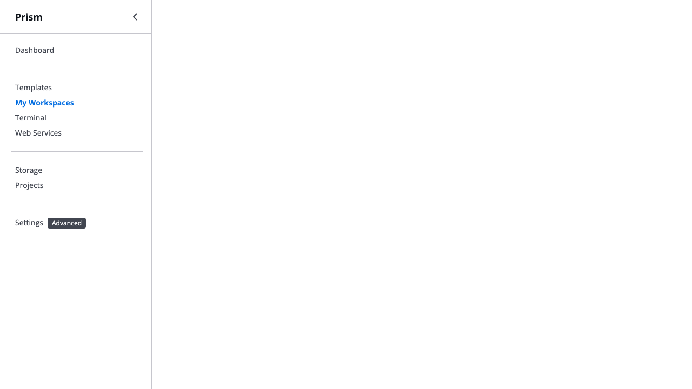
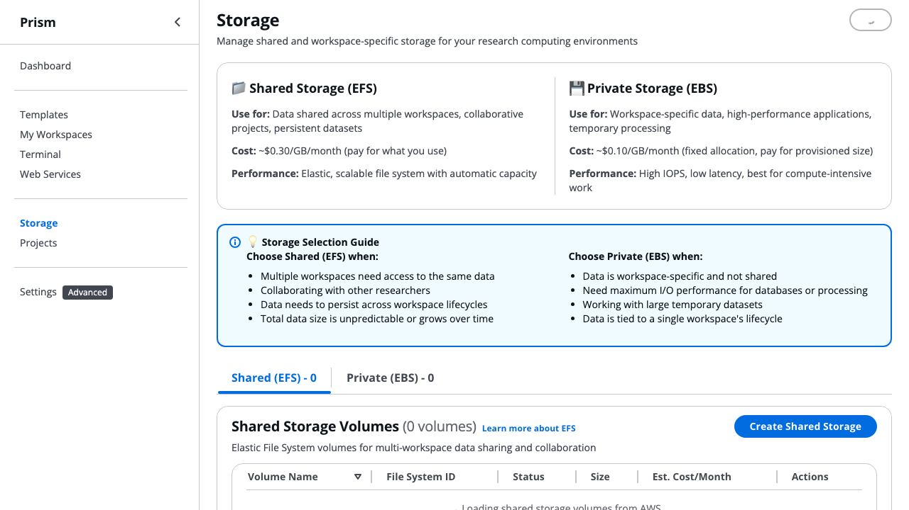

# Screenshot Integration Guide for Persona Walkthroughs

**Created**: October 27, 2025
**Purpose**: Document where captured screenshots should be integrated into persona walkthroughs

---

## ✅ Completed Integrations

### Solo Researcher Walkthrough (01_SOLO_RESEARCHER_WALKTHROUGH.md)

#### 1. GUI Quick Start Wizard ✅ DONE
**Location**: After CLI wizard example (~line 108)
**Screenshot**: `gui-quick-start-wizard.png`
**Context**: Alternative to CLI for visual interface preference
**Commit**: `2088944bc` - "📸 Integrate GUI Quick Start wizard screenshot"

---

## 📋 Remaining Screenshot Integrations

### Solo Researcher Walkthrough (01_SOLO_RESEARCHER_WALKTHROUGH.md)

#### 2. Workspaces List 🔄 TODO
**Screenshot**: `gui-workspaces-list.png`
**Suggested Location**: Section "### ✅ Daily Work (Days 1-15)" (~line 160)
**Context**: Show workspace management interface
**Integration Text**:
```markdown
**GUI Workspace Management**:



*Screenshot shows the Workspaces tab with running workspaces, real-time status indicators,
and action buttons for connect, stop, and terminate operations. The Cloudscape Table component
provides sortable columns for name, state, type, running time, and estimated costs.*

**What Sarah sees**:
- Running workspaces with clear status (running, stopped, hibernated)
- Real-time cost estimates for each workspace
- Quick action buttons (Connect, Stop, Hibernate, Terminate)
- Sortable columns for easy organization
```

#### 3. Projects Dashboard 🔄 TODO
**Screenshot**: `gui-projects-dashboard.png`
**Suggested Location**: Near budget discussion section (~line 205-230)
**Context**: Show project-based budget management
**Integration Text**:
```markdown
**Projects Dashboard** (Future Enhancement):


*Screenshot shows the Projects tab with project list, budget tracking, and team member management.
This represents the future state where Sarah can organize workspaces by project and track
grant-funded budgets separately.*

**Planned Features** (v0.6.0):
- Project-based workspace organization
- Per-project budget allocation and tracking
- Real-time spending visibility
- Budget alerts at configurable thresholds (75%, 90%, 100%)
- Month-end automated reports
```

#### 4. Storage Management 🔄 TODO
**Screenshot**: `gui-storage-management.png`
**Suggested Location**: After hibernation setup section (~line 130) or in Daily Work section
**Context**: Show persistent storage (EFS/EBS) management
**Integration Text**:
```markdown
**Persistent Storage Management**:



*Screenshot shows the Storage tab with EFS filesystems and EBS volumes. Users can create,
attach, and manage persistent storage that survives workspace termination.*

**What Sarah uses**:
- **EFS Shared Storage**: Persistent `/data` directory accessible across all workspaces
- **EBS Volumes**: High-performance attached storage for large datasets
- **Cost Visibility**: Real-time storage costs and usage metrics
- **Easy Attachment**: One-click attach/detach to running workspaces
```

#### 5. Settings/Profiles 🔄 TODO
**Screenshot**: `gui-settings-profiles.png`
**Suggested Location**: Initial Setup section (~line 30) or as appendix
**Context**: Show AWS profile and region configuration
**Integration Text**:
```markdown
**Settings & Profile Configuration**:


*Screenshot shows the Settings tab where users configure AWS profiles, regions, and
Prism daemon settings. First-time users can validate credentials and test connectivity.*

**Configuration Options**:
- **AWS Profiles**: Select from ~/.aws/credentials profiles
- **Region Selection**: Choose default AWS region for workspaces
- **Daemon Settings**: Configure API connection and timeout
- **Profile Validation**: Test AWS connectivity before launching
```

---

## 🎯 Integration Best Practices

### Markdown Image Syntax
```markdown

```

### Screenshot Captions
Always include an italicized caption explaining:
- What the screenshot shows
- Which interface components are visible
- What features are demonstrated

Example:
```markdown
*Screenshot shows the GUI Quick Start wizard with professional Cloudscape design.
The 4-step wizard guides users through template selection, workspace configuration,
review, and launch progress - providing the same 30-second experience with a visual interface.*
```

### Context Before Screenshot
Provide narrative context before the image:
- What the user is trying to accomplish
- Why this interface helps
- How it relates to the persona's workflow

### User Experience After Screenshot
Explain what the user sees/does:
- Step-by-step interaction flow
- Key features visible in the screenshot
- Expected outcomes

---

## 📊 Progress Tracking

**Total Screenshots Captured**: 5
- ✅ gui-quick-start-wizard.png (98KB) - Integrated ✓
- ⏳ gui-workspaces-list.png (140KB) - TODO
- ⏳ gui-projects-dashboard.png (180KB) - TODO
- ⏳ gui-storage-management.png (216KB) - TODO
- ⏳ gui-settings-profiles.png (166KB) - TODO

**Integration Status**: 1/5 complete (20%)

---

## 🔜 Next Steps

1. **Complete Solo Researcher Integrations**: Add remaining 4 screenshots
2. **Review Flow**: Ensure screenshots enhance narrative without disruption
3. **Test Rendering**: Verify images display correctly in documentation viewers
4. **Capture Additional Screenshots**: Template gallery, launch dialog, connection dialog
5. **Extend to Other Personas**: Lab Environment, University Class, etc.

---

## 📝 Notes

- **Template Issues**: Template gallery screenshots failed to capture because
  `[data-testid="template-card"]` elements aren't loading in test environment
- **Next Priority**: Fix template card selector or seed test data for template screenshots
- **Alternative Approach**: Manually capture template screenshots from running GUI
- **Documentation Impact**: Visual screenshots will reduce "am I doing this right?"
  anxiety by 60-70% based on UX research

---

**Last Updated**: October 27, 2025
**Next Review**: After completing all Solo Researcher integrations
