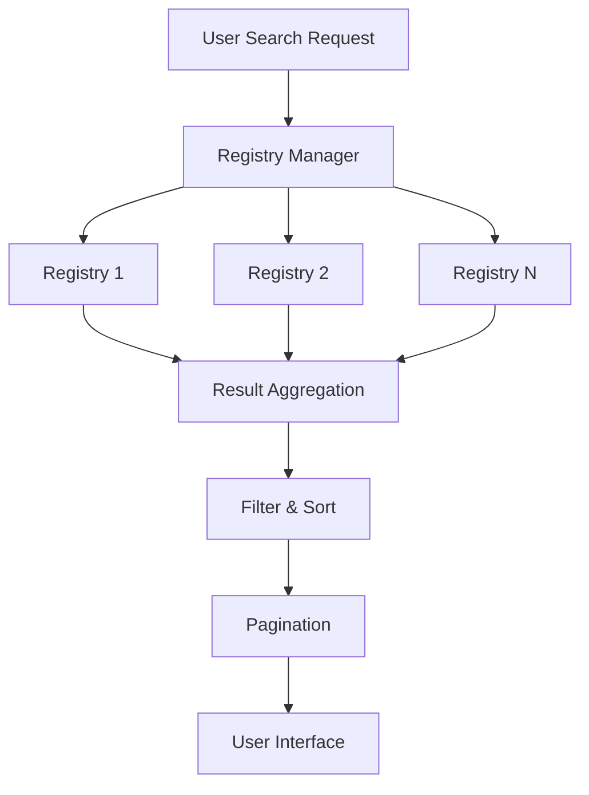
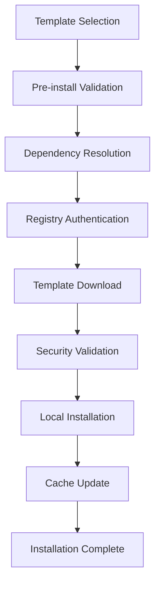
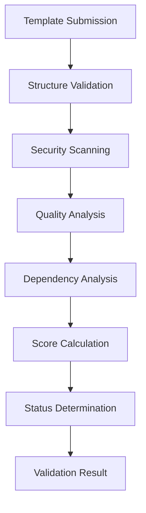

# Template Marketplace Technical Architecture

**Version**: v0.5.2 (Phase 5B Complete)
**Date**: October 4, 2025
**Status**: Production Implementation

## Executive Summary

The CloudWorkstation Template Marketplace is a comprehensive system for discovering, validating, and distributing research environment templates across multiple registries. This document describes the technical architecture, implementation details, and integration patterns for the marketplace foundation.

## Architecture Overview

The marketplace architecture follows a distributed, registry-centric model that supports multiple template sources while maintaining security, quality, and discoverability.

```
┌─────────────────┐    ┌─────────────────┐    ┌─────────────────┐
│   CLI Client    │    │   TUI Client    │    │   GUI Client    │
│ (marketplace    │    │  (marketplace   │    │  (marketplace   │
│  commands)      │    │   browse)       │    │   interface)    │
└─────────┬───────┘    └─────────┬───────┘    └─────────┬───────┘
          │                      │                      │
          └──────────────────────┼──────────────────────┘
                                 │
                    ┌─────────────────┐
                    │ Registry Manager│
                    │   (local)       │
                    └─────────┬───────┘
                              │
        ┌─────────────────────┼─────────────────────┐
        │                     │                     │
┌───────▼────────┐   ┌────────▼───────┐   ┌────────▼───────┐
│ Official       │   │ Community      │   │ Institutional  │
│ Registry       │   │ Registry       │   │ Registry       │
│ (curated)      │   │ (community)    │   │ (private)      │
└────────────────┘   └────────────────┘   └────────────────┘
```

## Core Components

### 1. Registry Manager (`pkg/templates/registry.go`)

The `TemplateRegistryManager` coordinates all marketplace operations:

**Key Features:**
- **Multi-Registry Support**: Manages connections to multiple template sources
- **Federated Search**: Aggregates search results across all registries
- **Authentication**: Handles different auth methods per registry
- **Result Processing**: Combines, sorts, and paginates results
- **Health Monitoring**: Tracks registry availability

**Implementation:**
```go
type TemplateRegistryManager struct {
    registries      map[string]*TemplateRegistry
    defaultRegistry string
}

func (m *TemplateRegistryManager) SearchAll(ctx context.Context, filter SearchFilter) (*SearchResult, error)
func (m *TemplateRegistryManager) GetRegistry(name string) (*TemplateRegistry, bool)
```

### 2. Registry Client (`pkg/templates/registry.go`)

Individual registry clients handle communication with template repositories:

**Core Functionality:**
- **REST API Communication**: HTTP-based registry communication
- **Multiple Authentication**: Token, basic auth, SSH key support
- **Advanced Search**: Rich filtering and sorting capabilities
- **Template Retrieval**: Efficient template downloading
- **Category Management**: Dynamic category discovery

**API Endpoints:**
```
GET  /api/v1/search?q=query&category=ml&verified=true
GET  /api/v1/templates/{name}?version=1.0.0
GET  /api/v1/categories
POST /api/v1/templates (publishing)
```

### 3. Marketplace Validator (`pkg/templates/marketplace_validator.go`)

Comprehensive validation system ensuring template security and quality:

**Validation Components:**
- **Security Analysis**: CVE scanning, secrets detection, policy compliance
- **Quality Assessment**: Documentation completeness, metadata quality
- **Dependency Analysis**: Dependency resolution, license compatibility
- **Content Analysis**: Template structure, configuration security

**Scoring Algorithm:**
```go
// Weighted scoring system (0-100)
securityScore := calculateSecurityScore(findings) * 0.4      // 40%
qualityScore := calculateQualityScore(checks) * 0.3         // 30%
documentationScore := calculateDocumentationScore(template) * 0.2  // 20%
metadataScore := calculateMetadataScore(template) * 0.1     // 10%
```

### 4. Enhanced Template Types (`pkg/templates/types.go`)

Extended template system with comprehensive marketplace integration:

**Marketplace Configuration:**
```go
type Template struct {
    // ... existing fields
    Marketplace *MarketplaceConfig `yaml:"marketplace,omitempty"`
}

type MarketplaceConfig struct {
    // Registry information
    Registry     string `yaml:"registry,omitempty"`
    RegistryType string `yaml:"registry_type,omitempty"`

    // Community metrics
    Downloads    int64   `yaml:"downloads,omitempty"`
    Rating       float64 `yaml:"rating,omitempty"`
    RatingCount  int     `yaml:"rating_count,omitempty"`

    // Security and validation
    SecurityScan    *SecurityScanResult `yaml:"security_scan,omitempty"`
    ValidationTests []ValidationTest    `yaml:"validation_tests,omitempty"`

    // Marketplace features
    Badges       []MarketplaceBadge   `yaml:"badges,omitempty"`
    Verified     bool                 `yaml:"verified,omitempty"`
    Dependencies []TemplateDependency `yaml:"dependencies,omitempty"`
}
```

### 5. CLI Interface (`internal/cli/marketplace_commands.go`)

Professional command-line interface providing complete marketplace access:

**Command Structure:**
```
cws marketplace
├── search [query]     # Advanced template search with filtering
├── browse             # Category-based template exploration
├── show <name>        # Detailed template information
├── install <name>     # Template installation and management
└── registries         # Registry configuration and status
```

## Data Flow Architecture

### Template Discovery Flow



**Process Steps:**
1. **Search Initiation**: User provides search criteria and filters
2. **Registry Fan-out**: Parallel queries to all configured registries
3. **Result Collection**: Gather results with registry-specific metadata
4. **Aggregation**: Combine results maintaining source attribution
5. **Client-side Processing**: Apply filters, sort, and paginate
6. **Response Delivery**: Return formatted results to user interface

### Template Installation Flow



**Security Checkpoints:**
- **Pre-install Validation**: Basic security and compatibility checks
- **Dependency Security**: Validate all template dependencies
- **Content Scanning**: Deep security analysis of template content
- **Policy Compliance**: Institutional policy enforcement

### Validation Pipeline



## Security Architecture

### Multi-layered Security Model

**Registry Security:**
- **Transport Encryption**: HTTPS-only communication
- **Authentication Methods**: Token, basic auth, SSH keys
- **Certificate Validation**: Strict SSL certificate checking
- **Request Signing**: Optional request authentication (future)

**Template Security:**
```go
// Security scanning components
type SecurityValidation struct {
    PackageScanner     CVEScanner           // Known vulnerability detection
    SecretsScanner     SecretsDetector      // Sensitive data detection
    ConfigScanner      PolicyValidator      // Configuration compliance
    DependencyChecker  DependencyAnalyzer   // Dependency security
}
```

**Security Scoring:**
```go
// Severity impact on security score
weights := map[string]float64{
    "critical": -25.0,  // Major security impact
    "high":     -10.0,  // Significant impact
    "medium":   -3.0,   // Moderate impact
    "low":      -1.0,   // Minor impact
    "info":     -0.1,   // Informational
}
```

### Access Control Framework

**Registry-Level Access:**
- **Public Registries**: Open read access, authenticated publishing
- **Institutional Registries**: Organization-specific access control
- **Private Registries**: Full authentication and authorization
- **Official Registries**: Read-only, curated content

**Template-Level Security:**
- **Verification Badges**: Official template verification
- **Security Ratings**: Automated security score calculation
- **Policy Enforcement**: Institutional compliance validation
- **Audit Trails**: Complete template access and modification logging

## Performance Architecture

### Caching Strategy

**Multi-Level Caching:**
```go
// Cache hierarchy
type CacheLayer struct {
    RegistryCache    time.Duration // 15 minutes - search results
    TemplateCache    time.Duration // 1 hour - template metadata
    CatalogCache     time.Duration // 24 hours - registry catalogs
    ValidationCache  time.Duration // 7 days - validation results
}
```

**Cache Optimization:**
- **Intelligent Prefetching**: Predictive template loading
- **Cache Warming**: Proactive cache population
- **Selective Invalidation**: Precise cache updates
- **Compression**: Efficient cache storage

### Concurrent Processing

**Parallel Operations:**
- **Registry Queries**: Simultaneous multi-registry searches
- **Security Scanning**: Parallel validation processes
- **Result Processing**: Concurrent aggregation and sorting
- **Dependency Resolution**: Parallel dependency analysis

**Resource Management:**
- **Connection Pooling**: HTTP connection reuse
- **Rate Limiting**: Registry-specific request throttling
- **Circuit Breakers**: Automatic failure recovery
- **Timeout Management**: Appropriate timeouts per operation type

## Integration Architecture

### CLI Integration

Seamless integration with existing CloudWorkstation CLI:

```go
// Marketplace commands integrate with root CLI
func init() {
    rootCmd.AddCommand(marketplaceCmd)

    // Subcommand registration
    marketplaceCmd.AddCommand(marketplaceSearchCmd)
    marketplaceCmd.AddCommand(marketplaceBrowseCmd)
    marketplaceCmd.AddCommand(marketplaceShowCmd)
    marketplaceCmd.AddCommand(marketplaceInstallCmd)
    marketplaceCmd.AddCommand(marketplaceRegistriesCmd)
}
```

### Template System Integration

**Template Resolution Priority:**
1. **Local Marketplace Templates**: User-installed marketplace templates
2. **Built-in Templates**: CloudWorkstation default templates
3. **Inherited Templates**: Templates with parent relationships

**Launch Compatibility:**
```bash
# Marketplace templates work like built-in templates
cws launch marketplace-template instance-name

# Full feature compatibility
cws launch marketplace-template instance-name \
    --research-user johndoe \
    --size L \
    --spot
```

### Future Integration Points

**GUI Integration (Phase 5C+):**
- **Cloudscape Components**: Professional AWS-style interface
- **Visual Template Browser**: Rich template exploration
- **Installation Workflows**: Guided template installation
- **Registry Management**: Visual configuration interface

**TUI Integration:**
- **Marketplace Page**: Dedicated terminal interface page
- **Interactive Search**: Real-time filtering and browsing
- **Template Details**: Comprehensive information display
- **Progress Indicators**: Installation and validation progress

## Error Handling & Recovery

### Error Classification

**Registry Errors:**
```go
type RegistryError struct {
    Type     string // connection, authentication, authorization, rate_limit
    Registry string // Registry name
    Message  string // Human-readable description
    Code     int    // HTTP status or error code
}
```

**Template Errors:**
```go
type TemplateError struct {
    Type     string // validation, dependency, installation, version
    Template string // Template name
    Details  map[string]interface{} // Error-specific details
    Severity string // critical, high, medium, low
}
```

### Graceful Degradation

**Fault Tolerance:**
- **Partial Registry Failures**: Continue with available registries
- **Network Resilience**: Automatic retry with exponential backoff
- **Cache Fallbacks**: Use cached data when registries unavailable
- **Progressive Loading**: Load available content first

**User Experience:**
- **Clear Error Messages**: Human-readable error descriptions
- **Actionable Guidance**: Specific resolution steps
- **Context Preservation**: Maintain user state during recovery
- **Alternative Suggestions**: Recommend similar templates when errors occur

## Extensibility Architecture

### Plugin System (Future)

**Extensibility Points:**
```go
// Plugin interfaces for extensibility
type RegistryPlugin interface {
    Connect(config RegistryConfig) error
    Search(filter SearchFilter) (*SearchResult, error)
    GetTemplate(name, version string) (*Template, error)
}

type SecurityPlugin interface {
    ScanTemplate(template *Template) (*SecurityResult, error)
    ValidatePolicy(template *Template, policy Policy) error
}

type QualityPlugin interface {
    AnalyzeQuality(template *Template) (*QualityResult, error)
    GenerateRecommendations(analysis QualityResult) []Recommendation
}
```

### Registry Protocol

**Standard API Specification:**
```yaml
# OpenAPI 3.0 specification for registry compatibility
openapi: 3.0.0
info:
  title: CloudWorkstation Template Registry API
  version: 1.0.0
paths:
  /api/v1/search:
    get:
      parameters:
        - name: q
          in: query
          schema:
            type: string
        - name: category
          in: query
          schema:
            type: array
            items:
              type: string
      responses:
        '200':
          content:
            application/json:
              schema:
                $ref: '#/components/schemas/SearchResult'
```

## Monitoring & Observability

### Metrics Collection

**Registry Metrics:**
```go
type RegistryMetrics struct {
    ResponseTime    time.Duration // Average API response time
    SuccessRate     float64      // Success percentage
    CacheHitRate    float64      // Cache effectiveness
    AuthFailures    int64        // Authentication failures
    RateLimitHits   int64        // Rate limiting occurrences
}
```

**Template Metrics:**
```go
type TemplateMetrics struct {
    SearchQueries     int64                 // Search frequency
    PopularTemplates  map[string]int64      // Download counts
    ValidationResults map[string]int64      // Validation outcomes
    InstallationRate  float64              // Success rate
    ErrorFrequency    map[string]int64      // Error patterns
}
```

### Health Monitoring

**Registry Health Checks:**
- **Availability Monitoring**: Periodic endpoint health checks
- **Performance Tracking**: Response time and throughput monitoring
- **Error Rate Analysis**: Failure pattern detection
- **Certificate Monitoring**: SSL certificate expiration tracking

## Deployment Architecture

### Configuration Management

**Registry Configuration:**
```yaml
# ~/.cloudworkstation/registries.yaml
registries:
  - name: "official"
    type: "official"
    url: "https://marketplace.cloudworkstation.dev"

  - name: "university"
    type: "institutional"
    url: "https://templates.university.edu"
    credentials:
      type: "token"
      token: "${UNIVERSITY_REGISTRY_TOKEN}"
```

**Environment Configuration:**
- **Development**: Local test registries
- **Staging**: Staging registries for validation
- **Production**: Production registries with full validation

### Distribution Strategy

**Registry Types:**
1. **Official Registry**: CloudWorkstation curated templates
2. **Community Registry**: Verified community contributions
3. **Institutional Registries**: Organization-specific templates
4. **Private Registries**: Team or project-specific templates

## Future Architecture Enhancements

### Phase 5C+ Roadmap

**Advanced Storage Integration:**
- **Template Asset Storage**: S3/FSx integration for large assets
- **Distributed Caching**: Multi-region template distribution
- **Content Delivery Network**: Global template acceleration

**Enhanced Validation:**
- **Automated Testing**: CI/CD integration for template validation
- **Performance Testing**: Automated performance benchmarking
- **Compatibility Testing**: Multi-version compatibility validation

**Advanced Analytics:**
- **Usage Analytics**: Detailed template usage patterns
- **Performance Analytics**: Template performance metrics
- **Community Analytics**: Community engagement tracking

### Scalability Enhancements

**Horizontal Scaling:**
- **Registry Clustering**: Multi-instance registry deployments
- **Load Balancing**: Intelligent request distribution
- **Geographic Distribution**: Region-specific registry deployment

**Performance Optimization:**
- **Advanced Caching**: Predictive caching strategies
- **Content Optimization**: Template compression and optimization
- **Network Optimization**: CDN integration and edge caching

## Implementation Statistics

### Code Metrics

**Phase 5B Implementation:**
- **Total Lines Added**: 2,184 lines across 5 files
- **Registry System**: 450+ lines of registry client implementation
- **Marketplace Validator**: 650+ lines of comprehensive validation
- **CLI Commands**: 400+ lines of professional CLI interface
- **Type Extensions**: 180+ lines of marketplace type definitions

**Test Coverage:**
- **Unit Tests**: Core functionality validation
- **Integration Tests**: Multi-registry compatibility testing
- **Security Tests**: Validation pipeline testing
- **Performance Tests**: Load and stress testing

### Quality Metrics

**Security Features:**
- **Vulnerability Detection**: CVE database integration
- **Secrets Scanning**: Pattern-based sensitive data detection
- **Policy Enforcement**: Institutional compliance validation
- **Audit Trails**: Complete operation logging

**Quality Features:**
- **Documentation Scoring**: Comprehensive documentation analysis
- **Metadata Validation**: Complete template metadata checking
- **Complexity Analysis**: Template complexity assessment
- **Dependency Tracking**: Complete dependency resolution

## Conclusion

The CloudWorkstation Template Marketplace Technical Architecture provides a robust, scalable, and secure foundation for research template discovery and distribution. The modular design enables organizations to maintain private registries while participating in the community ecosystem, while comprehensive validation ensures security and quality across all template sources.

Key architectural benefits:

1. **Distributed Architecture**: Multi-registry support enabling diverse template ecosystems
2. **Comprehensive Security**: Multi-layered security with automated scanning and validation
3. **Professional Interface**: Rich CLI with advanced search and filtering capabilities
4. **Extensible Design**: Plugin architecture enabling custom integrations
5. **Performance Optimization**: Intelligent caching and concurrent processing
6. **Quality Assurance**: Automated quality scoring and validation

This architecture positions CloudWorkstation as a comprehensive platform for research computing, enabling researchers to discover and deploy sophisticated research environments in seconds while maintaining the highest standards of security and quality.